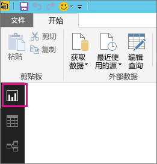
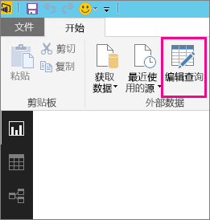
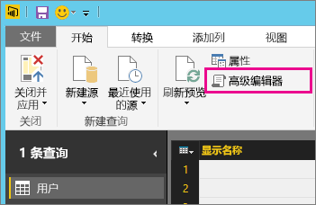
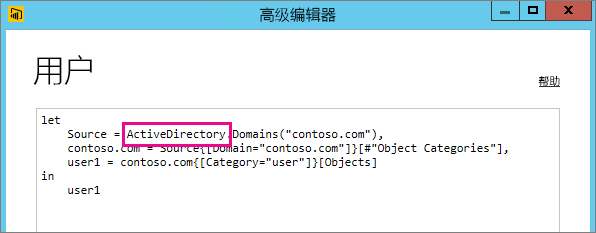

# 刷新不支持的数据源故障排除
尝试为计划的刷新配置数据集时，你可能会遇到错误。

        You cannot schedule refresh for this dataset because it gets data from sources that currently don’t support refresh.

刷新不支持在 Power BI Desktop 中使用的数据源时，会发生这种情况。 你需要查找所使用的数据源并将它与[在 Power BI 中刷新数据](refresh-data.md)处的不支持数据源列表进行比较。 

## 查找数据源
如果你不确定所使用的数据源，则可以在 Power BI Desktop 中使用以下步骤来查找该数据源。  

1. 在 Power BI Desktop 中，请确保你处于**报表**窗格上。  
   
2. 从功能区栏中选择**编辑查询**。  
   
3. 选择**高级编辑器**。  
   
4. 记下为源列出的提供程序。  在此示例中，提供程序是 ActiveDirectory。  
   
5. 将提供程序与[在 Power BI 中刷新数据](refresh-data.md)中的不支持数据源列表进行比较。  你会发现 Active Directory 不是刷新支持的数据源。  

## 后续步骤
[数据刷新](refresh-data.md)  
[Power BI Gateway - Personal](personal-gateway.md)  
[本地数据网关](service-gateway-onprem.md)  
[本地数据网关故障排除](service-gateway-onprem-tshoot.md)  
[Power BI Gateway - Personal 故障排除](service-admin-troubleshooting-power-bi-personal-gateway.md)  

更多问题？ [尝试咨询 Power BI 社区](http://community.powerbi.com/)

