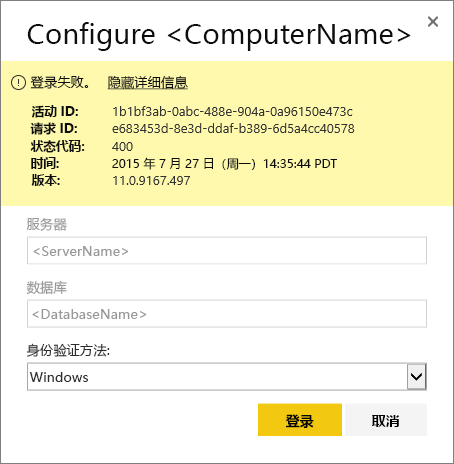
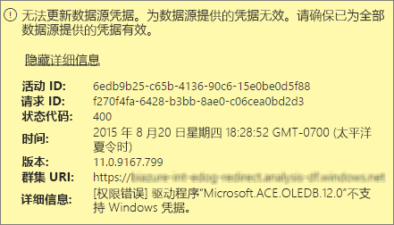
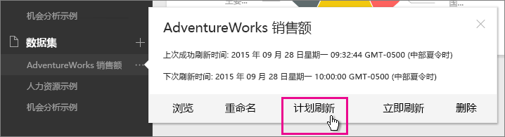
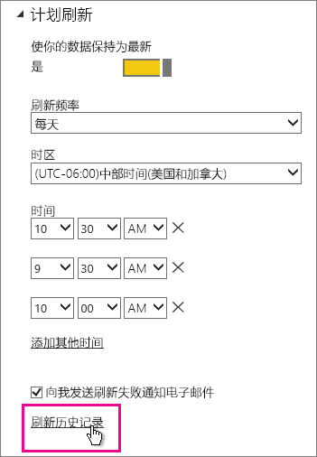
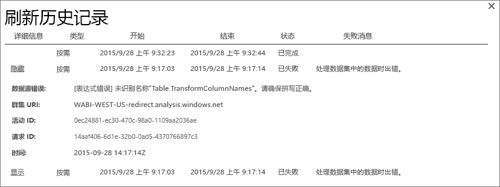
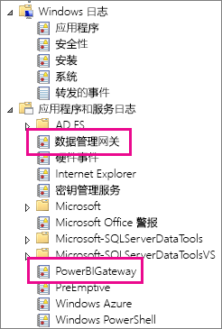
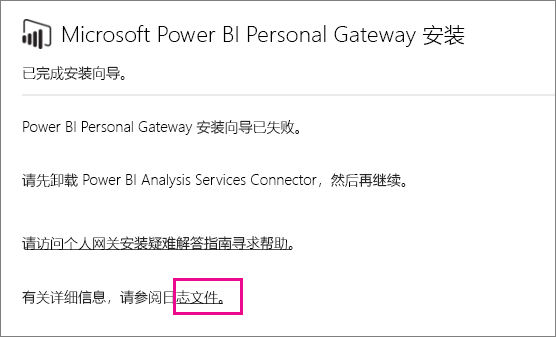
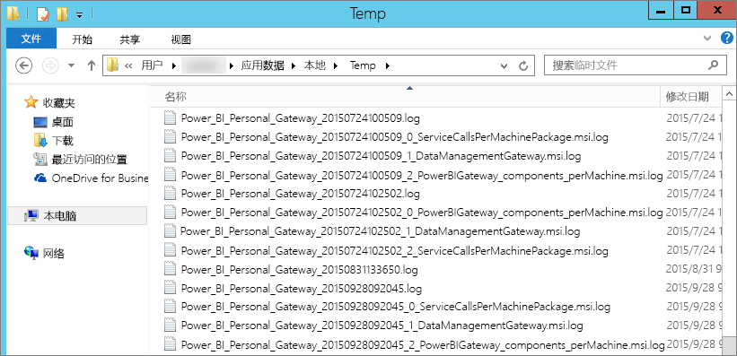

# Power BI 网关故障排除 - 个人
以下介绍使用 Power BI 个人网关时可能遇到的一些常见问题。

> [!NOTE]
> 最新版本的个人用网关为**本地数据网关（个人版）**。 请更新安装以使用该版本。
> 
> 

## 更新到最新版本
网关版本过期后，可能会遇到很多问题。  好的常规做法是确保所使用的是最新版本。  如果你已经一个月或更长时间没有升级网关，可能需要考虑安装网关最新版本，并检查此问题是否会重现。

## 安装
**个人网关为 64 位** - 如果计算机为 32 位则不能安装个人网关。 操作系统必须是 64 位。 需安装 64 位版 Windows，或者在 64 位计算机上安装个人网关。

**个人网关无法作为一项服务安装，即使你是计算机的本地管理员** - 如果用户是计算机本地管理员组中的成员，但组策略不允许该用户名作为服务登录，安装可能会失败。  目前，请确保组策略允许用户作为服务登录。 我们正在努力修复此问题。 [了解详细信息](https://technet.microsoft.com/library/cc739424.aspx)

**操作超时** - 如果要在其上安装个人网关的计算机（物理计算机或 VM）具有单核处理器，此问题很常见。 关闭所有应用程序和任何不必要的进程并再次尝试安装。

**数据管理网关或 Analysis Services 连接器不能与个人网关安装在同一台计算机上** - 如果你已经安装 Analysis Services 连接器或数据管理网关，必须先卸载该连接器或网关，然后尝试安装个人网关。

> [!NOTE]
> 如果在安装期间遇到问题，安装日志会提供相关信息帮助你解决此问题。 有关详细信息，请参阅[安装程序日志](#SetupLogs)。
> 
> 

 **代理服务器配置** 如果你的环境需要使用代理服务器，可能会遇到与配置个人网关相关的问题。 若要了解有关如何配置代理服务器信息的详细信息，请参阅[配置 Power BI 网关的代理服务器设置](service-gateway-proxy.md)

## 计划刷新
**错误：云中存储的凭据丢失。**

如果你已计划刷新，然后卸载并重新安装个人网关，则在 \<dataset\> 的设置中会出现此错误。 当你卸载个人网关时，针对刷新配置的数据集的数据源凭据将从 Power BI 服务中删除。

**解决方案：** 在 Power BI 中，转到数据集的刷新设置。 在“管理数据源”中，对于任何存在错误的数据源，单击“编辑凭据”并再次登录到数据源。

**错误：为数据集提供的凭据无效。请通过刷新更新凭据或在“数据源设置”对话框中更新凭据以继续执行操作。**

**解决方案**：如果收到凭据消息，这可能意味着：

* 请确保用于登录到数据源的用户名和密码是最新的。 在 Power BI 中，转到数据集的刷新设置。 在“管理数据源”中，单击“编辑凭据”来更新数据源的凭据。
* 在单个查询中，如果其中一个源正在使用 OAuth 进行身份验证，云源和的本地源之间的混合应用程序将无法在个人网关中刷新。 例如，CRM Online 和本地 SQL Server 之间的混合应用程序。 这将失败，因为 CRM Online 需要 OAuth。
  
  这是一个已知问题，我们正在调查。 若要解决此问题，为云源和本地源配备单独的查询，并使用合并或追加查询以将它们合并。

**错误：数据源不受支持。**

**解决方案：** 如果在计划刷新设置中出现数据源不受支持的消息，这可能意味着： 

* Power BI 中当前不支持数据源进行刷新。 
* Excel 工作簿不包含数据模型，仅包含工作表数据。 如果已上载的 Excel 工作簿包含数据模型，Power BI 当前只支持刷新。 当在 Excel 中使用 Power Query 导入数据时，请务必选择此选项将数据加载到数据模型。 这可确保数据导入到数据模型。 

**错误：[无法合并数据] &lt;查询部分&gt;/&lt;…&gt;/&lt;…&gt; 正在访问的数据源具有无法一起使用的隐私级别。请重新生成此数据组合。**

**解决方案**：此错误是由于隐私级别限制和正在使用的数据源类型所导致。

**错误：数据源错误：无法将值“\[Table\]”转换为 Table 类型。**

**解决方案**：此错误是由于隐私级别限制和正在使用的数据源类型所导致。

**错误：对于此行没有足够的空间。**

如果有大于 4 MB 大小的单个行，则会出现此错误。 需要从数据源确定行是什么，并尝试将其筛选出或减少该行的大小。

## 数据源
**缺少数据提供程序** – 个人网关只有 64 位版。 它需要在已安装个人网关的同一台计算机上安装 64 位版本数据提供程序。 例如，如果数据集中的数据源是 Microsoft Access，必须在已安装个人网关的同一台计算机上安装 64 位 ACE 提供程序。  

>[!NOTE]
>如果有 32 位 Excel，则无法在同一台计算机上安装 64 位 ACE 提供程序。

**Access 数据库不支持 Windows 身份验证** - 对于 Access 数据库，Power BI 当前仅支持匿名访问。 对于 Access 数据库，我们将启用 Windows 身份验证。

**输入数据源凭据时出现登录错误** - 如果为数据源输入 Windows 凭据时遇到与此类似的错误，可能是因为你仍在使用旧版本的个人网关。 [安装最新版本的 Power BI 网关 - 个人](https://powerbi.microsoft.com/gateway/)。

  

**错误：为使用 ACE OLEDB 的数据源选择 Windows 身份验证时出现登录错误** - 如果为使用 ACE OLEDB 提供程序的数据源输入数据源凭据时出现以下错误：

对于使用 ACE OLEDB 提供程序的数据源，Power BI 当前不支持 Windows 身份验证。

解决方案：要解决此错误，可以选择匿名身份验证。 对于旧式 ACE OLEDB 提供程序，匿名凭据等效于 Windows 凭据。

## 磁贴刷新
如果接收到一个与仪表板磁贴刷新相关的错误，请参阅以下文章。

[磁贴错误故障排除](refresh-troubleshooting-tile-errors.md)

## 用于故障排除的工具
### 刷新历史记录
如果你需要创建一个支持请求，**刷新历史记录**可帮助你了解发生了什么错误，并提供有用的数据。 可以查看计划刷新和按需刷新。 下面是有关如何**刷新历史记录**的说明。

1. 在 Power BI 导航窗格中的**数据集**中，选择一个数据集&gt;打开菜单&gt;**计划刷新**。
   
2. 在**设置...**&gt;**计划刷新**中，选择**刷新历史记录**。  
   
   
   

### 事件日志
有几个事件日志可提供信息。 如果你是计算机管理员，则显示前两个，即**数据管理网关**和 **PowerBIGateway**。  如果你不是管理员，并且使用的是个人网关，将在**应用程序**日志中看到日志条目。

**数据管理网关**和 **PowerBIGateway** 日志显示在**应用程序和服务日志**下方。

### Fiddler 跟踪
[Fiddler](http://www.telerik.com/fiddler) 是 Telerik 提供的一款用于监视 HTTP 流量的免费工具。  可以从客户端计算机通过 Power BI 服务来回查看。 这可能会显示错误和其他相关的信息。

### 安装程序日志
如果**个人网关**无法安装，将看到一个链接以显示安装程序日志。 这可以显示有关故障的详细信息。 这些是 Windows 安装日志，也称作 MSI 日志。 它们可能非常复杂且难以阅读。 通常在底部显示引发的错误，但确定错误原因并非易事。 它可能是不同日志中错误的结果，或是较高的日志中错误的结果。

或者，可以转到“Temp 文件夹”(%temp%) 并查找以 **Power\_BI\_** 开头的文件。

> [!NOTE]
> 转到 %temp% 可能将你带到 temp 的子文件夹。**Power\_BI\_** 文件将位于 temp 目录的根目录中。  可能需要转到上一个或上两个级别。
> 
> 

## 后续步骤
[为 Power BI Gateway 配置代理设置](service-gateway-proxy.md)  
[数据刷新](refresh-data.md)  
[Power BI Gateway - Personal](personal-gateway.md)  
[磁贴错误故障排除](refresh-troubleshooting-tile-errors.md)  
[本地数据网关故障排除](service-gateway-onprem-tshoot.md)  
更多问题？ [尝试参与 Power BI 社区](http://community.powerbi.com/)

