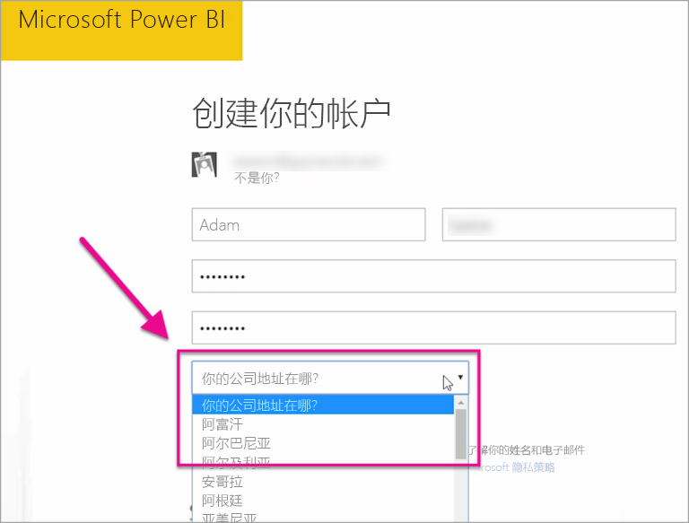

# 我的 Power BI 租户位于何处？
<iframe width="560" height="315" src="https://www.youtube.com/embed/0fOxaHJPvdM?showinfo=0" frameborder="0" allowfullscreen></iframe>

了解 Power BI 租户所处的位置及选择该位置的操作过程。 了解这点很重要，因为这会影响到你与该服务的交互。

## 如何确定 Power BI 租户所处的位置
若要查看租户所处的区域，可以执行以下操作。

1. 选择 Power BI 服务右上角方的 **?** 。
2. 选择“关于 Power BI”。
3. 查看“**您的数据存储于**”旁的值。 该值则是你所处的区域。

## 选择该数据区域的操作过程
该数据区域基于最初创建租户时所选的国家/地区。 该选择会应用到 Powe BI 及 Office 365 的注册，因为此信息为共享信息。 如果是新租户，则在注册时将看到国家/地区下拉列表。

该选项将生成存储数据的位置。 Power BI 将选择与此选项最接近的数据区域。

> [!WARNING]
> 该选项无法更改！
> 
> 

更多问题？ [尝试参与 Power BI 社区](http://community.powerbi.com/)

