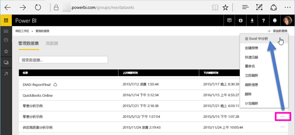
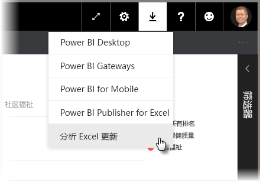
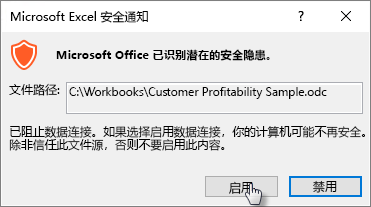
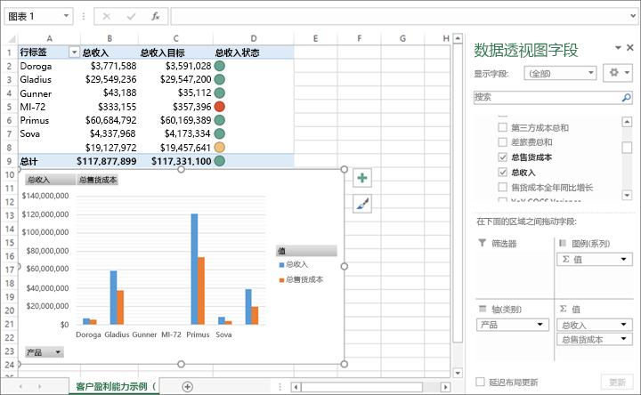

# 在 Excel 中分析
有时，你可能希望使用 Excel 查看 Power BI 中的数据集并与之交互。 借助**在 Excel 中分析**，不仅可以做到这一点，还可以基于 Power BI 中存在的数据集访问 Excel 中的数据透视表、图表和切片器功能。

## 要求
使用**在 Excel 中分析**时有以下几点要求：

* Microsoft Excel 2010 SP1 和更高版本支持**在 Excel 中分析**。
* Excel 数据透视表不支持对数值字段进行拖放聚合。 你在 Power BI 中的数据集 *必须具有预定义的度量值* 。
* 某些组织可能有组策略规则，导致无法对 Excel 安装所需的**在 Excel 中分析**更新。 如果无法安装更新，请与管理员联系。
* 在 Excel 中分析需要 Pro 许可证。 若要详细了解免费版与 Pro 许可证之间的功能差异，请参阅 [Power BI 免费版与 Power BI Pro](service-free-vs-pro.md)。 

## 工作原理
从与 **Power BI** 中的数据集或报表关联的省略号菜单 (…) 中选择**在 Excel 中分析**之后，Power BI 会创建一个 .ODC 文件并将其从浏览器下载到你的计算机。

在 Excel 中打开该文件后，将显示空的**数据透视表**和**字段**列表以及来自 Power BI 数据集的表、字段和度量值。 你可以创建数据透视表和图表，并分析该数据集，就像在 Excel 中处理本地数据集一样。

.ODC 文件有一个 MSOLAP 连接字符串，该字符串连接到 Power BI 中的数据集。 当你分析或处理数据时，Excel 会在 Power BI 中查询该数据集，并将结果返回到 Excel。 如果该数据集使用 DirectQuery 连接到实时数据源，Power BI 会查询该数据源，并将结果返回到 Excel。

“在 Excel 中分析” 对以下数据集和报表非常有用：连接 *Analysis Services 表格* 或 *多维* 数据库的数据集和报表，或者来自包含数据模型（模型度量值是使用数据分析表达式 (DAX) 创建而成）的 Power BI Desktop 文件或 Excel 工作簿的数据集和报表。

## 开始使用“在 Excel 中分析”
在 Power BI 中，选择报表或数据集旁边的省略号菜单（报表或数据集名称旁边的 ...），然后从出现的菜单中选择**在 Excel 中分析**。

### 安装 Excel 更新
首次使用**在 Excel 中分析**时，需要对 Excel 库安装更新。 系统会提示你下载并运行 Excel 更新（这将启动 *SQL_AS_OLEDDB.msi* Windows Installer 程序包的安装）。 此程序包将安装 **Microsoft AS OLE DB Provider for SQL Server 2016 RC0（预览版）**。

> [!NOTE]
> 务必选中“安装 Excel 更新”对话框中的“不再显示此信息”。 此更新只需安装一次。
> 
> 

如果需要为**在 Excel 中分析**再次安装 Excel 更新，可以通过 Power BI 中的**下载**图标下载更新，如下图所示。

### 登录到 Power BI
即便你已经在浏览器中登录 Power BI，在 Excel 中首次打开新的 .ODC 文件时，也会看到使用 Power BI 帐户登录 Power BI 的提示。 这会对 Excel 到 Power BI 的连接进行身份验证。

### 拥有多个 Power BI 帐户的用户
某些用户拥有多个 Power BI 帐户，这些用户可能会遇到这种情况：他们使用某个帐户登录到 Power BI，但有权访问“在 Excel 中分析”中所用数据集的帐户是不同的帐户。 在这些情况下，如果尝试访问“在 Excel 工作簿中分析”中所用的数据集，你可能会遇到**禁止**错误或登录失败。

你有机会再次登录，届时你可以使用有权访问“在 Excel 中分析”所访问的数据集的 Power BI 帐户登录。 也可以从 Excel 的 **Power BI** 功能区选项卡中选择**配置文件**，它标识了你当前所用的登录帐户，并提供一个链接，允许你注销（随后使用不同的帐户登录）。

### 启用数据连接
若要在 Excel 中分析 Power BI 数据，系统会提示你验证 .odc 文件的文件名和路径，验证后请选择**启用**。

> [!NOTE]
> 本地数据集托管在 Analysis Services (AS) 数据库中的情况下，Power BI 租户的管理员可以使用“Power BI 管理门户”禁用“在 Excel 中分析”。 禁用该选项时，会对 AS 数据库禁用**在 Excel 中分析**，但它仍可用于其他数据集。
> 
> 

## 开始分析
Excel 已打开并且你有一个空数据透视表，现在可以对 Power BI 数据集执行各种分析。 借助“在 Excel 中分析”，你可以创建数据透视表、图表、添加来自其他源的数据等等，就像使用其他本地工作簿一样。 当然，你也可以创建包含各种数据视图的不同工作表。

> [!NOTE]
> 请务必了解，使用“在 Excel 中分析”会向具有数据集访问权限的任何用户公开所有详细信息级别的数据。
> 
> 

## 保存
你可以保存此 Power BI 数据集连接工作簿，就像保存任何其他工作簿一样。 但是，你不能将该工作簿发布或导回到 Power BI，因为你只能将表中有数据或具有数据模型的工作簿发布或导入到 Power BI。 因为新工作簿与 Power BI 中的数据集建立了连接，所以将其发布或导入到 Power BI 无疑是在兜圈子！

## 共享
保存工作簿后，可以将它与组织中的其他 Power BI 用户共享。

当你与某位用户共享了你的工作簿，而该用户打开该工作簿时，他将看到你在上一次保存该工作簿时显示的数据透视表和数据，但这些可能不是最新版本的数据。 若要获取最新数据，用户必须使用**数据**功能区上的**刷新**按钮。 由于工作簿连接到 Power BI 中的数据集，因此，尝试刷新工作簿的用户在首次尝试使用此方法更新时，必须登录 Power BI 并安装 Excel 更新。

由于用户需要刷新数据集，但 Excel Online 不支持刷新外部连接，因此，建议用户在其计算机上的桌面版 Excel 中打开工作簿。

## 故障排除
有时，在使用 Analyze in Excel 期间可会能收意外的结果，或功能未按预期工作。 [此页提供针对 Analyze in Excel 常见问题的解决方案](desktop-troubleshooting-analyze-in-excel.md)