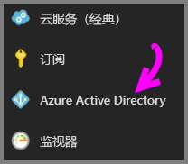
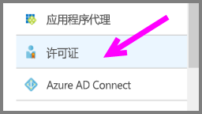
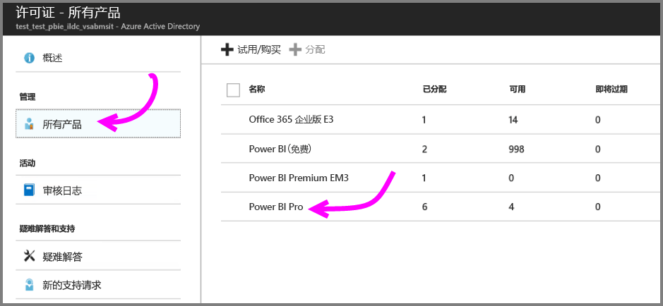
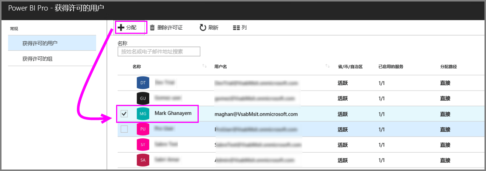
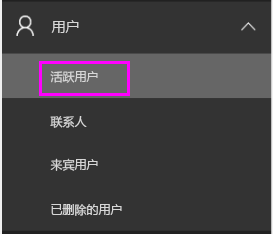
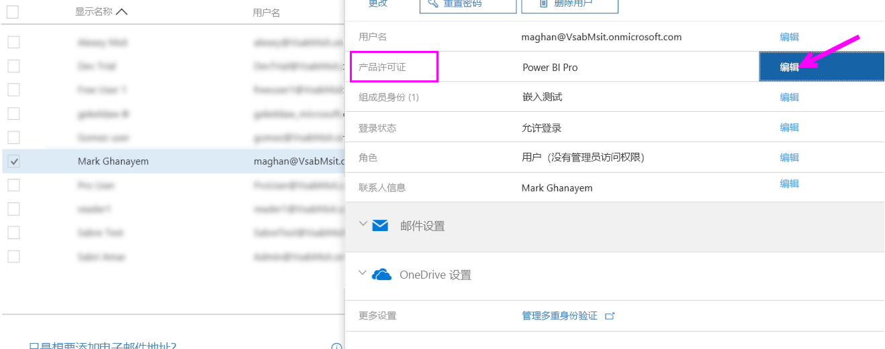
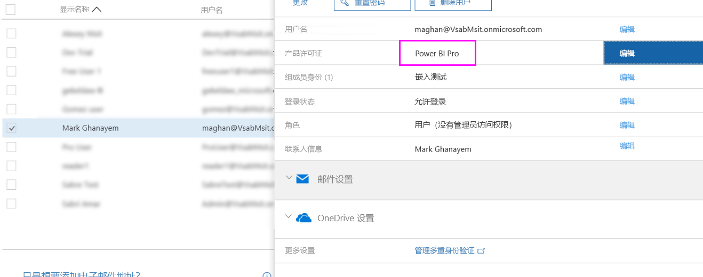

# 分配 Power BI Pro 许可证

管理员可以从多种管理门户和 PowerShell cmdlet 中选择以向用户分配 Power BI Pro 许可证。 Power BI 许可证管理由 Azure Active Directory (Azure AD) 提供支持。

* Azure 订阅所有者可以使用 [Azure 门户](https://ms.portal.azure.com/#@microsoft.onmicrosoft.com/dashboard/private/39bc3cf7-31a4-43f6-954c-f2d69ca2f0)中的“Azure Active Directory”边栏选项卡。 

* 全局管理员和用户帐户管理员可以使用 [Office 365 管理中心](https://portal.office.com/AdminPortal/Home#/homepage)。

## 在 Azure 门户中管理 Power BI Pro 许可证

Power BI 将 Azure AD 用作一项基本服务。 Azure AD 存储用户帐户和组，同时存储其他设置，例如有关购买的产品的信息。

### 将许可证分配给个人用户帐户

如果你是 Azure 订阅所有者，请按以下步骤将 Pro 许可证分配给个人用户帐户：

1. 导航到 [Azure 门户](https://ms.portal.azure.com/#@microsoft.onmicrosoft.com/dashboard/private/39bc3cf7-31a4-43f6-954c-f2d69ca2f0)。 

2. 在左侧的导航栏中，单击“Azure Active Directory”。

    

3. 打开“Azure Active Directory”边栏选项卡，单击“许可证”。

    

4. 在“许可证”边栏选项卡上单击“所有产品”，然后单击“Power BI Pro”以显示许可用户列表。

    

5. 单击“分配”将 Power BI Pro 许可证添加到其他用户帐户。

    

> [!NOTE]
> 尽管可以管理大多数的授权方面，但是无法在 Azure 门户中购买 Power BI Pro 许可证。 使用 Office 365 管理中心购买 Power BI Pro 订阅。 有关详细信息，请参阅[购买 Power BI Pro](https://docs.microsoft.com/en-us/power-bi/service-admin-purchasing-power-bi-pro)。
>

## 在 Office 365 管理中心管理 Power BI Pro 许可证

如果你是全局管理员，请在 Office 365 管理中心购买 Power BI Pro 订阅和管理组织的相关许可证。

如果你是 Office 365 管理员，请按以下步骤将 Pro 许可证分配给个人用户帐户：

1. 导航到 Office 365 管理中心。

2. 在左侧的导航窗格中，展开“用户”然后单击“活动用户”。

    

3. 选择一个或多个用户，然后单击“编辑产品许可证”。

    

4. 在“Power BI Pro”下将设置切换为“On”然后点击“保存”。

    

5. 根据所选帐户的状态，验证 Power BI Pro 许可证是否成功分配。

    

> [!NOTE]
> 如果订阅中的许可证已经用完，请在左侧导航窗格展开“计帐”并单击“订阅”以添加更多许可证。 在“订阅”页面中选择 Power BI Pro 订阅，然后单击“添加/删除许可证”。
>

## 后续步骤
[延长 Pro 试用期优惠的条款和条件](https://aka.ms/power-bi-trial)
 
[适用于个人用户的 Power BI 服务协议](https://powerbi.microsoft.com/terms-of-service/)
 
[Power BI Premium 公告](https://aka.ms/pbipremium-announcement)
 
[查找已登录的 Power BI 用户](service-admin-access-usage.md)

更多问题？ [尝试咨询 Power BI 社区](https://community.powerbi.com/)