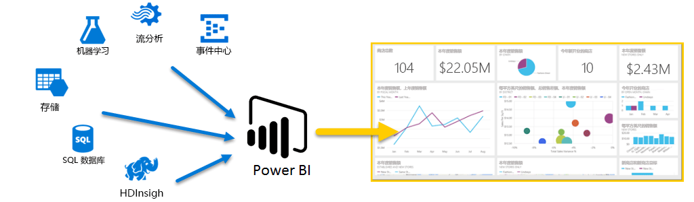
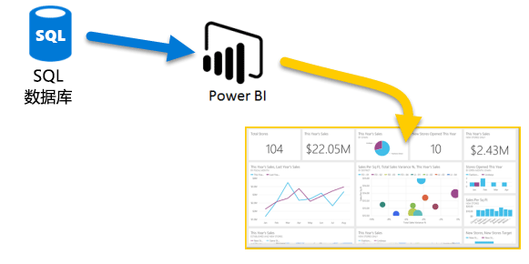
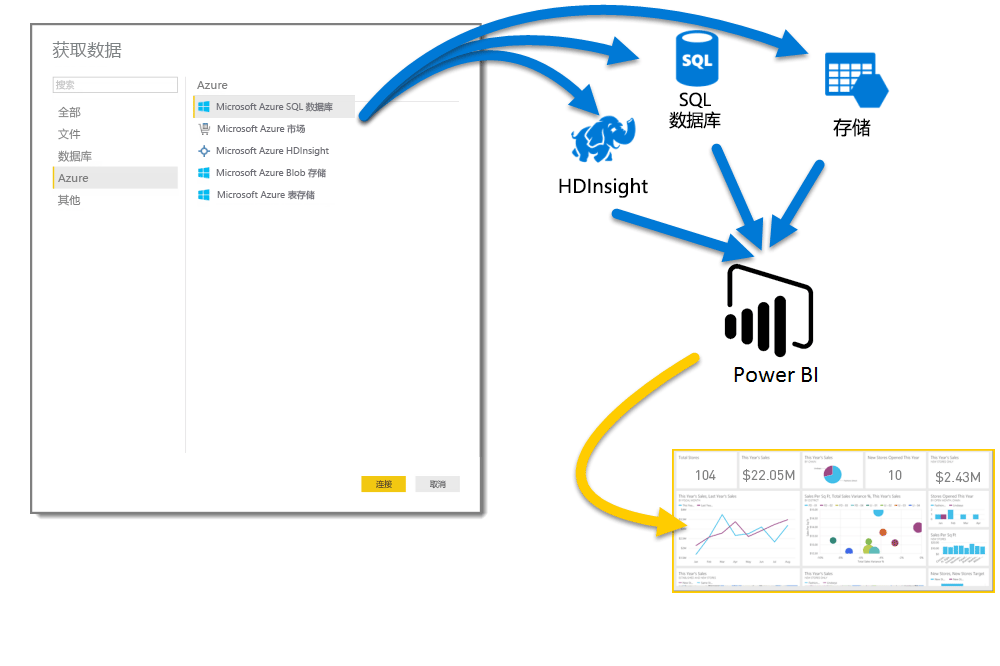
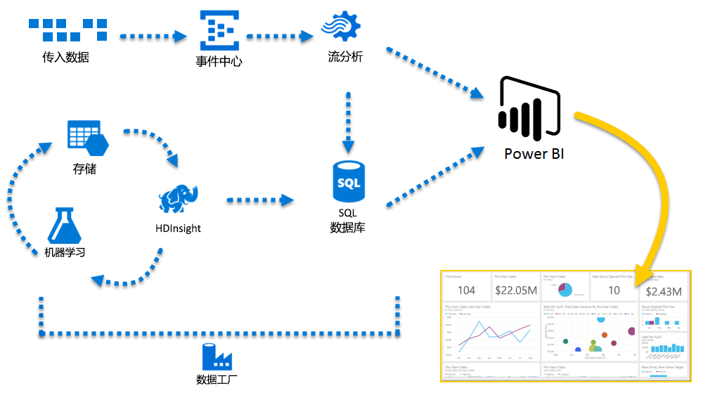

# Azure 和 Power BI
借助“Azure”服务和“Power BI”，你可以将数据处理工作转换为可以提供实时业务策略的分析和报告。 无论你处理的数据基于云还是位于本地、简单还是复杂、采用单一来源还是大量混合来源、封存还是实时的，Azure 和 Power BI 提供的内置连接和集成都可以使你的商业智能努力成为现实。

Power BI 拥有多种 Azure 连接可用，而且使用这些服务创建的商业智能解决方案与你的业务一样与众不同。 你可以连接至少一个 Azure 数据源，也可连接多个，然后对数据进行调整和优化以创建自定义报表。

### Azure SQL 数据库 和 Power BI
你可以从简单的到 Azure SQL 数据库的连接开始，然后创建报表来监视业务进度。 借助 [Power BI Desktop](desktop-getting-started.md)，你可以创建报表来确定趋势和关键绩效指标，进而促进业务发展。

了解有关 [Azure SQL 数据库](http://azure.microsoft.com/services/sql-database/)的详细信息。

### 转换、调整和合并云数据
是否有更为复杂的数据，且来自各种源？ 没问题。 借助 **Power BI Desktop** 和 Azure 服务，只需点击一下“获取数据”对话框即可实现连接。 在相同的查询中，你可以连接到“Azure SQL 数据库”、“Azure HDInsight”数据源和“Azure Blob 存储”（或“Azure 表存储”，然后只选择每个源中你需要的子集，并在其中进行优化。

你也可以使用相同的数据连接甚至相同的查询为不同受众创建不一样的报表。 只需生成新的报表页、针对每个受众优化可视化组件，然后就可以目睹报表对业务信息的持续反馈。

有关详细信息，请参阅以下资源：

* [Azure SQL 数据库](http://azure.microsoft.com/services/sql-database/)
* [Azure HDInsight](http://azure.microsoft.com/services/hdinsight/)
* [Azure 存储](http://azure.microsoft.com/services/storage/)（Blob 存储和表存储）

### 借助 Azure 服务和 Power BI 深入并领先行业。
你可以根据需要拓展 Azure 和 Power BI 的功能。 使用多源数据处理、利用大量的实时系统，借助[流分析](http://azure.microsoft.com/services/stream-analytics/)和[事件中心](http://azure.microsoft.com/services/event-hubs/)，将各种 SaaS 服务合并到商业智能报表以增加你的业务优势。

### 使用 Power BI API 连接应用程序数据
你还可以在现有的应用程序中使用 Power BI 来获取策略。 借助 Power BI API，应用程序开发人员可以将全部数据集以编程的方式发送到 Power BI。 需要持续更新？ 借助 Power BI API，开发人员可以发送实时数据更新以快速启动，然后根据规模需求，转为使用 Azure 流分析。

在 [Power BI 开发人员门户](http://dev.powerbi.com)中查看 Power BI API 的详细信息。 你还可以通过 [Power BI 开发人员博客](http://blogs.msdn.com/powerbidev)了解其他人利用 Power BI 以编程方式进行的操作。 还有一个网页专门致力于[帮助你实现 Power BI 研发快速入门](https://msdn.microsoft.com/library/dn889824.aspx)。

### Azure 和 Power BI 可以用来做什么？
**Azure** 和 **Power BI** 可以在各种场景下组合，其可能性和机遇与你的业务一样独一无二。 有关“Azure 服务”的详细信息，请查看此[概览页](http://go.microsoft.com/fwlink/?LinkId=535031&clcid=0x409)，其中会介绍**使用 Azure 的数据分析场景**，并可以了解如何将数据源转换为推动业务的信息。

