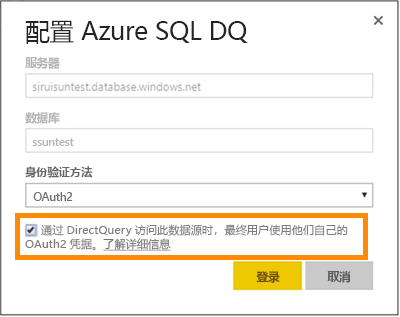
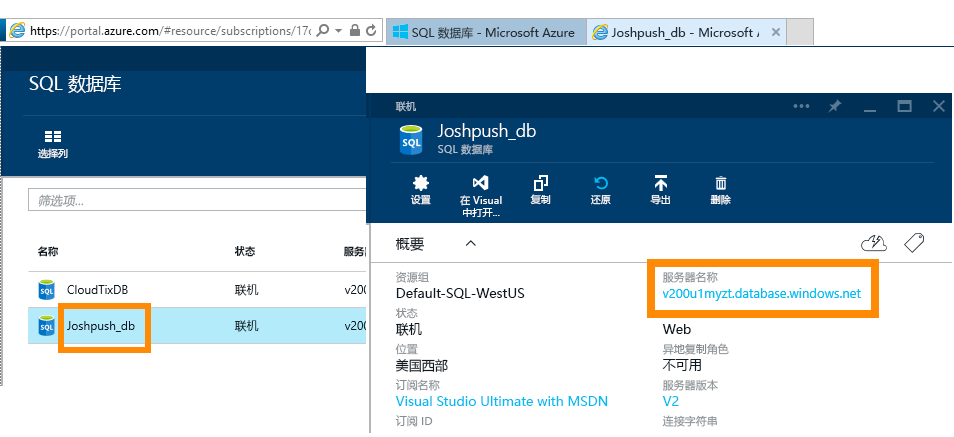
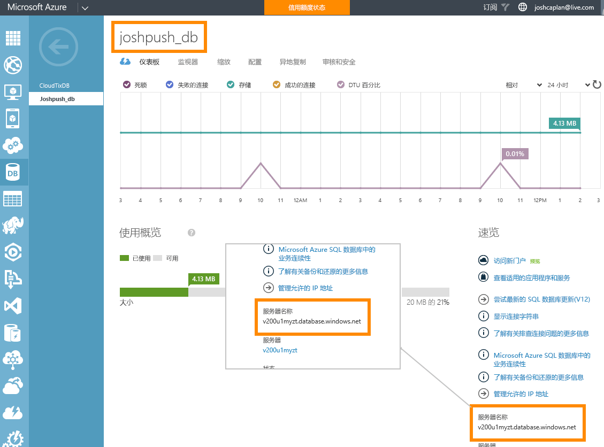

# 具有 DirectQuery 的 Azure SQL 数据库
了解如何直接连接到 Azure SQL 数据库并使用实时数据创建报表。 你可以在源中（不是在 Power BI 中）保存数据。

借助 DirectQuery，查询会在你浏览报表视图中的数据时发送回 Azure SQL 数据库。 对于熟悉数据库以及它们连接到的实体的用户，建议使用此体验。

**注意：**

* 在连接时指定完全限定的服务器名称（请参阅下文以了解详细信息）
* 确保数据库的防火墙规则配置为[允许访问 Azure 服务](https://msdn.microsoft.com/library/azure/ee621782.aspx)。
* 每个操作（例如选择列或添加筛选器）都会将查询发送回数据库
* 磁贴每小时刷新一次（刷新不需要进行计划）。 连接时可以在“高级设置”中对此进行调整。
* 问答不可用于 DirectQuery 数据集
* 不会自动选取架构更改

随着我们继续改进体验，这些限制和说明可能会发生变化。 下面详细介绍了用于连接的步骤。 

## Power BI Desktop 和 DirectQuery
若要使用 DirectQuery 连接到 Azure SQL 数据库，则必须使用 Power BI Desktop。 这种方法具有更高的灵活性和更多功能。 使用 Power BI Desktop 创建的报表随后可以发布到 Power BI 服务。 可了解如何在 Power BI Desktop 内[使用 DirectQuery 连接到 Azure SQL 数据库](desktop-use-directquery.md)的详细信息。 

## 单一登录

将 Azure SQL DirectQuery 数据集发布到服务后，可以通过 Azure Active Directory (Azure AD) OAuth2 为最终用户启用单一登录 (SSO)。 

若要启用 SSO，请转到数据集的设置，打开“数据源”选项卡，然后选中“SSO”框。

启用“SSO”选项后，如果用户访问基于数据源生成的报表，则 Power BI 会在查询中将这些用户的已经过身份验证的 Azure AD 凭据发送到 Azure SQL 数据库。 这样，Power BI 便可以遵守在数据源级别配置的安全设置。

SSO 选项针对使用此数据源的所有数据集生效。 它不影响用于导入方案的身份验证方法。

## 查找参数值
可以在 Azure 门户中找到你的完全限定的服务器名称和数据库名称。

## 后续步骤
[在 Power BI Desktop 中使用 DirectQuery](desktop-use-directquery.md)  
[Power BI 入门](service-get-started.md)  
[获取 Power BI 的数据](service-get-data.md)  
更多问题？ [尝试参与 Power BI 社区](http://community.powerbi.com/)
