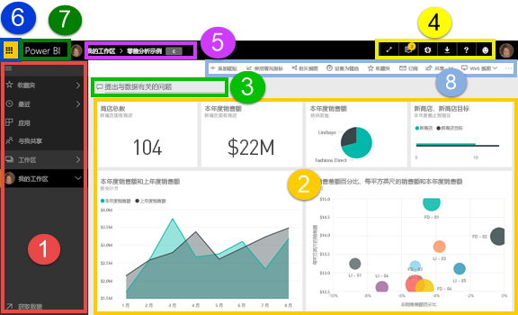
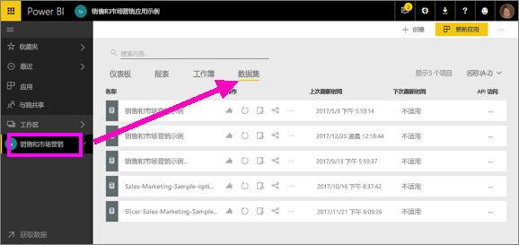
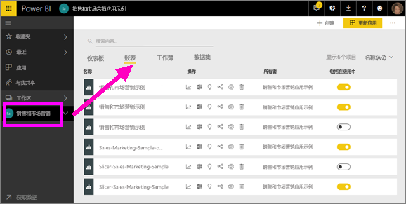
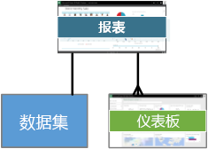
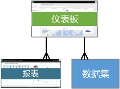
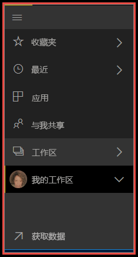
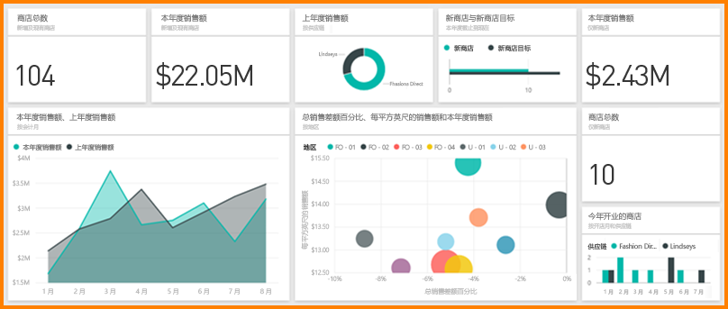

# Power BI - Power BI 服务的基本概念

本文假设你已[注册 Power BI 服务](service-self-service-signup-for-power-bi.md)，且已[添加了一些数据](service-get-data.md)。

打开 Power BI 服务后，将看到显示一个***仪表板***。 仪表板可以区分 Power BI 服务和 Power BI Desktop。

Power BI 服务 UI 的主要功能如下：

1. 左侧导航窗格
2. 画布（在本例中为包含磁贴的仪表板）
3. 问题解答问题框
4. 图标按钮（包括帮助和反馈）
5. 仪表板标题（导航路径，也称为痕迹导航）
6. Office 365 应用程序启动程序
7. Power BI 主页按钮
8. 带标签的图标按钮

我们稍后将深入了解这些操作，不过首先让我们了解一些 Power BI 概念。

或者，你可能想要在阅读本文的剩余部分前先观看该视频。  在视频中，Will 回顾基本概念并提供 Power BI 服务的教程。

<iframe width="560" height="315" src="https://www.youtube.com/embed/B2vd4MQrz4M" frameborder="0" allowfullscreen></iframe>

## Power BI 概念
Power BI 的 4 个主要构建基块包括：仪表板、报表和工作簿和数据集。 这些基块一起组织成工作区。 在深入了解 4 个构建基块之前，我们必须先了解工作区。 

## 工作区
工作区是 Power BI 中仪表板、报表、工作簿和数据集的容器。 有两种类型的工作区：*“我的工作区”和应用工作区。 什么是应用？ Power BI 应用是仪表板和报表的集合，生成应用的目的是为组织提供关键指标。 应用是交互性的，但不可编辑 

- “我的工作区”是个人工作区，任何 Power BI 客户在其中处理其内容。 只有你自己才有权访问你的工作区。 如果你想要共享任何内容，可以采用多种做法：创建一个应用工作区并在其中将内容捆绑到某个应用，然后向组织中的其他人提供此内容；或者创建一个应用工作区，并向同事授予对该工作区的访问权限，以便你们可以共享内容和展开协作。     
-  应用工作区用于与同事展开协作和共享内容。 也可以在其中为组织创建、发布和管理应用。 可将应用工作区视为构成 Power BI 应用的内容的暂存区域和容器。 可将同事添加到应用工作区，然后在仪表板、报表、工作簿和数据集方面进行协作。 所有应用工作区成员需要 Power BI Pro 许可证，但应用使用者（有权访问应用的同事）不一定需要 Pro 许可证。  

若要了解详细信息，请参阅“目录”中的**共享工作**部分，并从[如何展开协作和共享仪表板与报表](service-how-to-collaborate-distribute-dashboards-reports.md)开始

现在，让我们继续了解 Power BI 构建基块。 仪表板或报表不能没有数据（嗯，你可以有空仪表板和空报表，但是必须具有数据，它们才会有用），因此，让我们先来了解一下数据集吧。

## 数据集
数据集是导入或连接到的数据集合。 通过 Power BI，你可以连接到并导入各种类型的数据集并将它们组合在一起。  

数据集与工作区相关联，单个数据集可以包含在多个工作区中。 打开某个工作区时，关联的数据集会列在“数据集”选项卡下面。每个列出的数据集表示一个数据源，例如，OneDrive 上的 Excel 工作簿，或本地 SSAS 表格数据集或 Salesforce 数据集。 支持许多不同的数据源，并且我们一直在添加新的数据源。 [请参阅可与 Power BI 一起使用的数据集类型列表](service-get-data.md)。

在下面的示例中，我已选择“销售和市场营销”应用工作区，并单击了“数据集”选项卡。

**一个**数据集...

* 可在一个或多个工作区中反复使用。
* 可以用于许多不同的报表。
* 可以在许多不同的仪表板上显示该数据集的可视化对象。
  
  

若要[连接或导入数据集](service-get-data.md)，请选择“获取数据”（左侧导航栏底部），或者选择“+ 创建”>“数据集”（右上角）。 按照说明连接到或导入特定的源，并将该数据集添加到活动的工作区。 新的数据集项目带有黄色星号标记。 你在 Power BI 中所做的工作不会更改基础数据集。

如果你是[应用工作区的一部分](service-collaborate-power-bi-workspace.md)，一个工作区成员添加的数据集也可供其他工作区成员使用。

可以刷新、重命名、浏览和删除数据集。 使用数据集从头开始创建报表，或运行[快速见解](service-insights.md)创建报表。  若要查看哪些报表和仪表板已使用数据集，请选择“查看相关项”。 若要浏览数据集，请选择数据集。 你实际执行的操作是在报表编辑器中打开数据集，在报表编辑器中，你可以真正开始深入了解数据并创建可视化对象。 那么，我们进入下一个主题 -- 报表。

### 深入了解
* [什么是 Power BI Premium？](service-premium.md)
* [获取 Power BI 的数据](service-get-data.md)
* [Power BI 的示例数据集](sample-datasets.md)

## 报表
Power BI 报表是一页或多页可视化效果（折线图、饼图、树状图等图表和图形）。 可视化效果也称为视觉对象。 报表中所有可视化对象来自单个数据集。 可以在 Power BI 中从头开始创建报表，可以使用同事与你共享的仪表板导入报表，也可以在从 Excel、Power BI Desktop、数据库、SaaS 应用程序和[应用](service-get-data.md)连接到数据集时创建报表。  例如，当你连接到包含 Power View 表的 Excel 工作簿时，Power BI 将基于这些表创建报表。 当连接到 SaaS 应用程序时，Power BI 将导入预先构建的报表。

有两种模式可用来查看报表并与之交互：[阅读视图和编辑视图](service-reading-view-and-editing-view.md)。  只有创建报表的人员、共同所有者以及被授权的那些人员有权访问该报表编辑视图的所有浏览、设计、构建和共享功能。 他们共享报表的对象可以使用阅读视图了解报表并与之进行交互。   

打开某个工作区时，关联的报表会列在“报表”选项卡下面。每个列出的报表代表只基于其中一个基础数据集的一页或多页可视化对象。 若要打开报表，只需选择报表即可。 

打开某个应用时，会同时显示一个仪表板。  若要访问基础报表，请选择从报表固定的仪表板磁贴（稍后将详细介绍）。 请记住，并非所有磁贴都是从报表固定的，因此，可能需要单击几个磁贴才能找到所需的报表。 

默认情况下，报表将在“阅读”视图中打开。  只需选择“编辑报表”即可将其在编辑视图下打开（如果有所需的权限）。 

在下面的示例中，我已选择“销售和市场营销”应用工作区，并单击了“报表”选项卡。

**一个**报表...

* 包含在单个工作区中
* 可与该工作区中的多个仪表板关联（从该报表固定的磁贴可以显示在多个仪表板上）。
* 可以使用来自一个数据集的数据进行创建。 （一个小例外是 Power BI Desktop 可以将多个数据集组合到一个报表中，该报表可以导入到 Power BI）
  
  

### 深入了解
* [Power BI 服务和 Power BI Desktop 中的报表](service-reports.md)
* [Power BI 移动应用中的报表](mobile-reports-in-the-mobile-apps.md)

## 仪表板
可以**在 Power BI 服务中**创建仪表板，或者由同事**在 Power BI 服务中**创建仪表板并与你共享。 它是一个画布，其中包含零个或多个磁贴和小组件。 从报表或[问答](service-q-and-a.md)固定的每个磁贴显示通过数据集创建并固定到仪表板的单个[可视化对象](power-bi-report-visualizations.md)。 可将整个报表页作为单个磁贴固定到仪表板。 有多种方法可将磁贴添加到仪表板中，本概述主题中将会介绍很多。 若要了解详细信息，请参阅 [Power BI 中的仪表板磁贴](service-dashboard-tiles.md)。 

人们为什么创建仪表板？  下面只是其中一些原因：

* 为了快速查看做出决策所需的所有信息
* 为了监视有关业务的最重要信息
* 为了确保同一页面上的所有同事均查看和使用相同的信息
* 为了监视业务、产品、业务部门或市场营销活动的运行状况。
* 为了创建更大仪表板的个性化视图（所有指标都很重要）

打开某个工作区时，关联的仪表板会列在“仪表板”选项卡下面。选择某个仪表板即可将它打开。 打开某个应用时，会同时显示一个仪表板。  每个仪表板代表一个自定义视图，其中包含基础数据集的某个子集。  如果你拥有该仪表板，则还对基础数据集和报表拥有编辑访问权限。  如果仪表板是共享的，则可与仪表板和任何基础报表交互，但无法保存任何更改。

你或者同事可以通过多种不同的方式[共享仪表板](service-share-dashboards.md)。 共享仪表板时需要 Power BI Pro，查看共享的仪表板时可能也需要它。

> [!NOTE]
> “包含磁贴的仪表板”标题下更详细地介绍了固定和磁贴。
> 

**一个**仪表板...

* 与单个工作区相关联
* 可以显示来自许多不同数据集的可视化对象
* 可以显示来自许多不同报表的可视化对象
* 可以显示在其他工具（例如 Excel）中固定的可视化对象
  
  

### 深入了解
* [创建新的空白仪表板并获取一些数据](service-dashboard-create.md)
* [复制仪表板](service-dashboard-copy.md) 
* [创建仪表板电话视图](service-create-dashboard-mobile-phone-view.md)

## 工作簿
工作簿是特殊类型的数据集。 如果你已阅读前面的**数据集**部分，则大致已了解有关工作簿的所有信息。 但你可能想要知道，为何 Power BI 有时将 Excel 工作簿分类为**数据集**，而有时又将它分类为**工作簿**。 

对 Excel 文件使用“获取数据”时，可以选择“导入”或“连接”文件。 选择“连接”时，工作簿会显示在 Power BI 中，就像在 Excel Online 中那样。 但与 Excel Online 不同，你会有一些出色的功能，可帮助你将各元素从你的工作表固定仪表板中。

不能在 Power BI 中编辑你的工作簿。 但是，如果你需要进行一些更改，你可以单击“编辑”，然后选择在 Excel Online 中编辑你的工作簿或在计算机上的 Excel 中打开工作簿。 你所作的任何更改都会保存到 OneDrive 上的工作簿中。

### 深入了解
* [从 Excel 工作簿文件中获取数据](service-excel-workbook-files.md)
* [从 Excel 发布到 Power BI](service-publish-from-excel.md)

## 我的工作区
前面已介绍工作区和构建基块。 接下来，让我们再看看 Power BI 的界面，并了解构成 Power BI 服务登陆页面的各个部分。

### 1.**导航窗格**（左侧）
使用导航窗格可在工作区与 Power BI 构建基块（仪表板、报表、工作簿和数据集）之间定位和切换。  

  

* 选择“获取数据”，以[将数据集、报表和仪表板添加到 Power BI](service-get-data.md)。
* 使用此图标  展开和折叠导航栏。
* 选择“收藏夹”可以打开或管理收藏的内容。
* 选择“最近”可以查看和打开最近访问的内容。
* 选择“应用”可以查看、打开或删除某个应用。
* 同事是否与你共享了内容？ 选择“与我共享”可以搜索和排序内容，以找到所需的内容。
* 选择“工作区”可以显示和打开工作区。

单击

* 某个图标或标题可在内容视图中打开内容
* 向右箭头 (>) 可以打开“收藏夹”、“最近”和“工作区”的浮出菜单。 
* V 形图标 () 可以显示包含仪表板、报表、工作簿和数据集的“我的工作区”滚动列表。
* 数据集可浏览数据集

### 2.**画布** 
由于我们打开了一个仪表板，画布区域中显示了可视化对象磁贴。 例如，如果我们已打开报表编辑器，则画布区域会显示报表页。 

仪表板由[磁贴](service-dashboard-tiles.md)组成。  磁贴在报表编辑视图、问答和其他仪表板中创建，并且可从 Excel、SSRS 等应用中进行固定。 称为[小组件](service-dashboard-add-widget.md)的特殊类型的磁贴将直接添加到仪表板中。 显示在仪表板上的磁贴是由报表创建者/所有者专门放在仪表板上的。  向仪表板添加磁贴的操作称为固定。

有关详细信息，请参阅仪表板（上述）。

### 3.问题解答问题框
浏览你数据的一种方法是提出问题并让 Power BI 问题与解答为你提供答案（采用可视化对象的形式） 可以使用问答将内容添加到仪表板或报表。

问题与解答会在连接到仪表板的数据集中查找答案。  已连接的数据集是至少有一个磁贴固定到仪表板的数据集。

开始键入问题后，问题与解答将带你进入问题与解答页面。 键入时，问题与解答将帮助你询问相应的问题并通过改换、自动填充、建议以及更多功能来查找最佳答案。 当你拥有想要的可视化对象（答案）时，将其固定到仪表板中。 有关详细信息，请参阅 [Power BI 中的问题与解答](service-q-and-a.md)。

### 4.**图标按钮** 
右上角的图标是用于指定设置、获取通知、下载内容、帮助以及向 Power BI 团队提供反馈的资源。 选择双箭头以全屏 模式打开仪表板。  

### 5.**仪表板标题**（导航路径，也称为痕迹导航）
有时，我们难以判断哪个工作区和仪表板处于活动状态，为此，Power BI 将会创建导航路径。  在本示例中，可以看到工作区（“我的工作区”）和仪表板标题（“零售分析示例”）。  如果我们打开了某个报表，该报表的名称将追加到导航路径的末尾。  路径的每个部分是活动的超链接。  

请注意仪表板标题后面的“C”图标。 此仪表板包含“机密”类型的[数据分类标记](/service-data-classification.md)。 标记确定数据的敏感度和安全级别。 如果管理员已启用数据分类，则每个仪表板中都会设置一个默认标记。 仪表板所有者应根据其仪表板的适当安全性级别更改该标记。

### 6.Office 365 应用启动程序
使用应用启动程序，只需单击一下鼠标，就能轻松访问所有 Office 365 应用。 在应用启动程序中，可以快速启动电子邮件、文档、日历和其他应用。 

### 7.Power BI 主页
选择此项会打开[特色仪表板](service-dashboard-featured.md)（如果已设置），否则会打开上次查看过的仪表板。

   

### 8.**带标签的图标按钮**
此屏幕区域包含用来与内容（在本例中为仪表板）交互的其他选项。  除了显示的带标签图标以外，还可以选择省略号来显示用于复制、打印和刷新仪表板和其他内容的选项。

   

## 后续步骤
[Power BI 入门](service-get-started.md)  
[Power BI 视频](videos.md)  
[报表编辑器 - 教程](service-the-report-editor-take-a-tour.md)

更多问题？ [尝试咨询 Power BI 社区](http://community.powerbi.com/)

