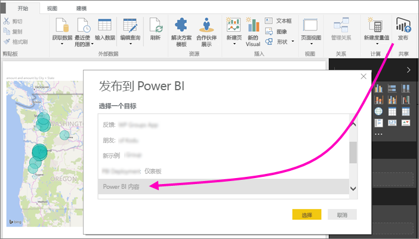
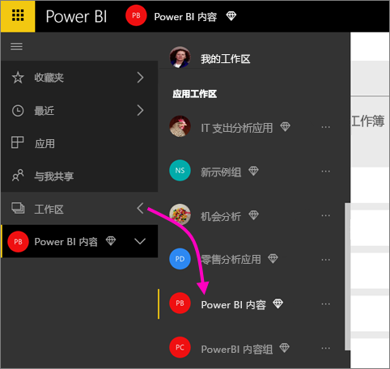
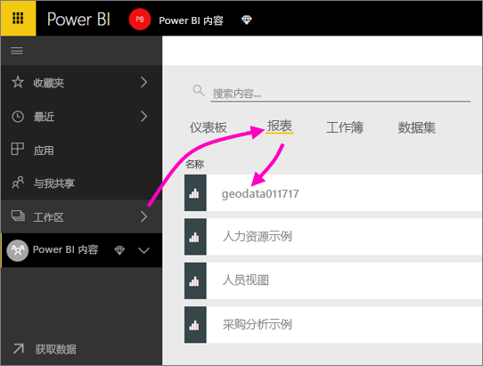
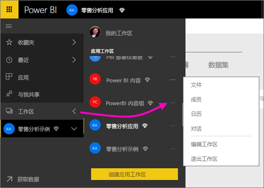
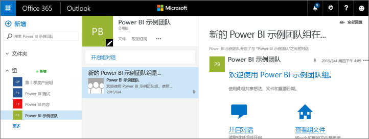
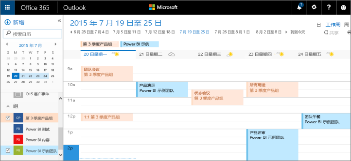

# 在 Power BI 应用工作区中展开协作
Power BI 应用工作区是在仪表板、报表和数据集上与同事协作以创建应用的好地方。 协作并不限于在 Power BI 中的工作区内进行。 Office 365 提供其他组服务，如共享 OneDrive for Business 上的文件、Exchange 中的对话、共享日历和任务等。 了解有关 [Office 365 中的组](https://support.office.com/article/Create-a-group-in-Office-365-7124dc4c-1de9-40d4-b096-e8add19209e9)的详细信息。

> [!NOTE]
> 新工作区体验预览将更改 Power BI 工作区与 Office 365 组之间的关系。 每次创建新工作区时，不会自动创建 Office 365 组。 了解如何[创建新工作区（预览版）](service-create-the-new-workspaces.md)

应用工作区仅适用于 [Power BI Pro](service-free-vs-pro.md)。

## 在应用工作区中的 Power BI Desktop 文件上展开协作
创建 Power BI Desktop 文件后，如果你将该文件发布到 Power BI 应用工作区，则工作区中的每个人都可以在其上展开协作。

1. 在 Power BI Desktop 中，在“开始”功能区上选择“发布”，然后在“选择目标”框中选择你的应用工作区。
   
    
2. 在 Power BI 服务中，选择“工作区”旁边的箭头，然后选择你的应用工作区。
   
    
3. 选择“报表”选项卡并选择你的报表。
   
    
   
    此处与 Power BI 中的任何其他报表一样。 你和应用工作区中的其他人都可以[修改报表](consumer/end-user-reports.md)，并将磁贴保存到你选择的仪表板。

## 在 Office 365 中开展协作
若要在 Office 365 中展开协作，请从 Power BI 中的应用工作区入手。

1. 在 Power BI 服务中，选择“工作区”旁边的箭头，然后选择你的工作区名称旁边的省略号（“…”）。 
   
   
2. 在此菜单中，可以通过以下几种方法来与组进行协作： 
   
   * [在 Office 365 中建立组对话](service-collaborate-power-bi-workspace.md#have-a-group-conversation-in-office-365)。
   * 在应用的组工作区日历上[安排活动](service-collaborate-power-bi-workspace.md#schedule-an-event-on-the-group-workspace-calendar)。
   
   当你首次前往你在 Office 365 中的应用组工作区时，可能需要一些时间。 等候 15 到 30 分钟，然后刷新浏览器。

## 在 Office 365 中建立组对话
1. 选择应用工作区名称旁边的省略号 (…) \> 然后选择“对话”。 
   
    
   
   这会打开在 Outlook for Office 365 中打开应用的组工作区的电子邮件和对话站点。
   
   
2. 了解有关 [Outlook for Office 365 中的组对话](https://support.office.com/Article/Have-a-group-conversation-a0482e24-a769-4e39-a5ba-a7c56e828b22)的详细信息。

## 在应用的组工作区日历上安排活动
1. 选择应用工作区名称旁的省略号（“…”） \> 然后选择“成员”。 
   
   
   
   这会在 Outlook for Office 365 中打开应用的组工作区的日历。
   
   
2. 了解有关 [Outlook in Office 365 中的组日历](https://support.office.com/Article/Add-edit-and-subscribe-to-group-events-0cf1ad68-1034-4306-b367-d75e9818376a)的详细信息。

## 管理应用工作区
如果你是应用工作区的所有者或管理员，还可以添加或删除工作区成员。 了解有关[管理 Power BI 应用工作区](service-manage-app-workspace-in-power-bi-and-office-365.md)的详细信息。

## 后续步骤
* [在 Power BI 中创建应用和应用工作区](consumer/end-user-create-apps.md)
* 更多问题？ [尝试参与 Power BI 社区](http://community.powerbi.com/)
* 想要提供反馈？ 请访问 [Power BI Ideas](https://ideas.powerbi.com/forums/265200-power-bi)

