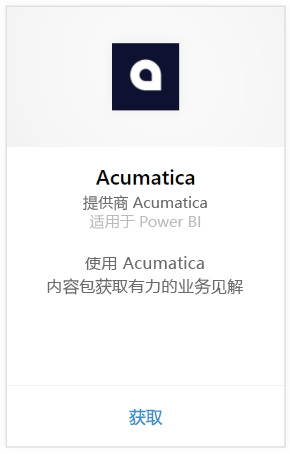
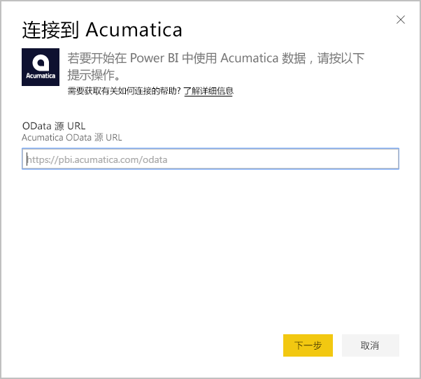
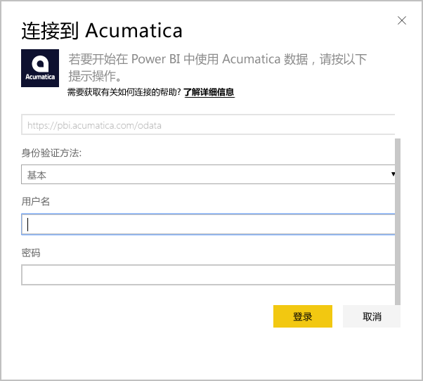
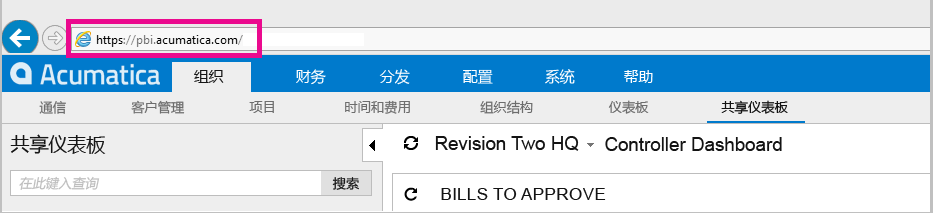
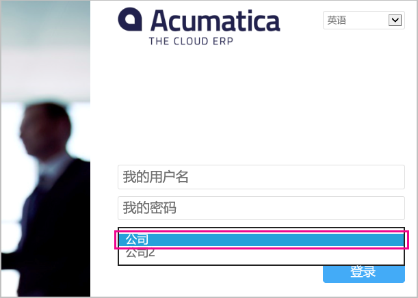

# 使用 Power BI 连接到 Acumatica
通过 Power BI Acumatica 内容包可以快速深入了解商机数据。 Power BI 会检索数据（包括商机、帐户和客户），然后生成默认仪表板以及基于该数据的相关报表。

连接到 [Acumatica 内容包](https://app.powerbi.com/getdata/services/acumatica)，或了解有关 [Acumatica 与 Power BI 的集成](https://powerbi.microsoft.com/integrations/acumatica)的详细信息。

>[!NOTE]
>此内容包需要 Acumatica v5.2 或更高版本。

## 如何连接
1. 选择左侧导航窗格底部的**获取数据**。
   
   
2. 在**服务**框中，选择**获取**。
   
   
3. 选择 **Acumatica** \> **获取**。
   
   
4. 输入 Acumatica OData 终结点。 OData 终结点允许外部系统从 Acumatica 请求数据。 Acumatica OData 终结点按如下所示设置格式，应使用 HTTPS：
   
     https://[sitedomain]/odata/[companyname]
   
   仅当具有多公司部署时才需要公司名称。 下面包含有关在 Acumatica 帐户中查找此参数的详细信息。
   
   
5. 对于身份验证方法，选择**基本**。 输入来自 Acumatica 帐户的用户名和密码，然后单击**登录**。
   
    
6. Power BI 导入数据后，你将在左侧的导航窗格中看到新的仪表板、报表和数据集。 新的项目会以黄色星号 \* 进行标记（在选择之后会消失），选择仪表板会显示类似于下面这样的布局：
   
    

**下一步？**

* 尝试在仪表板顶部的[在“问答”框中提问](power-bi-q-and-a.md)
* 在仪表板中[更改磁贴](service-dashboard-edit-tile.md)。
* [选择磁贴](service-dashboard-tiles.md)以打开基础报表。
* 虽然数据集将按计划每日刷新，你可以更改刷新计划或根据需要使用**立即刷新**来尝试刷新

## 系统要求
此内容包需要 Acumatica v5.2 或更高版本，请向 Acumatica 管理员确认版本。

## 查找参数
**Acumatica OData 终结点**

Acumatica OData 终结点按如下所示设置格式，应使用 HTTPS：

    https://[sitedomain]/odata/[companyname]

登录 Acumatica 时，可以在浏览器的地址栏中找到应用程序站点域。 在下面的示例中，站点域是“https://pbi.acumatica.com”，因此要提供的 OData 终结点会是“https://pbi.acumatica.com/odata”。

 

仅当具有多公司部署时才需要公司名称。 从 Acumatica 登录页面中可以找到此信息。

## 故障排除
如果你无法登录，请验证你提供的 Acumatica OData 终结点的格式是否正确。

    https://<application site domain>/odata/<company name>

如果你遇到连接问题，请向管理员确认你的 Acumatica 版本。 此内容包需要版本 5.2 或更高版本。

## 后续步骤
[Power BI 入门](service-get-started.md)

[在 Power BI 中获取数据](service-get-data.md)

