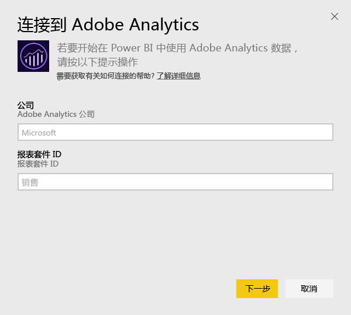
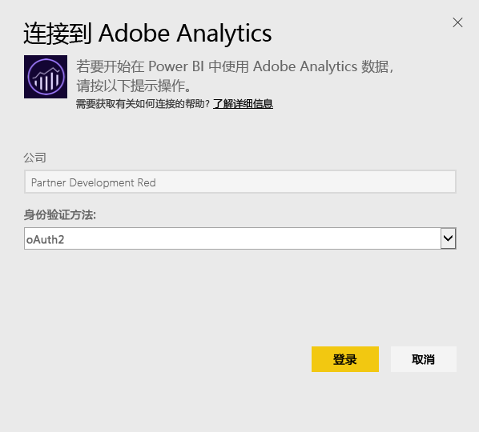
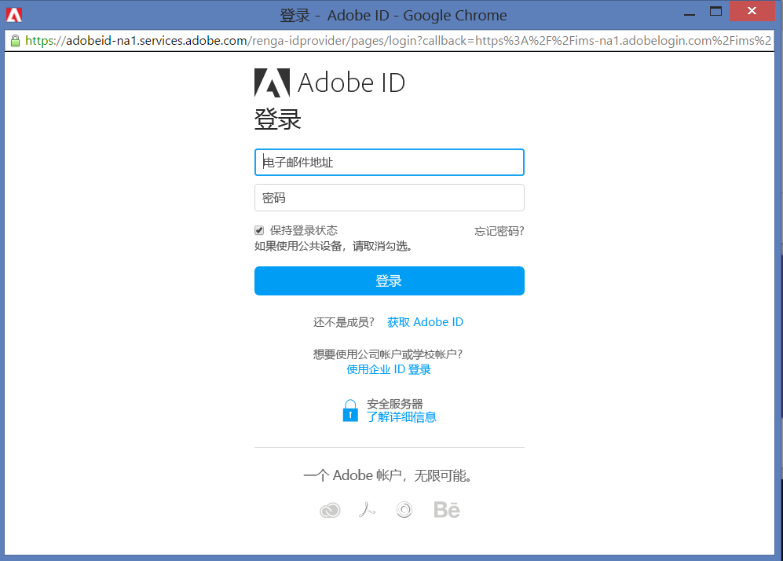
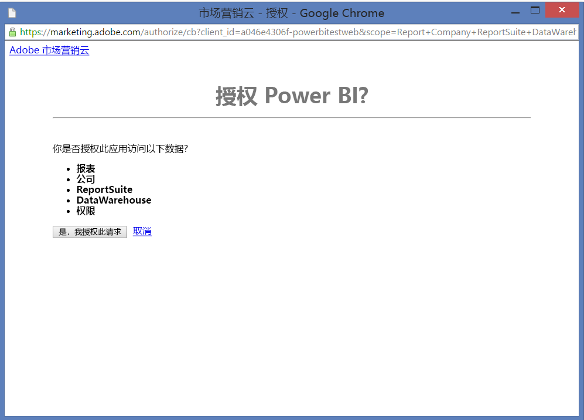
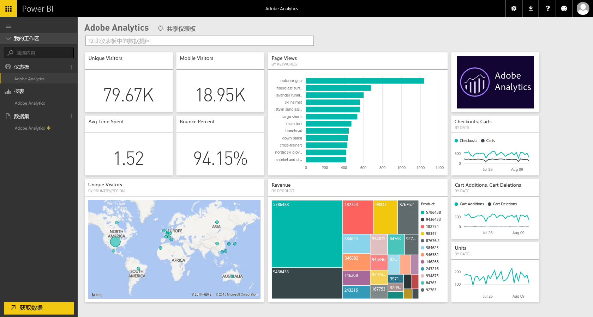
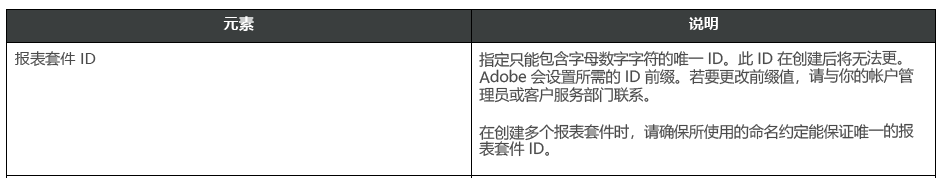

# 使用 Power BI 连接到 Adobe Analytics
通过 Power BI 连接到 Adobe Analytics 首先会连接到你的 Adobe Analytics 市场营销云帐户。 你将获得一个带 Power BI 仪表板和一组 Power BI 报表的应用，这些报表会提供网站流量和用户维度的相关见解。 此数据每天自动刷新一次。 可以与仪表板和报表进行交互，但不能保存更改。

连接到 [Adobe Analytics](https://app.powerbi.com/getdata/services/adobe-analytics)，或阅读有关使用 Power BI 进行 [Adobe Analytics 集成](https://powerbi.microsoft.com/integrations/adobe-analytics)的详细信息。

## 如何连接
[!INCLUDE [powerbi-service-apps-get-more-apps](./includes/powerbi-service-apps-get-more-apps.md)]

1. 选择**Adobe Analytics** \> **获取**。
   
   
2. Power BI 连接到特定 Adobe Analytics 公司和报表套件 ID（而不是报表套件名称）。 请参阅下面有关[查找这些参数](#FindingParams)的详细信息。
   
   
3. 对于**身份验证方法**，选择**oAuth2**\>**登录**。 出现提示时，输入 Adobe Analytics 凭据。 
   
    
   
    
4. 单击**接受**以允许 Power BI 访问你的 Adobe Analytics 数据。
   
   
5. 在你批准后，导入过程会自动开始。 

## 查看 Adobe Analytics 仪表板和报表
[!INCLUDE [powerbi-service-apps-open-app](./includes/powerbi-service-apps-open-app.md)]

      

[!INCLUDE [powerbi-service-apps-open-app](./includes/powerbi-service-apps-what-now.md)]

## 包含的内容
Power BI 使用 Adobe Analytics 报表 API 为以下表定义和运行报表：

| **表名** | **列详细信息** |
| --- | --- |
| 产品 |elements=  "product" (top 25)   metrics="cartadditions", "cartremovals", "carts", "cartviews", "checkouts", "revenue", "units" |
| 浏览器 |elements= "browser" (top 25)   metrics="bounces", "bouncerate", "visitors", "visits", "uniquevisitors", "totaltimespent", "pageviews" |
| 页面 |elements= "page" (top 25)   metrics="cartadditions", "cartremovals", "carts", "cartviews", "checkouts", "revenue", "units", "visits", "uniquevisitors", "pageviews", "bounces", "bouncerate", "totaltimespent" |
| JavaScript 已启用 |elements=  "javascriptenabled”, “browser” (top 25) |
| 移动 OS |elements= "mobileos"(top 25)  metrics="bounces", "bouncerate", "visitors", "visits", "uniquevisitors", "totaltimespent", "cartadditions", "cartremovals", "checkouts", "revenue", "units", "pageviews" |
| 搜索引擎关键字 |elements= "searchengine" "searchenginekeyword"   metrics="bounces", "bouncerate", "visitors", "visits", "entries", "uniquevisitors", "totaltimespent", "cartadditions", "cartremovals", "carts", "cartviews", "checkouts", "revenue", "units", "pageviews" |
| 搜索引擎到产品 |elements= "searchengine", "product"   metrics="bounces", "bouncerate", "visitors", "visits", "entries", "uniquevisitors", "totaltimespent", "cartadditions", "cartremovals", "carts", "cartviews", "checkouts", "revenue", "units", "pageviews" |
| 引用页面 |elements= "referrer" (top 15), “page" (top 10)   metrics="bounces", "bouncerate", "visitors", "visits", "entries", "uniquevisitors", "totaltimespent", "cartadditions", "cartremovals", "carts", "cartviews", "checkouts", "revenue", "units", "pageviews" |
| Geocountry 页面 |elements= "geocountry" (Top 20), "page"   metrics="bounces", "bouncerate", "visitors", "visits", "entries", "uniquevisitors", "totaltimespent", "cartadditions", "cartremovals", "carts", "cartviews", "checkouts", "revenue", "units", "pageviews" |
| Geocountry 产品 |elements= "geocountry" (Top 20), "product"  metrics="bounces", "bouncerate", "visitors", "visits", "entries", "uniquevisitors", "totaltimespent", "cartadditions", "cartremovals", "carts", "cartviews", "checkouts", "revenue", "units" |
| 国家和地区查找 |elements= "geocountry" (Top 200)   metrics="bounces", "bouncerate", "visitors", "visits", "entries", "uniquevisitors", "totaltimespent", "cartadditions", "cartremovals", "carts", "cartviews", "checkouts", "revenue", "units" |
| 语言 |elements= "language", "browser" (Top 25)   metrics="bounces", "bouncerate", "visitors", "visits", "uniquevisitors", "totaltimespent", "pageviews", "cartadditions", "cartremovals", "checkouts", "carts", "cartviews" |
| 搜索引擎查找 |elements= "searchengine" (top 100)   metrics="bounces", "bouncerate", "visitors", "visits", "entries", "uniquevisitors", "totaltimespent", "cartadditions", "cartremovals", "carts", "cartviews", "checkouts", "revenue", "units" |
| 浏览器查找 |elements= "browser" (top 25) |

## 系统要求
需要可以访问 [Adobe Analytics](http://www.adobe.com/marketing-cloud/web-analytics.html)，包括可以按如下所述访问正确参数。

## 查找参数
**公司**

登录之后，可以在帐户右上角找到公司值。 该值区分大小写并且需要注意间距。 请完全按照帐户中显示的内容输入。

**报表套件 ID**

创建报表套件时会创建套件 ID。 可以与管理员联系以确定 ID 值。 请注意，这不是报表套件名称。

来自 Adobe [文档](https://marketing.adobe.com/resources/help/en_US/reference/new_report_suite.html)：

## 故障排除
如果你在提供凭据之后看到指示你没有权限的错误，请向管理员确认你有权访问 Adobe Analytics API。 还需确认提供的 Adobe ID 链接到市场营销云组织（关联到 Adobe Analytics 公司）。

如果你在遇到错误之前已成功通过凭据屏幕，则可能是报表完成花费的时间太长。 常见错误形式如下：*“未能从 Adobe Analytics 报表获取数据。内容包括&quot;引用方，页面&quot;，大致持续时间为 xx 秒”*。 请查看“包含的内容”部分，并与 Adobe 实例的大小进行比较。 遗憾的是，目前尚无法解决此超时问题。 但我们正考虑进行更新以支持较大实例，请在 https://ideas.powerbi.com 向我们的 Power BI 团队提供反馈

## 后续步骤
* [Power BI 中的应用有哪些？](consumer/end-user-apps.md)
* [在 Power BI 中获取数据](service-get-data.md)
* 更多问题？ [尝试咨询 Power BI 社区](http://community.powerbi.com/)

