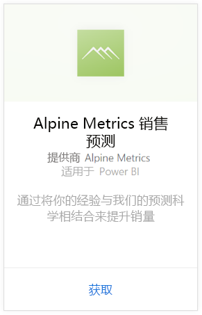
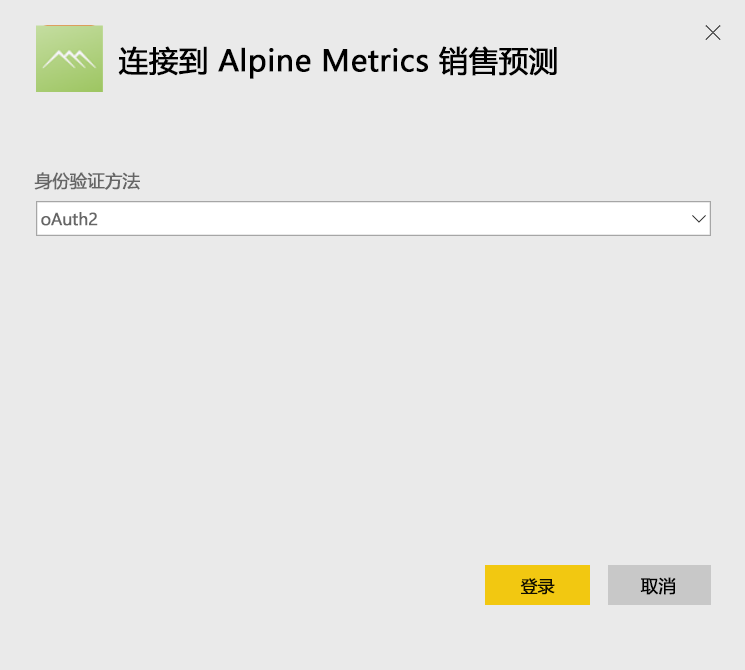
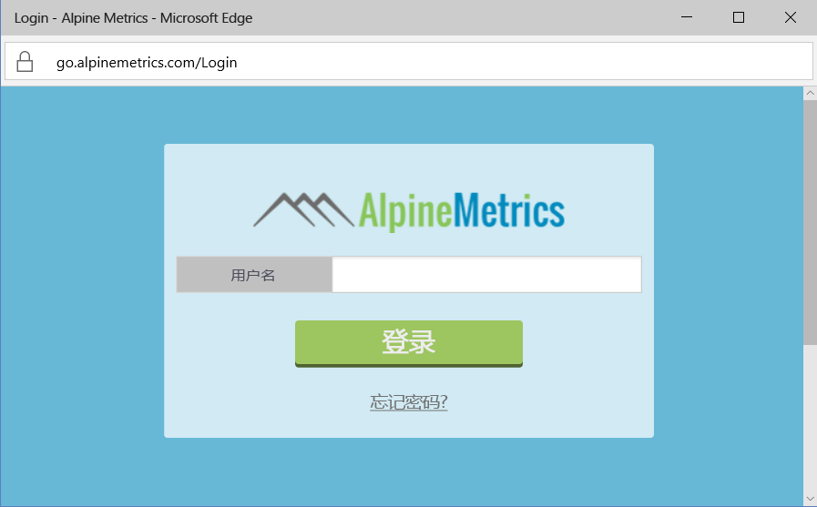
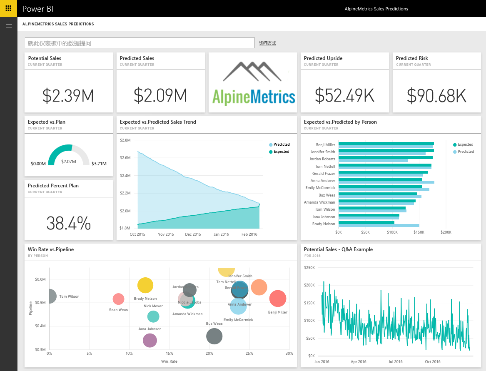

# 使用 Power BI 连接到 Alpine Metrics 销售预测
根据需要，Alpine Metrics 为不同规模大小的销售组织提供了云中的预测销售流程优化的尖端技术。 适用于 Power BI 的 Alpine Metrics 销售预测内容包包括指标，例如潜在和预测的销售和风险，从而允许你深入洞察商业前景。 

连接到适用于 Power BI 的 [Alpine Metrics 销售预测内容包](https://app.powerbi.com/getdata/services/alpine-metrics)。

## 如何连接
1. 选择左侧导航窗格底部的“获取数据”。  
   
    
2. 在**服务**框中，选择**获取**。  
   
    
3. 选择“AlpineMetrics 销售预测”，然后选择“获取”。  
   
    
4. 选择“OAuth 2”，然后选择“登录”。 出现提示时，请提供你的 AlpineMetrics 凭据。
   
    
   
    
5. 连接后，将自动加载仪表板、报表和数据集。 完成后，将使用帐户中的数据更新磁贴。
   
    

**下一步？**

* 尝试在仪表板顶部的[在“问答”框中提问](power-bi-q-and-a.md)
* 在仪表板中[更改磁贴](service-dashboard-edit-tile.md)。
* [选择磁贴](service-dashboard-tiles.md)以打开基础报表。
* 虽然数据集将按计划每日刷新，你可以更改刷新计划或根据需要使用**立即刷新**来尝试刷新

## 包含的内容
该内容包中包括来自下列表的数据：  

    - 帐户    
    - 企业    
    - 国家/地区    
    - 行业    
    - 商机  
    - 人员  
    - 预测    
    - 预测历史记录    
    - 产品  
    - 区域    

## 系统要求
为了实例化此内容包，Alpine Metrics 帐户需拥有对上表的权限。

## 后续步骤
[Power BI 入门](service-get-started.md)

[Power BI - 基本概念](service-basic-concepts.md)

