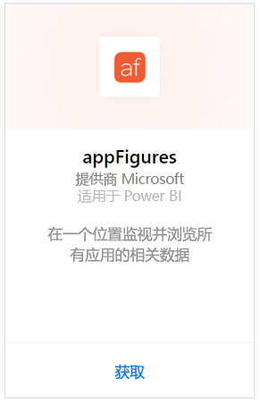
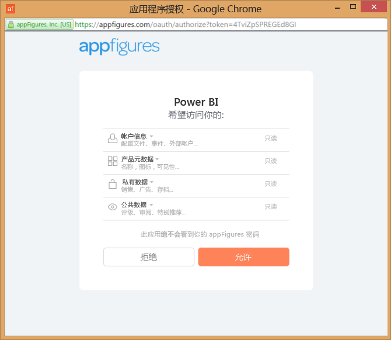
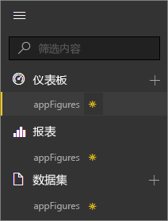
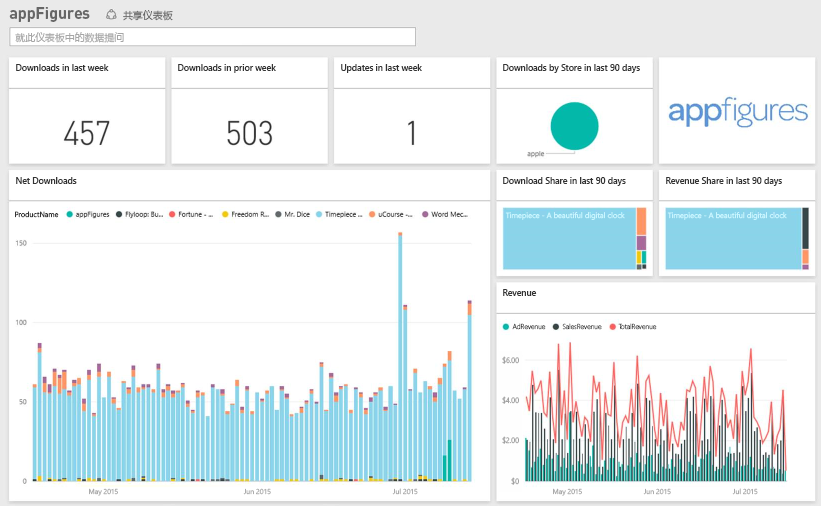
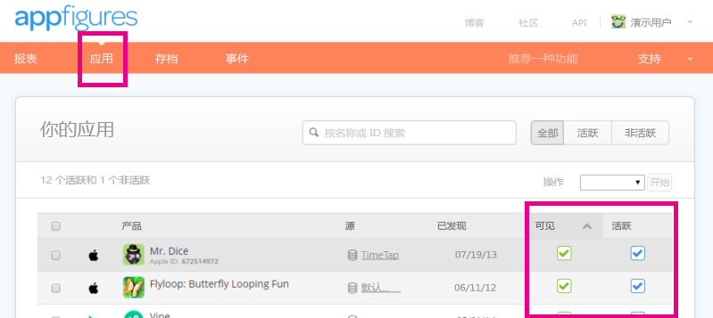

# 使用 Power BI 连接到 appFigures
可使用 Power BI 和 appFigures 内容包轻松地跟踪有关应用的重要统计信息。 Power BI 会检索数据（包括应用销售量、下载量和广告统计信息），然后生成默认仪表板以及基于该数据的相关报表。

连接到 [appFigures 内容包](https://app.powerbi.com/getdata/services/appfigures)，或了解有关 [appFigures 与 Power BI 的集成](https://powerbi.microsoft.com/integrations/appfigures)的详细信息。

## 如何连接
1. 选择左侧导航窗格底部的**获取数据**。
   
   
2. 在**服务**框中，选择**获取**。
   
   
3. 选择 **appFigures** \> **获取**。
   
   
4. 对于**身份验证方法**，选择\>oAuth2  **登录**。 出现提示时，输入 appFigures 凭据，然后按照 appFigures 身份验证过程执行。
   
   首次连接时，Power BI 会提示你允许对你的帐户进行只读访问。 选择**允许**以开始导入过程。 这可能需要几分钟时间，具体取决于你帐号中的数据量。
   
   
5. Power BI 导入数据后，你将在左侧的导航窗格中看到新的仪表板、报表和数据集。 新的项目会以黄色星号 \* 标记：
   
    
6. 选择 appFigures 仪表板。 这是 Power BI 为显示数据而创建的默认仪表板。 可以修改此仪表板以便按所需方式显示数据。
   
    

**下一步？**

* 尝试在仪表板顶部的[在“问答”框中提问](power-bi-q-and-a.md)
* 在仪表板中[更改磁贴](service-dashboard-edit-tile.md)。
* [选择磁贴](service-dashboard-tiles.md)以打开基础报表。
* 虽然数据集将按计划每日刷新，你可以更改刷新计划或根据需要使用**立即刷新**来尝试刷新

## 包含的内容
在 Power BI 中 appFigures 提供以下数据：

| **表名** | **说明** |
| --- | --- |
| 国家/地区 |此表提供国家/地区名称信息。 |
| 日期 |此表包含在 appFigures 帐户中活动和可见的应用的从当天回溯到最早 PublishDate 的日期。 |
| 事件 |此表包含每个应用每天的下载量、销售量和广告信息（按国家/地区划分）。 请注意，应用和应用内购买信息都处于此单个表中 — 你可以使用<strong>类型</strong>列进行区分。 |
| 应用内 |此表包含的数据与 appFigures 帐户中的活动、可见应用关联的应用内购买的不同类型有关。 |
| 产品 |此表包含的数据与 appFigures 帐户中的活动、可见的不同应用有关。 |

## 故障排除
如果来自某些应用的数据未在 Power BI 中显示，请检查以确保这些应用在 appFigures 站点的**应用**选项卡上可见且活动。

## 后续步骤
* [Power BI 入门](service-get-started.md)
* [在 Power BI 中获取数据](service-get-data.md)

