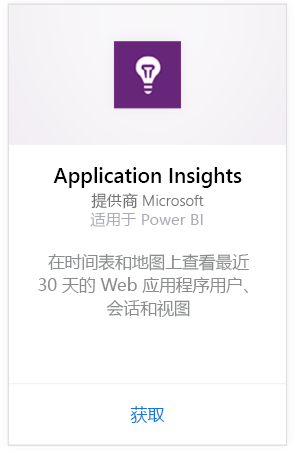
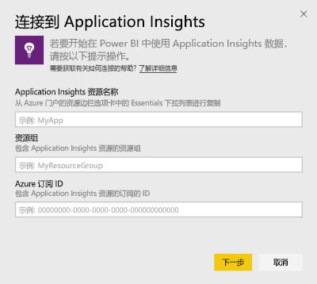
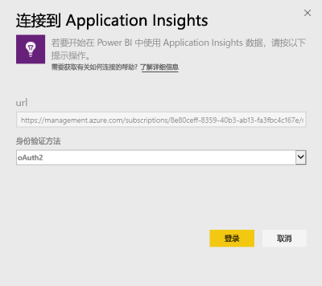
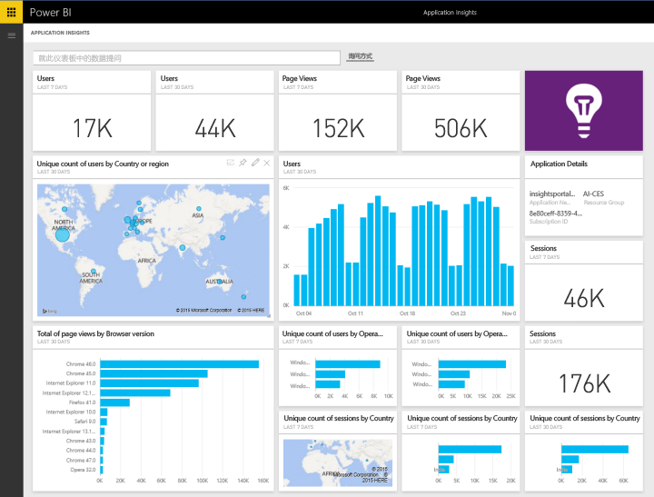
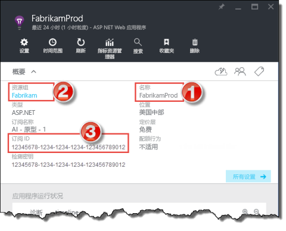
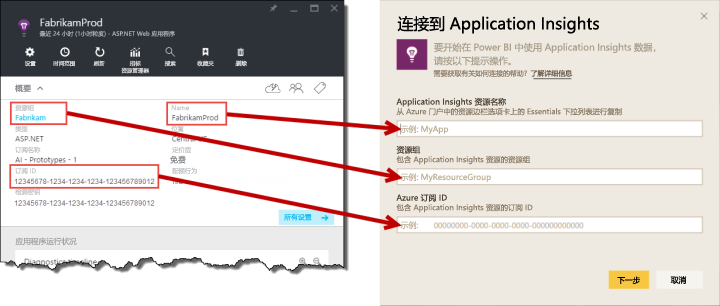

# 使用 Power BI 连接到 Application Insights
使用 Power BI 可通过 [Application Insights](https://azure.microsoft.com/documentation/articles/app-insights-overview/) 遥测创建功能强大的自定义仪表板。 可采用新方式来设想应用遥测。 将来自多个应用程序或组件服务的指标合并到一个仪表板上。 适用于 Application Insights 的 Power BI 内容包的此第一个版本包括用于常见使用情况相关指标（如活动用户、页面视图、会话、浏览器和操作系统版本以及地图中用户的地理分布）的小组件。

连接到[适用于 Power BI 的 Application Insights 内容包](https://app.powerbi.com/getdata/services/application-insights)。

>[!NOTE]
>若要进行连接，需要在 Azure 预览门户中访问应用程序的 Application Insights 概述边栏选项卡。 以下是有关要求的详细信息。

## 如何连接
1. 选择左侧导航窗格底部的**获取数据**。
   
    
2. 在**服务**框中，选择**获取**。
   
    
3. 选择 **Application Insights**  >  **获取**。
   
    
4. 提供要连接到的应用程序的详细信息，包括**Application Insights 资源名称**、**资源组**和**订阅 ID**。 有关详细信息，请参阅下面的[查找 Application Insights 参数](#FindingAppInsightsParams)。
   
        
5. 选择**登录**，然后按照屏幕进行连接。
   
    
6. 导入过程会自动开始。 完成时，一个通知会显示，并且一个新仪表板、报表和数据集会出现在导航窗格中并以星号进行标记。  选择仪表板查看已导入的数据。
   
    

**下一步？**

* 尝试在仪表板顶部的[在“问答”框中提问](power-bi-q-and-a.md)
* 在仪表板中[更改磁贴](service-dashboard-edit-tile.md)。
* [选择磁贴](service-dashboard-tiles.md)以打开基础报表。
* 虽然数据集将按计划每日刷新，你可以更改刷新计划或根据需要使用**立即刷新**来尝试刷新

## 包含的内容
Application Insights 内容包包含以下表和指标：  

    ´´´
    - ApplicationDetails  
    - UniqueUsersLast7Days   
    - UniqueUsersLast30Days   
    - UniqueUsersDailyLast30Days  
    - UniqueUsersByCountryLast7Days  
    - UniqueUsersByCountryLast30Days   
    - PageViewsDailyLast30Days   
    - SessionsLast7Days   
    - SessionsLast30Days  
    - PageViewsByBrowserVersionDailyLast30Days   
    - UniqueUsersByOperatingSystemLast7Days   
    - UniqueUsersByOperatingSystemLast30Days    
    - SessionsDailyLast30Days   
    - SessionsByCountryLast7Days   
    - SessionsByCountryLast30Days   
    - PageViewsByCountryDailyLast30Days  
    ´´´ 

## 查找参数
资源名称、资源组和订阅 ID 都可以在 Azure 门户中找到。 选择名称会打开详细视图，你可以使用“必备”下拉菜单来查找所需的所有值。

复制这些内容并粘贴到 Power BI 中的字段中：

## 后续步骤
[Power BI 入门](service-get-started.md)

[在 Power BI 中获取数据](service-get-data.md)

