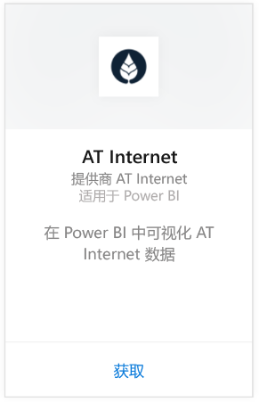
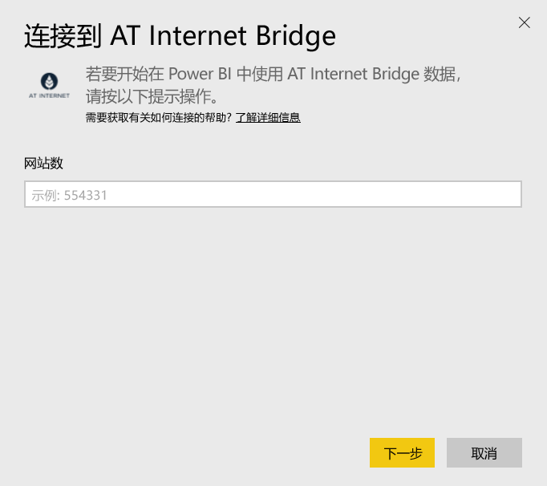
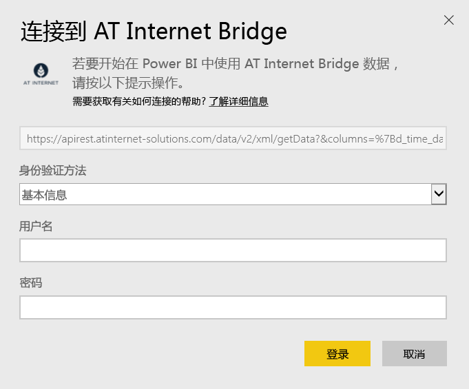

# 使用 Power BI 连接到 AT Internet Bridge
AT Internet 可帮助你使用其统一数字分析平台 Analytics Suite 从你的数据中提取即时值。 适用于 Power BI 的 AT Internet Bridge 内容包中包含你站点的访问、源、本地化和设备这些方面的数据。

连接到适用于 Power BI 的[ AT Internet Bridge 内容包](https://app.powerbi.com/getdata/services/at-internet-bridge)。

## 如何连接
1. 选择左侧导航窗格底部的**获取数据**。
   
    
2. 在**服务**框中，选择**获取**。
   
    
3. 选择 **AT Internet Bridge** \>**获取**。
   
   
4. 指定要连接到的 AT Internet 网站编号。
   
   
5. 选择**基本**作为身份验证机制，提供你的 AT Internet 用户名和密码，然后单击**登录**。
   
   
6. 单击**连接**以开始导入过程。 导入完成后，在导航窗格中将会出现新的仪表板、报表和模型。 选择仪表板查看已导入的数据。
   
    

**下一步？**

* 尝试在仪表板顶部的[在“问答”框中提问](power-bi-q-and-a.md)
* 在仪表板中[更改磁贴](service-dashboard-edit-tile.md)。
* [选择磁贴](service-dashboard-tiles.md)以打开基础报表。
* 虽然数据集将按计划每日刷新，你可以更改刷新计划或根据需要使用**立即刷新**来尝试刷新

## 包含的内容
此内容包在以下表中包含最近 45 天内的数据：  

    - 转换  
    - 设备  
    - 本地化  
    - 源  
    - 全局访问  

## 后续步骤
[Power BI 入门](service-get-started.md)

[Power BI - 基本概念](service-basic-concepts.md)

