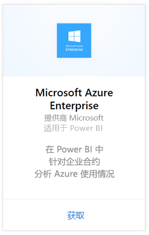
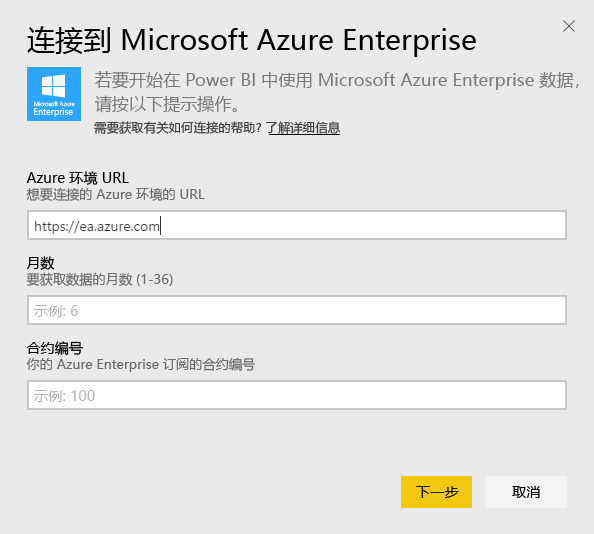
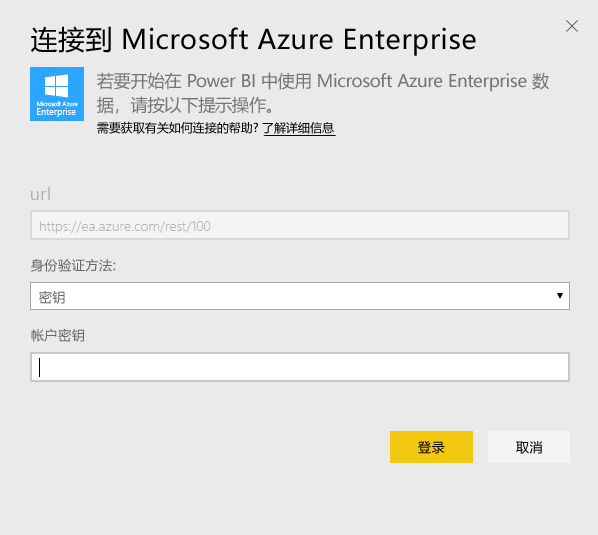
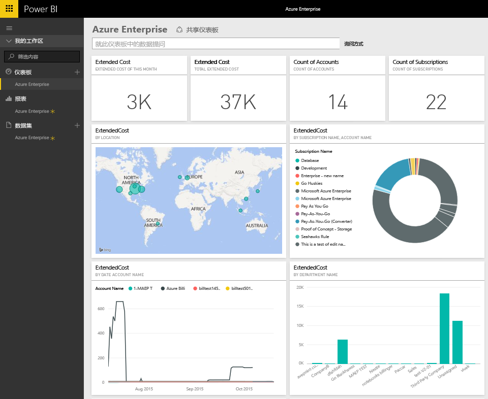
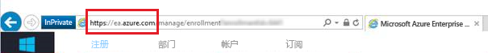
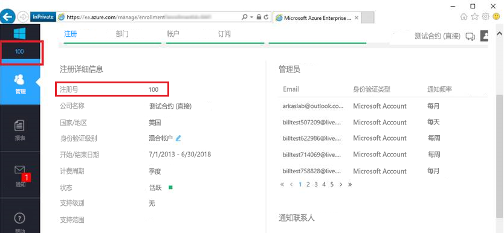
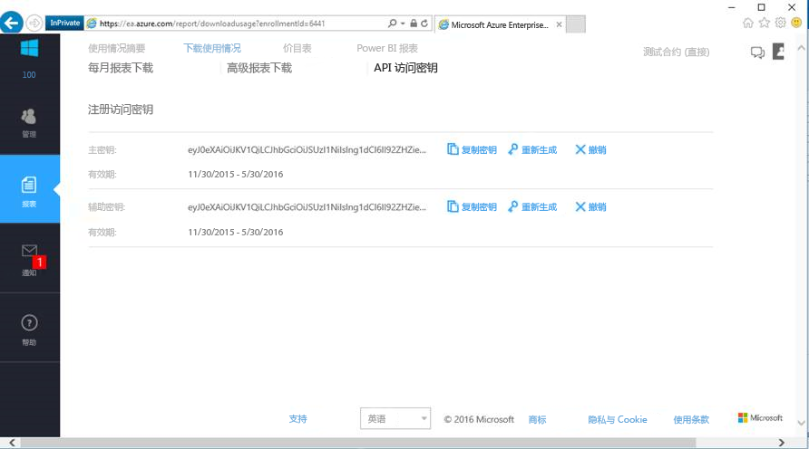

# 使用 Power BI 连接到 Microsoft Azure Enterprise
可使用 Power BI 内容包在 Power BI 中浏览和监视 Microsoft Azure Enterprise 数据。 此数据将每天自动刷新一次。

连接到适用于 Power BI 的 [Microsoft Azure Enterprise 内容包](https://app.powerbi.com/getdata/services/azure-enterprise)。

## 如何连接
1. 选择左侧导航窗格底部的**获取数据**。
   
    
2. 在**服务**框中，选择**获取**。
   
   
3. 选择**Microsoft Azure Enterprise** \> **获取**。
   
   
4. 提供 Azure 环境 URL、要导入的数据的月数以及你的 Azure Enterprise 注册号。 你的 Azure 环境 URL 会是 `https://ea.azure.com` 或 `https://ea.windowsazure.cn`。 请参阅下面有关[查找这些参数](#FindingParams)的详细信息。
   
    
5. 提供访问密钥进行连接。 在 Azure EA 门户中可以找到用于注册的密钥。
   
    
6. 导入过程将自动开始。 导入完成后，在导航窗格中将会出现新的仪表板、报表和模型。 选择仪表板查看已导入的数据。
   
   

**下一步？**

* 尝试在仪表板顶部的[在“问答”框中提问](power-bi-q-and-a.md)
* 在仪表板中[更改磁贴](service-dashboard-edit-tile.md)。
* [选择磁贴](service-dashboard-tiles.md)以打开基础报表。
* 虽然数据集将按计划每日刷新，你可以更改刷新计划或根据需要使用**立即刷新**来尝试刷新

## 包含的内容
Azure Enterprise 内容包中包含你在连接流程中提供的月份范围的每月报表数据。 该范围是不断变化的时间窗口，因此包含的日期会随着数据集刷新而更新。

## 系统要求
该内容包需要可以在 Azure 门户中访问企业功能。

## 查找参数
Power BI 报表可用于能够查看计帐信息的 EA 直接、合作伙伴和间接客户。 有关查找连接流程所需的每个值的详细信息，请阅读以下内容。

**Azure 环境 URL**

* 此值通常是 https://ea.azure.com，不过可以在登录之后检查该 URL 以进行确认。
  
    

**月数**

* 这应是介于 1-36 之间的数字，表示你要导入的数据的月数（从当天算起）。

**注册号**

* 这是你的 Azure Enterprise 注册号，可以在 [Azure Enterprise 门户](https://ea.azure.com/)主屏幕上的“注册详细信息”下找到。
  
    

**访问密钥**

* 可以在 Azure Enterprise 门户中的“下载使用”>“API 访问密钥”下找到密钥。
  
    

**其他帮助**

* 有关设置 Azure Enterprise Power BI 包的其他帮助，请登录 Azure Enterprise 门户以查看“帮助”下的 API 帮助文件以及“报表”->“下载使用”->“API 访问密钥”下的其他说明。

## 后续步骤
[Power BI 入门](service-get-started.md)

[在 Power BI 中获取数据](service-get-data.md)

