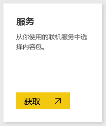
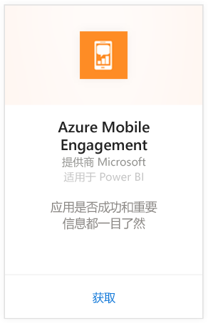
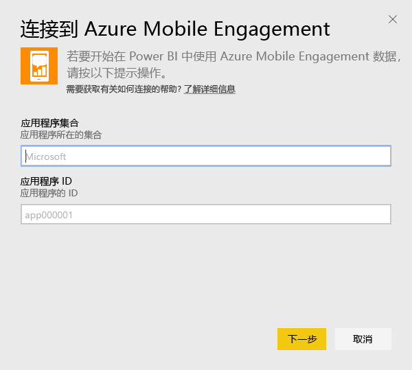
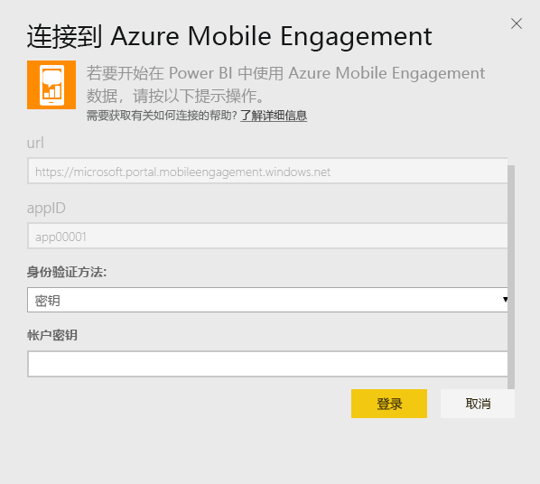
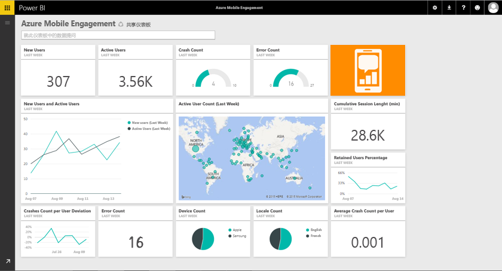

# 使用 Power BI 连接到 Azure Mobile Engagement
通过 Power BI Azure Mobile Engagement 内容包可以快速深入了解应用数据。

连接到适用于 Power BI 的 [Azure Mobile Engagement 内容包](https://app.powerbi.com/groups/me/getdata/services/azme)。

## 如何连接
1. 选择左侧导航窗格底部的**获取数据**。
   
    
2. 在**服务**框中，选择**获取**。
   
    
3. 选择 **Azure Mobile Engagement** \> **获取**。
   
     
4. 指定应用集合和应用名称。 可以在 Azure Mobile Engagement 帐户中找到此信息。
   
     
5. 对于身份验证方法，提供你的密钥，然后单击“登录”。
   
    
6. Power BI 导入数据后，你将在左侧的导航窗格中看到新的仪表板、报表和数据集。 新的项目会以黄色星号 \* 标记（在选择之后会消失）：
   
    

 **下一步？**

* 尝试在仪表板顶部的[在“问答”框中提问](power-bi-q-and-a.md)
* 在仪表板中[更改磁贴](service-dashboard-edit-tile.md)。
* [选择磁贴](service-dashboard-tiles.md)以打开基础报表。
* 虽然数据集将按计划每日刷新，你可以更改刷新计划或根据需要使用**立即刷新**来尝试刷新

## 后续步骤
[Power BI 入门](service-get-started.md)

[在 Power BI 中获取数据](service-get-data.md)

