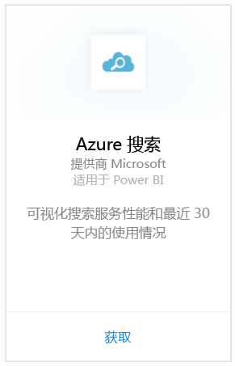
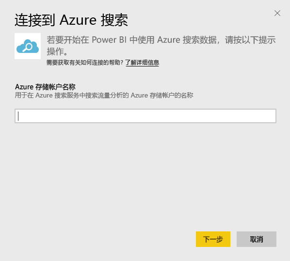
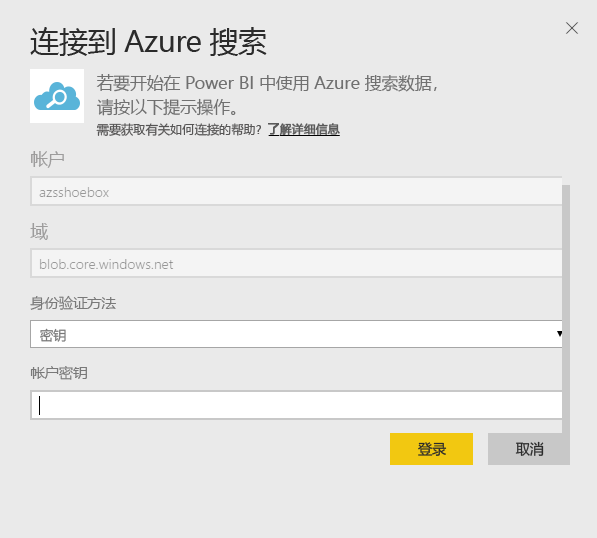
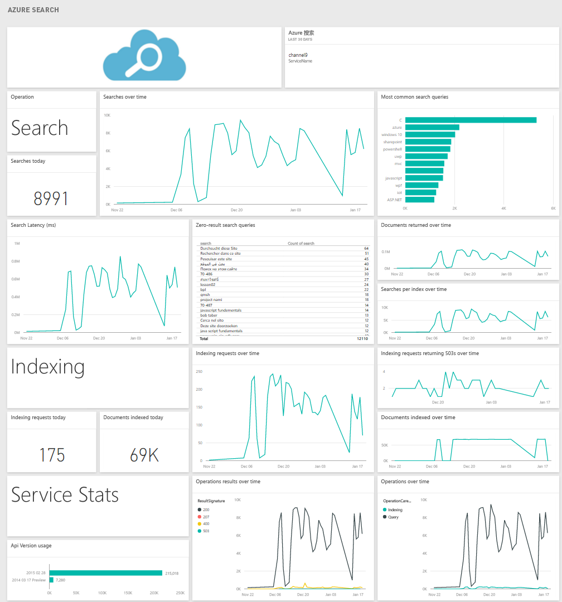

# 使用 Power BI 连接到 Azure 搜索
Azure 搜索流量分析允许你监视并了解 Azure 搜索服务的流量。 适用于 Power BI 的 Azure 搜索内容包提供了搜索数据的详细深入解析，包括过去 30 天内的搜索、索引、服务统计和延迟。 有关详细信息，请参阅 [Azure 博客文章](https://azure.microsoft.com/en-us/blog/analyzing-your-azure-search-traffic/)。

连接到适用于 Power BI 的 [Azure 搜索内容包](https://app.powerbi.com/getdata/services/azure-search)。

## 如何连接
1. 选择左侧导航窗格底部的**获取数据**。
   
    
2. 在**服务**框中，选择**获取**。
   
    
3. 选择“Azure 搜索”\>“获取”。
   
   
4. 提供存储了 Azure 搜索分析的表存储帐户的名称。
   
   
5. 选择“密钥”作为验证机制，并提供你的存储帐户密钥。 单击“登录”开始加载程序。
   
   
6. 加载完成后，导航窗格中会出现新的仪表板、报表和模型。 选择仪表板查看已导入的数据。
   
    

**下一步？**

* 尝试在仪表板顶部的[在“问答”框中提问](power-bi-q-and-a.md)
* 在仪表板中[更改磁贴](service-dashboard-edit-tile.md)。
* [选择磁贴](service-dashboard-tiles.md)以打开基础报表。
* 虽然数据集将按计划每日刷新，你可以更改刷新计划或根据需要使用**立即刷新**来尝试刷新

## 系统要求
Azure 搜索内容包需要对帐户启用 Azure 搜索流量分析。

## 故障排除
确保已提供正确的存储帐户名称以及完整的访问密钥。 存储帐户名称应对应使用 Azure 搜索流量分析配置的帐户。

## 后续步骤
[Power BI 入门](service-get-started.md)

[Power BI - 基本概念](service-basic-concepts.md)

