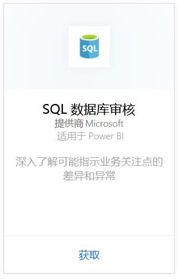
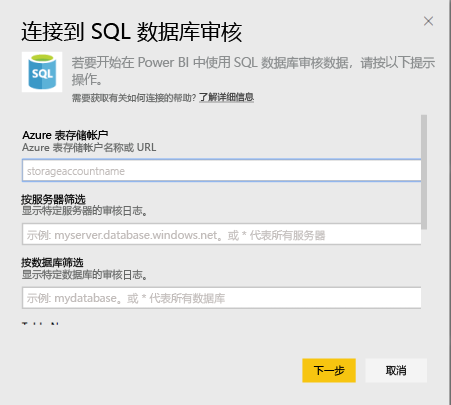
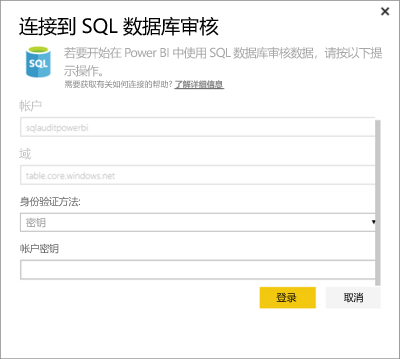
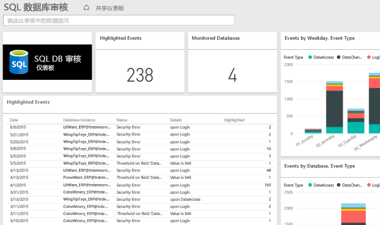

# 适用于 Power BI 的 SQL 数据库审核内容包
通过适用于 Azure [SQL 数据库审核](http://azure.microsoft.com/documentation/articles/sql-database-auditing-get-started/)的 Power BI 内容包可以了解数据库活动并深入了解可能指示业务问题或可疑安全冲突的差异和异常。 

连接到适用于 Power BI 的 [SQL 数据库审核内容包](https://app.powerbi.com/getdata/services/sql-db-auditing)。

>[!NOTE]
>此内容包从名称包含“AuditLogs”的所有表中导入数据，并将其附加到名为“AuditLogs”的单个数据模型表中。 会包含最近 250k 事件，并且每天刷新数据。

## 如何连接
1. 选择左侧导航窗格底部的**获取数据**。
   
    
2. 在“服务”框中，选择“获取”。
   
    
3. 选择 **SQL 数据库审核**\>**获取**。
   
   
4. 在“连接到 Sql Database 审核”窗口中：
   
   - 输入在其中存储日志的 Azure 表存储帐户名称或 URL。
   
   - 输入你感兴趣的 SQL Server 的名称。 输入“\*”可加载所有服务器的审核日志。
   
   - 输入你感兴趣的 SQL 数据库的名称。 输入“\*”可加载所有数据库的审核日志。
   
   - 输入包含你感兴趣的日志的 Azure 表的名称。 输入“\*”可从名称中包含“AuditLogs”的所有表加载审核日志。
   
   >[!IMPORTANT]
   >出于性能原因，最好始终指定显式表名称，即使所有审核日志都存储在单个表中也是如此。
   
   - 输入你感兴趣的审核日志的开始日期。 输入“\*”可加载没有时间下限的审核日志，输入“1d”可从最近一天加载审核日志。
   
   - 输入你感兴趣的审核日志的结束日期。 输入“\*”可加载没有时间上限的审核日志。
   
   
5. 对于“身份验证方法”，请选择“密钥”，输入你的“帐户密钥”\>，然后选择“登录”。
   
   
6. Power BI 导入数据后，你会在左侧的导航窗格中看到新的仪表板、报表和数据集。 新的项目会以黄色星号 \* 标记。
   
   

**下一步？**

* 尝试在仪表板顶部的[在“问答”框中提问](power-bi-q-and-a.md)
* 在仪表板中[更改磁贴](service-dashboard-edit-tile.md)。
* [选择磁贴](service-dashboard-tiles.md)以打开基础报表。
* 虽然数据集将按计划每日刷新，你可以更改刷新计划或根据需要使用**立即刷新**来尝试刷新

## 后续步骤
[获取 Power BI 数据](service-get-data.md)
[什么是 Power BI？](power-bi-overview.md)
