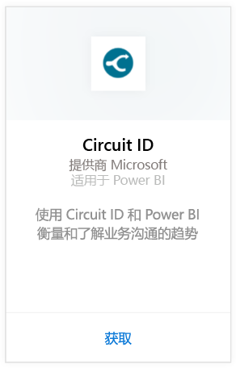
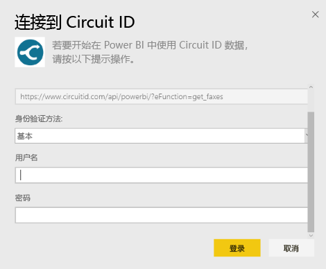
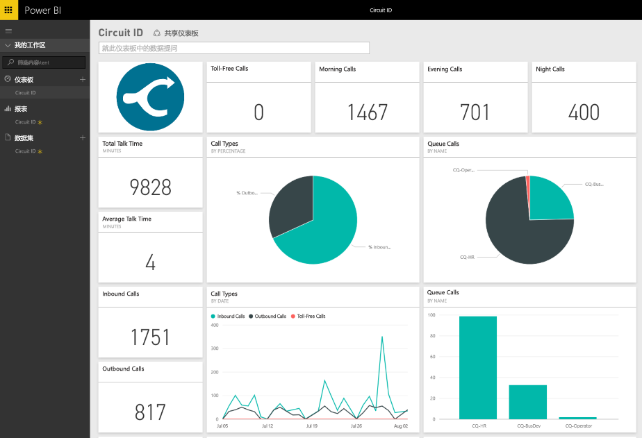

# 使用 Power BI 连接到 Circuit ID
借助 Power BI 轻松分析 Circuit ID 的通信数据。 Power BI 检索数据，然后生成默认的仪表板并基于此数据生成相关的报表。 创建连接后，你可以根据需要管理数据并自定义仪表板。 数据每日自动刷新。

连接到适用于 Power BI 的 [Circuit ID 内容包](https://app.powerbi.com/getdata/services/circuitid)

## 如何连接
1. 选择左侧导航窗格底部的**获取数据**。
   
    
2. 在**服务**框中，选择**获取**。
   
    
3. 依次选择“Circuit ID”\>“获取”。
   
    
4. 身份验证方法请选择“基本”并提供用户名和密码。 然后点击“登录”。
   
    
5. Power BI 导入数据后，你将在左侧的导航窗格中看到新的仪表板、报表和数据集。 新项将标记为黄色星号。
   
    

**下一步？**

* 尝试在仪表板顶部的[在“问答”框中提问](power-bi-q-and-a.md)
* 在仪表板中[更改磁贴](service-dashboard-edit-tile.md)。
* [选择磁贴](service-dashboard-tiles.md)以打开基础报表。
* 虽然数据集将按计划每日刷新，你可以更改刷新计划或根据需要使用**立即刷新**来尝试刷新

## 后续步骤
[Power BI 入门](service-get-started.md)

[获取 Power BI 的数据](service-get-data.md)

