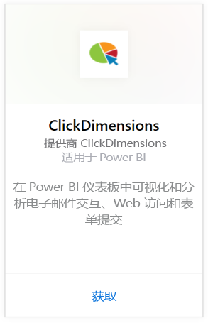
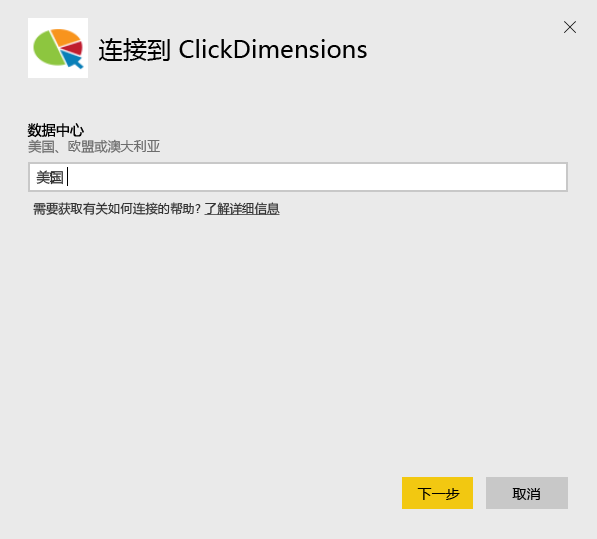
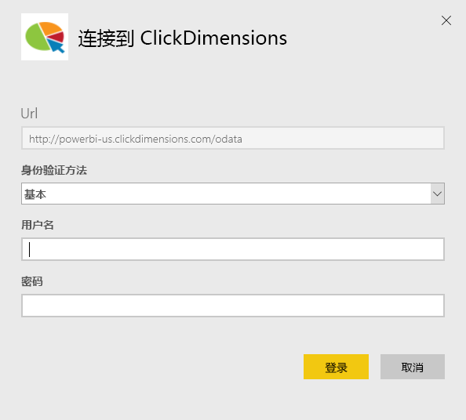
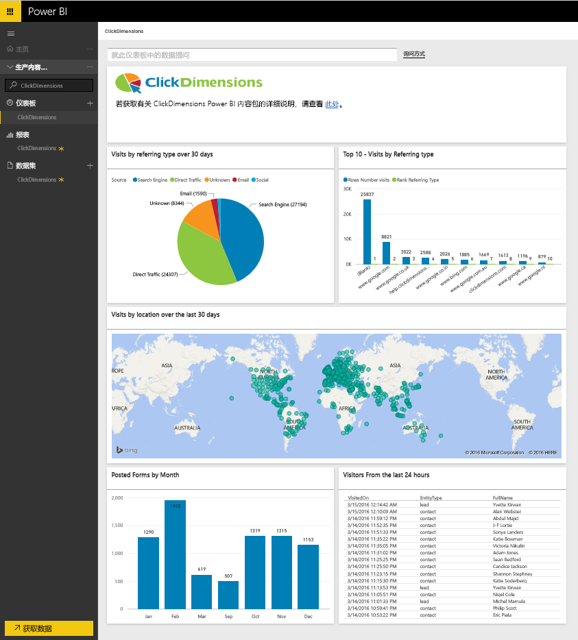
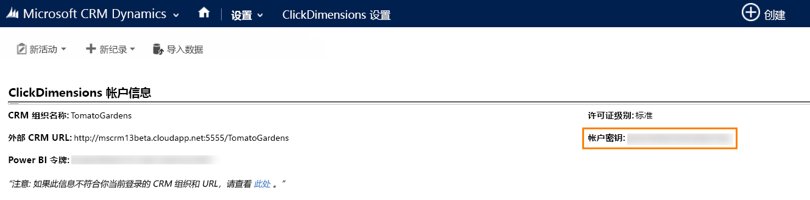
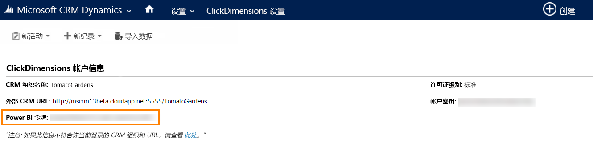

# 使用 Power BI 连接到 ClickDimensions
适用于 Power BI 的 ClickDimensions 内容包使用户可以在 Power BI 中利用 ClickDimensions 市场营销数据，从而使管理团队可以进一步深入了解其销售和市场营销工作的成功之处。 在 Power BI 仪表板和报表中可视化和分析电子邮件交互、Web 访问和表单提交。

连接到适用于 Power BI 的 [ClickDimensions 内容包](https://app.powerbi.com/getdata/services/click-dimensions)。

## 如何连接
1. 选择左侧导航窗格底部的**获取数据**。
   
   
2. 在**服务**框中，选择**获取**。
   
   
3. 选择 **ClickDimensions** \> **获取**。
   
   
4. 提供数据中心的位置（美国、欧盟或澳大利亚），然后选择**下一步**。
   
   
5. 对于**身份验证方法**，选择**基本** \> **登录**。 出现提示时，输入你的 ClickDimensions 凭据。 请参阅下面[查找这些参数](#FindingParams)中的详细信息
   
    
6. 审批后，导入过程将自动开始。 导入完成后，在导航窗格中将会出现新的仪表板、报表和模型。 选择仪表板查看已导入的数据。
   
     

**下一步？**

* 尝试在仪表板顶部的[在“问答”框中提问](service-q-and-a.md)
* 在仪表板中[更改磁贴](service-dashboard-edit-tile.md)。
* [选择磁贴](service-dashboard-tiles.md)以打开基础报表。
* 虽然数据集将按计划每日刷新，你可以更改刷新计划或根据需要使用**立即刷新**来尝试刷新

## 系统要求
若要连接到 Power BI 内容包，你必须提供与你的帐户对应的数据中心，并使用 ClickDimensions 帐户登录。 如果你不确定要提供的数据中心，请与管理员进行核对。

## 查找参数
帐户密钥可在“CRM 设置”\>“ClickDimensions 设置”中找到。 从“ClickDimensions 设置”中复制帐户密钥并将它粘贴到“用户名”字段中。  

  

从“ClickDimensions 设置”中复制 Power BI T令牌并将它粘贴到“密码”字段中。 Power BI 令牌可在“CRM 设置”\>“ClickDimensions 设置”中找到。  

  

## 后续步骤
[Power BI 入门](service-get-started.md)

[在 Power BI 中获取数据](service-get-data.md)

