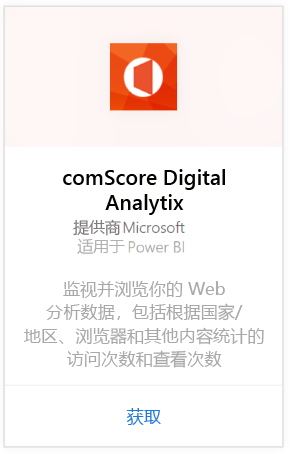
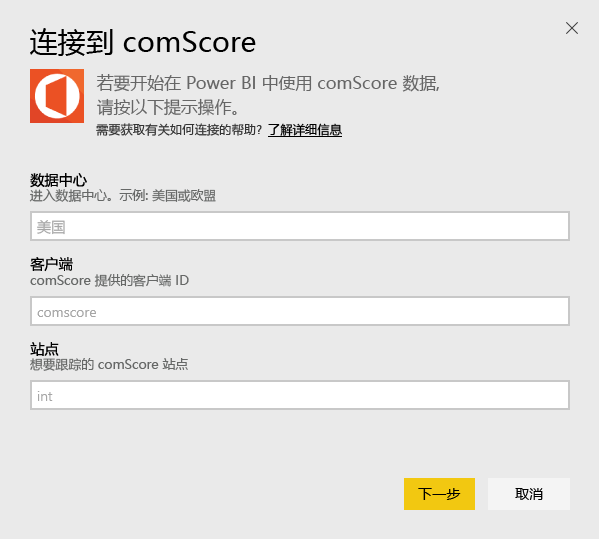
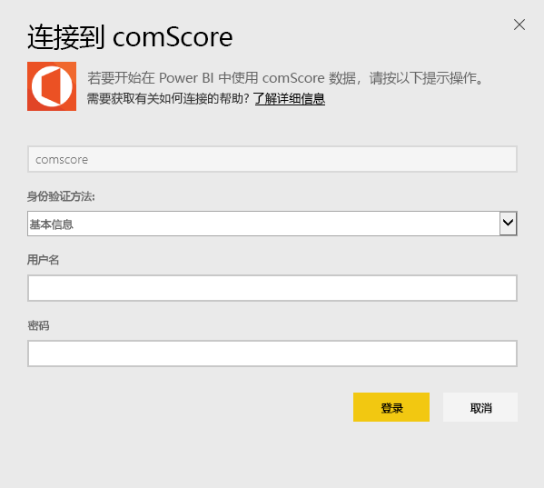
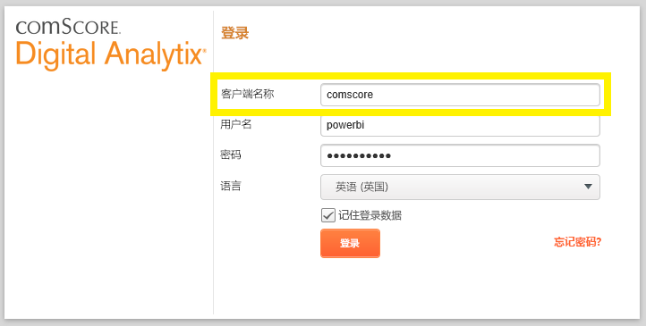
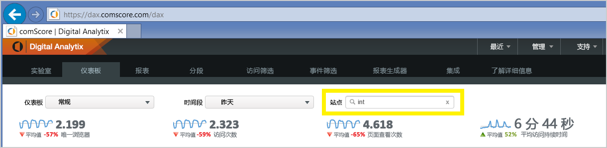

# 使用 Power BI 连接到 comScore Digital Analytix
通过 Power BI 内容包可视化和浏览 Power BI 中的 comScore Digital Analytix 数据。 此数据将每天自动刷新一次。

连接到[ Power BI 的 comScore 内容包](https://app.powerbi.com/getdata/services/comscore)。

>[!NOTE]
>若要连接到内容包，需要 comScore DAx 用户帐户且具有 comScore API 访问权限。 请参阅以下[详细信息](#Requirements)。

## 如何连接
1. 选择左侧导航窗格底部的“获取数据”。
   
   
2. 在“服务”框中，选择“获取”。
   
   
3. 选择“comScore Digital Analytix”\>“获取”。
   
   
4. 提供想要连接到的数据中心、comScore 客户端 ID 和站点。 有关如何查找这些值的详细信息，请参阅下面的[查找 comScore 参数](#FindingParams)。
   
   
5. 提供 comScore 用户名和密码才能连接。 请参阅以下有关查找此值的详细信息。
   
   
6. 导入过程将自动开始。 导入完成后，在导航窗格中将会出现新的仪表板、报表和模型。 选择仪表板查看已导入的数据。

**下一步？**

* 尝试在仪表板顶部的[在“问答”框中提问](service-q-and-a.md)
* 在仪表板中[更改磁贴](service-dashboard-edit-tile.md)。
* [选择磁贴](service-dashboard-tiles.md)以打开基础报表。
* 虽然数据集将按计划每日刷新，你可以更改刷新计划或根据需要使用**立即刷新**来尝试刷新

## 系统要求
需要 comScore DAx 用户帐户以及 comScore DAx API 的访问权限才能连接。 请联系你的 comScore DAx 管理员以确认你的帐户。

## 查找参数
下面是有关如何查找每个 comScore 参数的详细信息。

**数据中心**

连接到的数据中心取决于在 comScore 中导航到的 URL。

如果使用 https://dax.comscore.com，输入“US”；如果使用 https://dax.comscore.eu，输入“EU”。

 

**客户端**

客户端与在登录到 comScore DAx 时提供的相同。

 

**站点**

comScore 站点确定想要查看的数据来自哪个站点。 你可以从 comScore 帐户查找站点列表。

## 后续步骤
[Power BI 入门](service-get-started.md)

[在 Power BI 中获取数据](service-get-data.md)

