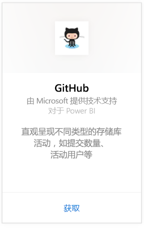
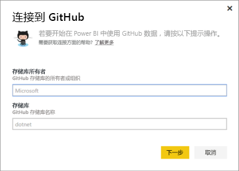
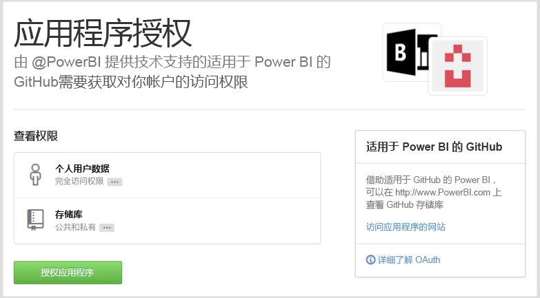
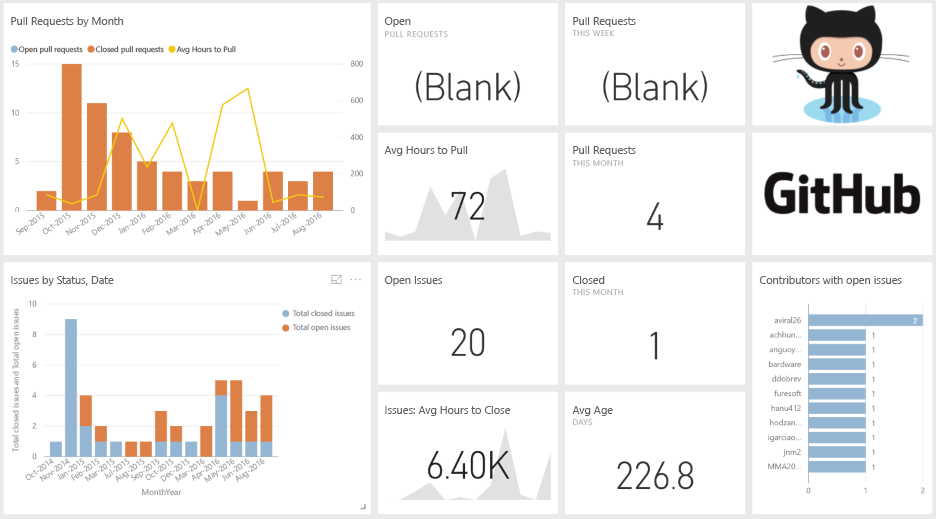
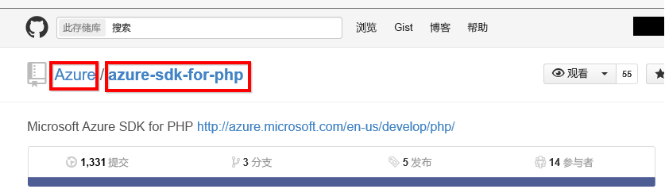

# 使用 Power BI 连接到 GitHub
适用于 Power BI 的 GitHub 内容包允许你通过参与、问题、拉取请求和活动用户的相关数据，深入了解 GitHub 存储机制（也称为存储库）。

连接到 [GitHub 内容包](https://app.powerbi.com/getdata/services/github)或进一步了解 Power BI 与 [GitHub 集成](https://powerbi.microsoft.com/integrations/github)。

>[!NOTE]
>内容包要求 GitHub 帐户具有存储库的访问权限。 以下是有关要求的详细信息。

## 如何连接
1. 选择左侧导航窗格底部的**获取数据**。
   
    
2. 在**服务**框中，选择**获取**。
   
    
3. 选择“GitHub”\>“获取”。
   
   
4. 输入该存储库的存储库名称和存储库所有者。 有关详细信息，请参阅下面的[查找这些参数](#FindingParams)。
   
   
5. 输入 GitHub 凭据（如果你已经登录浏览器，可跳过此步骤）。 
6. 针对“验证方法”，选择“oAuth2”\>“登录”。 
7. 按照 Github 验证界面执行操作。 向适用于 Power BI 的 GitHub 内容包授予对 GitHub 数据的权限。
   
   
   
   这将把 GitHub 与 Power BI 连接到一起，并允许 Power BI 连接到数据。  数据会每天刷新一次。
8. 连接到存储库后，Power BI 会导入数据。 你将在左侧导航窗格中看到新的 [GitHub 仪表板](https://powerbi.microsoft.com/integrations/github)、报表和数据集。 新的项目会以黄色星号 \* 标记。
   
   

**下一步？**

* 尝试在仪表板顶部的[在“问答”框中提问](power-bi-q-and-a.md)
* 在仪表板中[更改磁贴](service-dashboard-edit-tile.md)。
* [选择磁贴](service-dashboard-tiles.md)以打开基础报表。
* 虽然数据集将按计划每日刷新，你可以更改刷新计划或根据需要使用**立即刷新**来尝试刷新

## 包含的内容
在 Power BI 中 GitHub 提供以下数据：     

| 表名 | 说明 |
| --- | --- |
| 参与 |参与者表提供每周汇总的参与者所执行的总新增、删除和提交操作。 包括前 100 个参与者。 |
| 问题 |列出所选存储库的所有问题，其中包含计算，如：解决问题的总时间和平均时间、未解决问题总数和已解决问题总数。 存储库中没有任何问题时，此表为空。 |
| 拉取请求 |此表包含此存储库和拉取请求者的所有拉取请求。 它也包含相关计算，如：有多少未解决、已解决和总的拉取请求、拉取这些请求花了多少时间，以及拉取请求所耗用的平均时间。 存储库中没有任何问题时，此表为空。 |
| 用户 |下表提供了 GitHub 使用者或参与者的列表，他们针对所选的存储库进行参与、提出问题或解决拉取请求。 |
| 里程碑 |它具有所选存储库的所有里程碑。 |
| DateTable |此表包含从今天开始推算的和过去多年的日期，可让你按日期分析 GitHub 数据。 |
| ContributionPunchCard |此表可用作所选存储库的参与穿孔卡。 它会按一周中各天和一天中各小时来显示提交。 此表未连接到模型中的其他表。 |
| RepoDetails |此表提供所选存储库的详细信息。 |

## 系统要求
* 具有存储库访问权限的 GitHub。  
* 第一次登录期间授予给适用于 GitHub 的 Power BI 应用的权限。 有关撤消访问权限的详细信息，请参阅下文。  
* 具有足够可用的 API 调用以拉取和刷新数据。  

### 取消授权 Power BI
若要取消将 Power BI 连接到 GitHub 的授权，可以撤销 GitHub 中的访问权限。 有关详细信息，请参阅 [GitHub 帮助](https://help.github.com/articles/keeping-your-ssh-keys-and-application-access-tokens-safe/#reviewing-your-authorized-applications-oauth)主题。

## 查找参数
你可以通过查看 GuiHub 本身的存储库来确定所有者和存储库：

第一部分“Azure”是所有者，第二部分“azure-sdk-for-pho”是存储库本身。  将在存储库的 URL 中看到这两个相同的项目：

    <https://github.com/Azure/azure-sdk-for-php> .

## 故障排除
如有必要，可以验证你的 GitHub 凭据。  

1. 在另一个浏览器窗口中，转到 GitHub 网站并登录到 GitHub。 将在 GitHub 网站的右上角看到你已登录。    
2. 在 GitHub 中，导航到你计划要在 Power BI 中访问的存储库的 URL。 例如：https://github.com/dotnet/corefx。  
3. 返回到 Power BI，尝试连接到 GitHub。 在“配置 GitHub”对话框中，使用相同存储库的存储库名称和存储库所有者。  

## 后续步骤
* [Power BI 入门](service-get-started.md)
* [获取数据](service-get-data.md)

