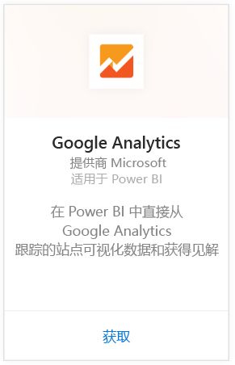
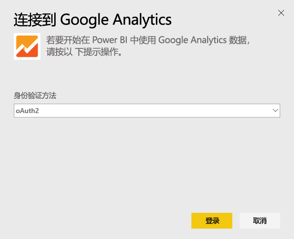
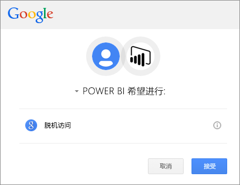
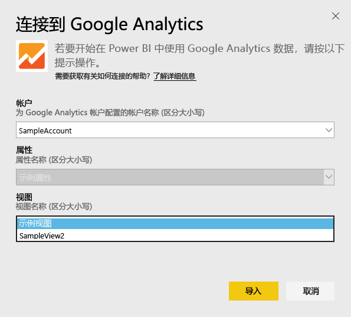
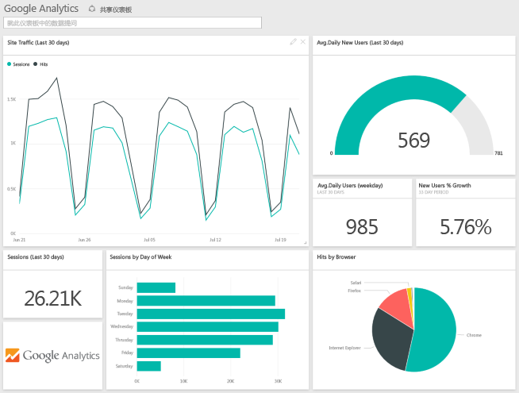
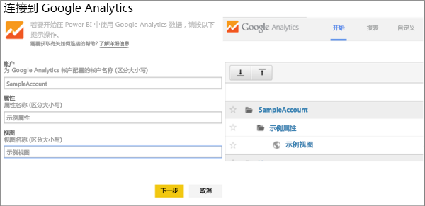

# 使用 Power BI 连接到 Google Analytics
要通过 Power BI 连接到 Google Analytics，需首先连接到 Google Analytics 帐户。 你将获得一个 Power BI 仪表板和一组 Power BI 报表，这些报表会提供网站流量和用户维度的相关见解。 可以与仪表板和报表进行交互，但不能保存更改。 此数据将每天自动刷新一次。

连接到适用于 Power BI 的 [Google Analytics](https://app.powerbi.com/getdata/services/google-analytics)。 阅读有关使用 Power BI 进行 [Google Analytics 集成](https://powerbi.microsoft.com/integrations/google-analytics)的详细信息。

可以从 Power BI Desktop 中的 [Google Analytics 连接器](service-google-analytics-connector.md)开始创建自定义仪表板和报表。 只需连接 Google Analytics 帐户，然后就可以创建可以发布到 Power BI 服务的自定义报表。

## 如何连接
[!INCLUDE [powerbi-service-apps-get-more-apps](./includes/powerbi-service-apps-get-more-apps.md)]

1. 依次选择“Google Analytics”\>“获取”。
   
   
2. 出现提示时，输入 Google Analytics 凭据。 选择“oAuth 2”作为身份验证机制，然后单击“登录”。 按照 Google 身份验证流进行操作。如果你配置了双因素身份验证，则其中可能包括双因素身份验证。
   
   
3. 单击“接受”以允许 Power BI 访问你的 Google Analytics 数据。
   
   
4. Power BI 连接到特定的 Google Analytics 视图。 选择想要连接到的帐户名称、属性名称和视图名称。 此信息可在 Google Analytics 帐户的左上方或“主页”选项卡上获取。请参阅以下详细信息。 
   
   
5. 单击“连接”以开始导入过程。 

## 查看 Google Analytics 仪表板和报表
[!INCLUDE [powerbi-service-apps-open-app](./includes/powerbi-service-apps-open-app.md)]

      

[!INCLUDE [powerbi-service-apps-open-app](./includes/powerbi-service-apps-what-now.md)]

## 系统要求
若要从 Power BI 连接，需要具有 [Google Analytics](https://www.google.com/analytics/) 帐户。 未连接到 Google Analytics 帐户的其他 Google 帐户将会出现身份验证错误。

## 故障排除
**凭据** 如果你有多个 Google 帐户，连接时请使用匿名或私密浏览器窗口以确保你使用的是正确帐户。

如果你可以登录 Google，但却收到了显示你的凭据无效的错误消息，请确认你具有 [Google Analytics](https://www.google.com/analytics/) 帐户。

**参数** 参数目前必须具有唯一的名称。 如果你看到显示所选值已重复的错误消息，请选择其他值或在 Google Analytics 中更改名称使其是唯一的。 对此我们正在进行积极改进。

>[!NOTE]
>参数区分大小写。 输入与在 Google Analytics 帐户中显示的完全相同的参数。

还有问题？ 打开支持票证以联系 Power BI 团队：

* 在 Power BI 应用程序中依次选择“问号”\>“联系支持人员”。
* 从 Power BI 技术支持网站（即你正在阅读此文章的地方）中选择页面右侧的**联系支持人员**。

## 后续步骤
* [Power BI 中的应用有哪些？](consumer/end-user-apps.md)
* [在 Power BI 中获取数据](service-get-data.md)
* 更多问题？ [尝试咨询 Power BI 社区](http://community.powerbi.com/)

