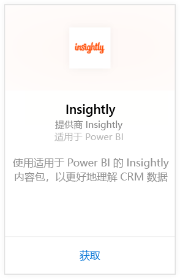
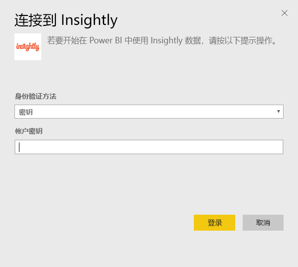
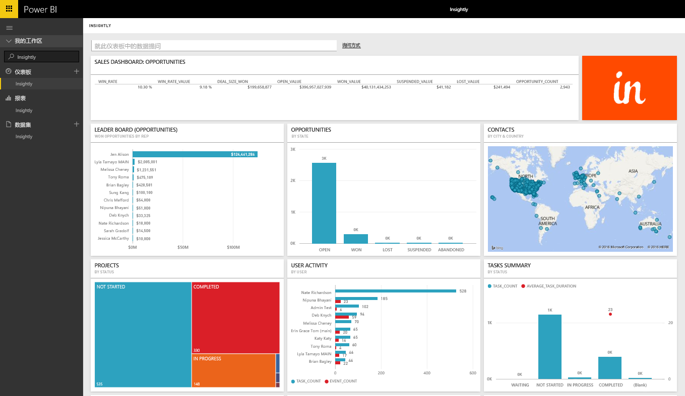
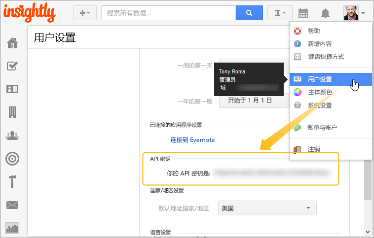

# 使用 Power BI 连接到 Insightly
使用 Insightly 内容包可视化和共享 Power BI 中的 Insightly CRM 数据。 使用 Insightly API 密钥连接到 Power BI，以从 CRM 数据查看和生成报表和仪表板。 使用 Power BI，你可以用新的方式分析数据、创建功能强大的图形和图表，并显示地图上的联系人、潜在客户和组织。

连接到适用于 Power BI 的 [Insightly 内容包](https://app.powerbi.com/getdata/services/insightly)。

## 如何连接
1. 选择左侧导航窗格底部的**获取数据**。
   
   
2. 在**服务**框中，选择**获取**。
   
   
3. 选择 **Insightly** \>**获取**。
   
   
4. 选择**密钥**作为身份验证类型并提供 Insight API 密钥，然后选择**登录**。 请参阅下方有关[查找此参数](#FindingParams)的详细信息。
   
   
5. 审批后，导入过程将自动开始。 导入完成后，在导航窗格中将会出现新的仪表板、报表和模型。 选择仪表板查看已导入的数据。
   
     

**下一步？**

* 尝试在仪表板顶部的[在“问答”框中提问](power-bi-q-and-a.md)
* 在仪表板中[更改磁贴](service-dashboard-edit-tile.md)。
* [选择磁贴](service-dashboard-tiles.md)以打开基础报表。
* 虽然数据集将按计划每日刷新，你可以更改刷新计划或根据需要使用**立即刷新**来尝试刷新

## 包含的内容
此内容包包括以下表，其中带有对应记录中的字段：

| 表格 |  |  |  |
| --- | --- | --- | --- |
| 联系人 |机会 |管道阶段 |任务完成日期 |
| 自定义字段 |机会截止日期 |项目完成日期 |任务 |
| 事件 |机会预测日期 |项目 |团队/成员 |
| 潜在客户 |组织 |标记 |用户 |

许多表和报表同样包括唯一的计算字段，如：  

* 含有“分组的”机会预计截止日期、机会实际截止日期、项目完成日期和任务完成日期以便按月份、季度或年份进行分析的表。  
* 机会的加权值字段（机会值 * 赢得机会的概率）。  
* 基于开始日期和完成日期的任务的平均和总持续时间字段。  
* 含有机会赢得率（赢得计数/总机会计数）和赢得率值（赢得值/总机会值）的计算字段的报表。  

## 系统要求
需要能够访问 Insightly API 的 Insightly 帐户。 可见性权限将基于用于建立到 Power BI 的连接的 API 密钥。 你可以见到的任何 Insightly 记录也将在你与他人共享的 Power BI 报表和仪表板中可见。

## 查找参数
**API 密钥**

若要从 Insightly 中复制 API 密钥，请从“Insightly 配置文件”菜单中选择“用户设置”并向下滚动。 此字符串将被用于将你的数据连接到 Power BI。

## 故障排除
通过 Insightly API 导入数据，它包括基于你的 Insightly 订阅计划级别的每日限制。 API 文档 https://api.insight.ly/v2.2/Help#!/Overview/Introduction#ratelimit 的速率限制/限制请求部分列出了这些限制

提供的报表使用 Insightly 中的默认字段，并且可能不包含你的自定义项。 编辑报表以查看所有可用字段。

## 后续步骤
[Power BI 入门](service-get-started.md)

[在 Power BI 中获取数据](service-get-data.md)

