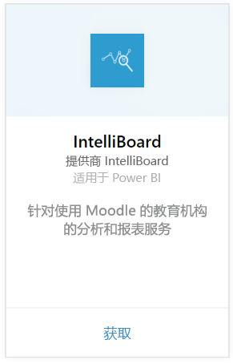
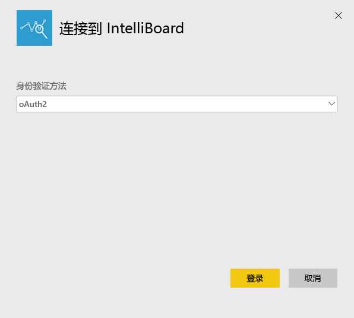
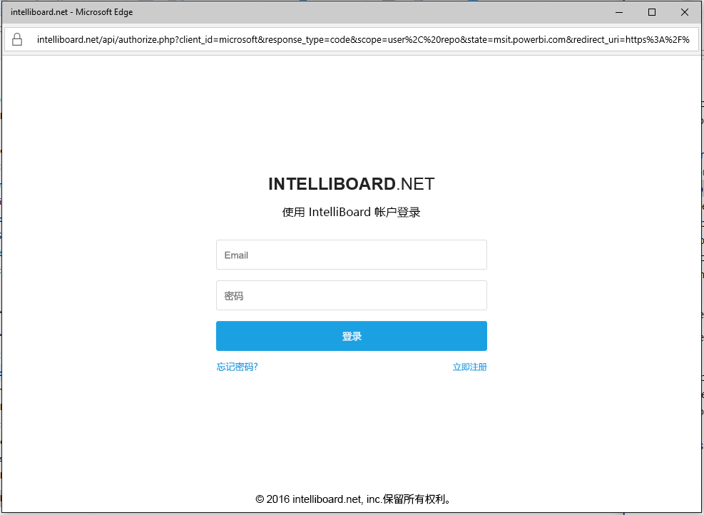
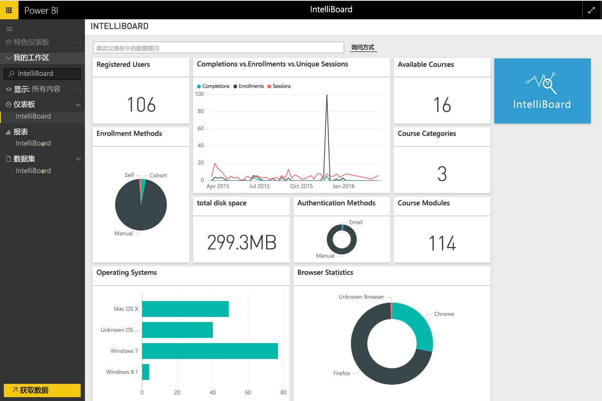

# 使用 Power BI 连接到 IntelliBoard
使用 IntelliBoard 可以通过报biao服务轻松访问 Moodle Learning Management System 数据。 适用于 Power BI 的 IntelliBoard 内容包还提供其他分析，包括有关课程的指标、已注册的用户、整体表现和你的 LMS 活动。

连接到适用于 Power BI 的[IntelliBoard 内容包](https://app.powerbi.com/getdata/services/intelliboard)

## 如何连接
1. 选择左侧导航窗格底部的**获取数据**。  
   
    
2. 在**服务**框中，选择**获取**。  
   
    
3. 选择 **IntelliBoard**，然后选择**获取**。  
   
    
4. 选择 **OAuth 2**，然后选择**登录**。 出现提示时，请提供你的 IntelliBoard 凭据。
   
    
   
    
5. 连接成功后，将自动加载仪表板、报表和数据集。 加载完成后，将使用 IntelliBoard 帐户中的数据更新磁贴。
   
    

**下一步？**

* 尝试在仪表板顶部的[在“问答”框中提问](service-q-and-a.md)
* 在仪表板中[更改磁贴](service-dashboard-edit-tile.md)。
* [选择磁贴](service-dashboard-tiles.md)以打开基础报表。
* 虽然数据集将按计划每日刷新，你可以更改刷新计划或根据需要使用**立即刷新**来尝试刷新

## 包含的内容
该内容包中包括来自下列表的数据：  

    - 活动  
    - 代理  
    - 身份验证  
    - 国家/地区  
    - 课程进度  
    - 注册
    - Lang  
    - 平台  
    - 总数  
    - 用户进度    

## 系统要求
若要实例化此内容包，需要对上述表有权限的 IntelliBoard 帐户。

## 后续步骤
[Power BI 入门](service-get-started.md)

[Power BI - 基本概念](service-basic-concepts.md)

