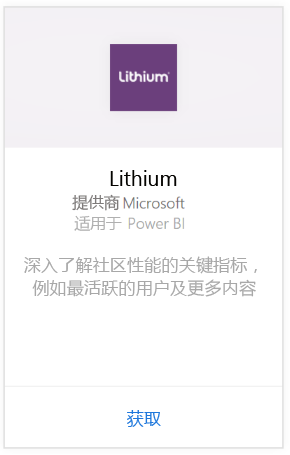
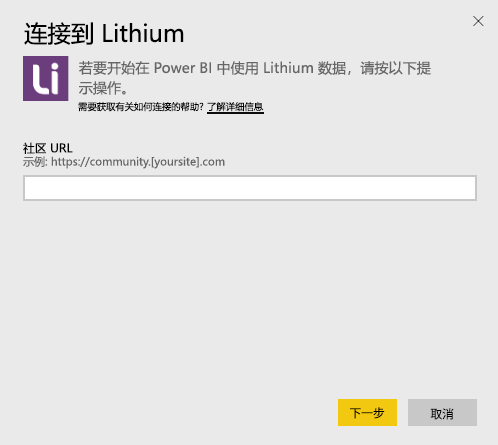
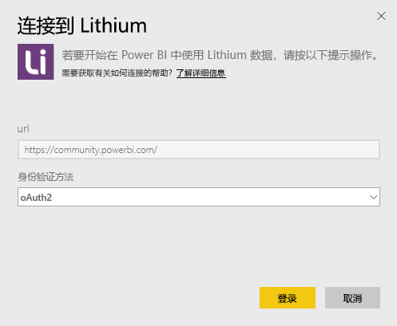
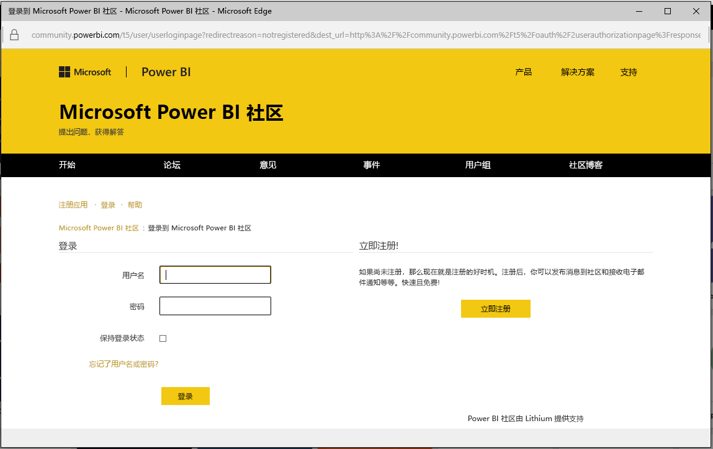
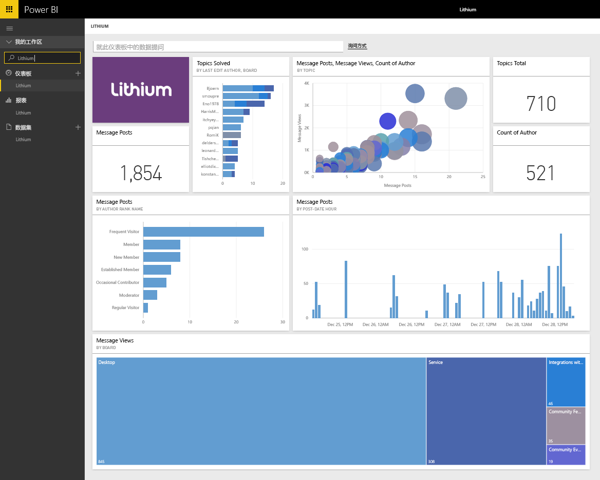

# 使用 Power BI 连接到 Lithium
Lithium 在全球最佳品牌及其客户之间建立起信任关系，同时帮助解答疑问和分享经验。 通过将 Lithium 内容包连接到 Power BI，你可以衡量你在线社区的关键指标，从而有助于推动销售、降低服务成本和提升忠诚度。 

连接到适用于 Power BI 的 [Lithium 内容包](https://app.powerbi.com/getdata/services/lithium)。

>[!NOTE]
>Power BI 内容包使用 Lithium API。 过多对 API 的调用可能会导致来自 Lithium 的额外费用，请与 Lithium 管理员进行确认。

## 如何连接
1. 选择左侧导航窗格底部的**获取数据**。
   
    
2. 在**服务**框中，选择**获取**。
   
    
3. 选择 **Lithium** \> **获取**。
   
   
4. 提供你 Lithium 社区的 URL。 它将采用 *https://community.yoursite.com* 形式。
   
   
5. 出现提示时，输入你的 Lithium 凭据。 选择 **oAuth 2** 作为身份验证机制，并单击**登录**，然后按照 Lithium 身份验证流程进行操作。
   
   
   
   
6. 完成登录流程后，导入过程将开始。 导入完成后，在导航窗格中将会出现新的仪表板、报表和模型。 选择仪表板查看已导入的数据。
   
    

**下一步？**

* 尝试在仪表板顶部的[在“问答”框中提问](power-bi-q-and-a.md)
* 在仪表板中[更改磁贴](service-dashboard-edit-tile.md)。
* [选择磁贴](service-dashboard-tiles.md)以打开基础报表。
* 虽然数据集将按计划每日刷新，你可以更改刷新计划或根据需要使用**立即刷新**来尝试刷新

## 系统要求
Lithium 内容包需要 Lithium 社区 v15.9 或更高版本。 请与你的 Lithium 管理员联系以进行确认。

## 后续步骤
[Power BI 入门](service-get-started.md)

[Power BI - 基本概念](service-basic-concepts.md)

