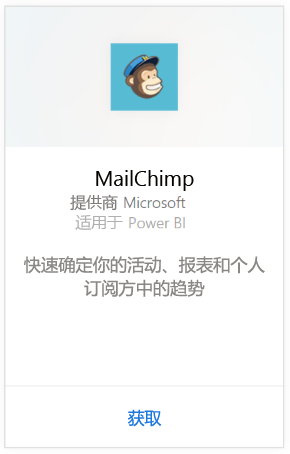
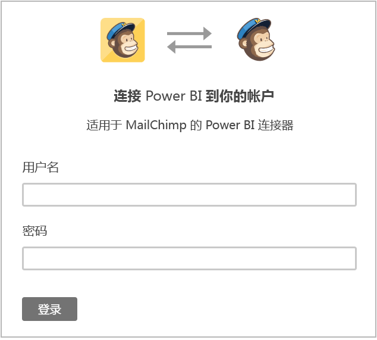
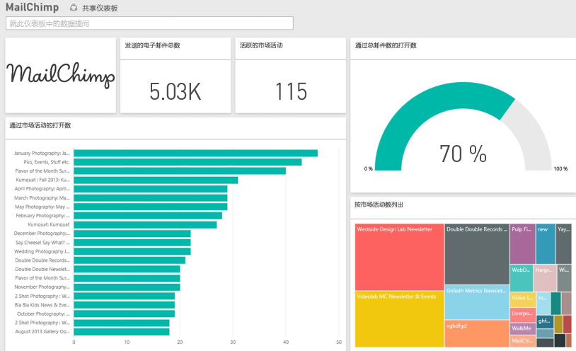

# 使用 Power BI 连接到 MailChimp
Power BI 内容包将从你的 MailChimp 帐户拉取数据，并生成一个仪表板、一组报表和一个数据集以便你浏览数据。 拉入分析以创建 [MailChimp 仪表板](https://powerbi.microsoft.com/integrations/mailchimp)，并快速确定你的活动、报表和个人订阅者中的趋势。 该数据设置为每日刷新，确保你正在监视的数据时刻保持最新。

连接到 Power BI 的 [MailChimp 内容包](https://app.powerbi.com/getdata/services/mailchimp)。

## 如何连接
1. 选择左侧导航窗格底部的**获取数据**。
   
    
2. 在**服务**框中，选择**获取**。
   
   
3. 选择 **MailChimp** \> **获取**。
   
   
4. 对于身份验证方法，选择 **oAuth2** \> **登录**。
   
    出现提示时，输入 MailChimp 凭据，然后按照身份验证过程进行操作。
   
    首次连接时，将提示你允许 Power BI 对你的帐户进行只读访问。 选择**允许**以开始导入过程，根据帐户中的数据量，这可能会花费几分钟时间。
   
    
5. Power BI 导入数据后，你将在左侧的导航窗格中看到新的仪表板、报表和数据集。 这是 Power BI 为显示数据而创建的默认仪表板。 可以修改此仪表板以便按所需方式显示数据。
   
   

**下一步？**

* 尝试在仪表板顶部的[在“问答”框中提问](power-bi-q-and-a.md)
* 在仪表板中[更改磁贴](service-dashboard-edit-tile.md)。
* [选择磁贴](service-dashboard-tiles.md)以打开基础报表。
* 虽然数据集将按计划每日刷新，你可以更改刷新计划或根据需要使用**立即刷新**来尝试刷新

## 后续步骤
[Power BI 入门](service-get-started.md)

[Power BI - 基本概念](service-basic-concepts.md)

