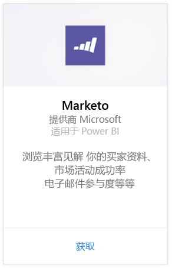
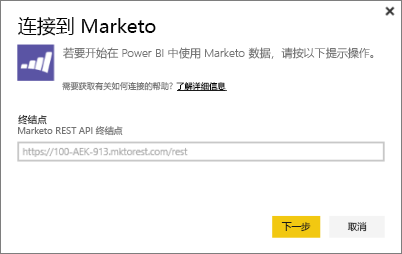
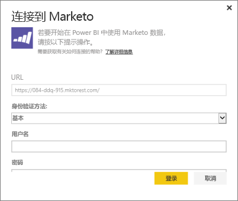
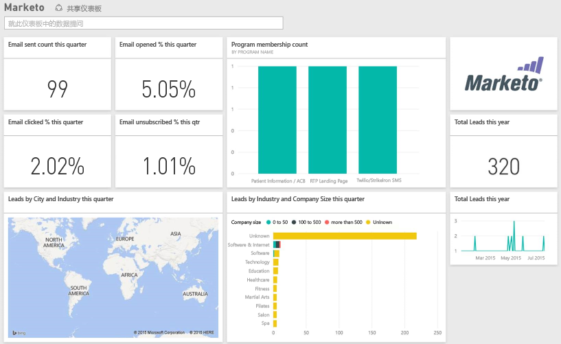

# 使用 Power BI 连接到 Marketo
使用 Power BI 的 Marketo 内容包，你可以通过有关潜在客户的数据及其活动，深入了解 Marketo 帐户。创建此连接将检索数据，并自动提供以该数据为基础的仪表板和相关报表。

连接到 Power BI 的 [Marketo 内容包](https://app.powerbi.com/getdata/services/marketo)。

## 如何连接
1. 选择左侧导航窗格底部的**获取数据**。
   
   
2. 在**服务**框中，选择**获取**。
   
    
3. 选择 **Marketo** \> **获取**。
   
   
4. 输入 Marketo 或你的 Marketo 管理员提供给你的 Marketo REST 终结点，然后选择“下一步”。
   
   
   
   阅读有关 Marketo REST 终结点的详细信息：[http://developers.marketo.com/documentation/rest/endpoint-url/ ](http://developers.marketo.com/documentation/rest/endpoint-url/)。
5. 使用**基本**身份验证方法，输入客户端 ID 作为**用户名**，并输入客户端密钥作为**密码**。 客户端 ID 和客户端密钥在 Marketo 中或由 marketo 管理员提供 ([http://developers.marketo.com/documentation/rest/custom-service/](http://developers.marketo.com/documentation/rest/custom-service/))。 
   
   
   
   这样，Power BI 的 Marketo 内容包将有权访问 [Marketo 分析](https://powerbi.microsoft.com/integrations/marketo)数据，你也能在 Power BI 中分析数据。 数据会每天刷新一次。
6. 连接到 Marketo 帐户后，将加载具有所有数据的仪表板：
   
   

**下一步？**

* 尝试在仪表板顶部的[在“问答”框中提问](power-bi-q-and-a.md)
* 在仪表板中[更改磁贴](service-dashboard-edit-tile.md)。
* [选择磁贴](service-dashboard-tiles.md)以打开基础报表。
* 虽然数据集将按计划每日刷新，你可以更改刷新计划或根据需要使用**立即刷新**来尝试刷新

## 包含的内容
对于过去一年间发生的活动，Marketo 可在 Power BI 中提供以下数据：

| 表名 | 说明 |
| --- | --- |
| EmailActivities |有关发送给潜在客户/联系人的电子邮件的数据，包含有关设备、类别、退信计数和百分比、点击计数和百分比、打开计数和百分比以及计划名称的详细信息。 Power BI 中所示的电子邮件活动是绝对的电子邮件送达情况报表，不对数据应用任何其他逻辑。 因此，你可能在 Marketo 客户端和 Power BI 之中看到不同结果。 |
| ProgramActivites |有关具有已更改状态的项目的数据。 此数据包含以下详细信息：原因、成功、计划采用计数和百分比，以及计划成功计数和百分比。 |
| WebPageActivities |来自用户网页访问的数据，包括搜索代理、用户代理、网页和时间。 |
| Datetable |过去一年内的日期。  允许你按日期分析 Marketo 数据。 |
| 潜在客户 |潜在客户信息，如公司、收入规模、员工数量、国家/地区、潜在客户评分和潜在客户状态。 将根据潜在客户是否存在于电子邮件、计划和网页活动数据中进行检索。 |

所有日期均采用 UTC 格式。 根据你的帐户所在时区，日期可能会有所不同（与 Marketo 客户端中也会出现这种情况）

## 系统要求
* 用于连接的 Marketo 帐户有权访问潜在客户和活动。
* 可通过众多 API 调用连接到数据。  Marketo 对于每个帐户具有一个 API。  当达到限制时，则无法将数据加载到 Power BI。 

**API 限制详细信息**

使用 Marketo API 从 Marketo 导入数据。 Marketo 的每位客户具有每天 10,000 个 API 调用的总限制，使用 Marketo API 的所有应用程序之间共享此限制。 你可以将这些 API 用于其他集成以及 Power BI 集成。 有关 API 的详细信息，请参阅：<http://developers.marketo.com/documentation/rest/>。

Power BI 对 Marketo 进行的 API 调用量取决于你的 Marketo 帐户中的数据量。 Power BI 会导入上一年的所有潜在客户和活动。 以下是来自 Marketo 的数据，以及 Power BI 在导入时使用的 API 调用数量的示例：  

| 数据类型 | 行数 | API 调用 |
| --- | --- | --- |
| 潜在客户信息 |15,000 |50 |
| 邮件活动 |150,000 |1,000 |
| 程序活动 |15,000 |100 |
| Web 活动 |150,000 |1,000 |
| 程序更改 |7,500 |50 |
| **API 调用总数** | |**2,200** |

## 后续步骤
[Power BI 入门](service-get-started.md)

[获取 Power BI 的数据](service-get-data.md)

[Power BI 博客：使用 Power BI 监视和分析你的 Marketo 数据](http://blogs.msdn.com/b/powerbi/archive/2015/03/19/monitor-and-analyze-your-marketo-data-with-power-bi.aspx)

