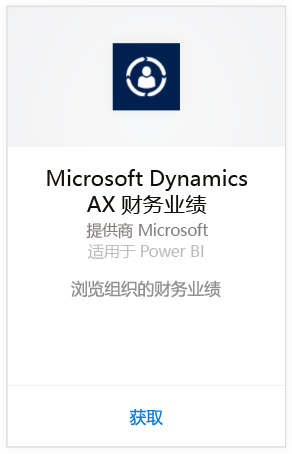
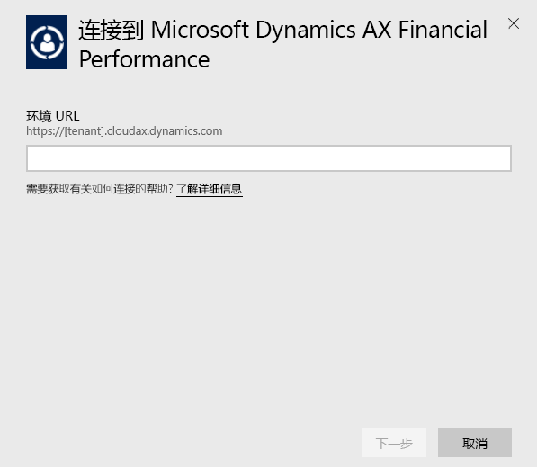
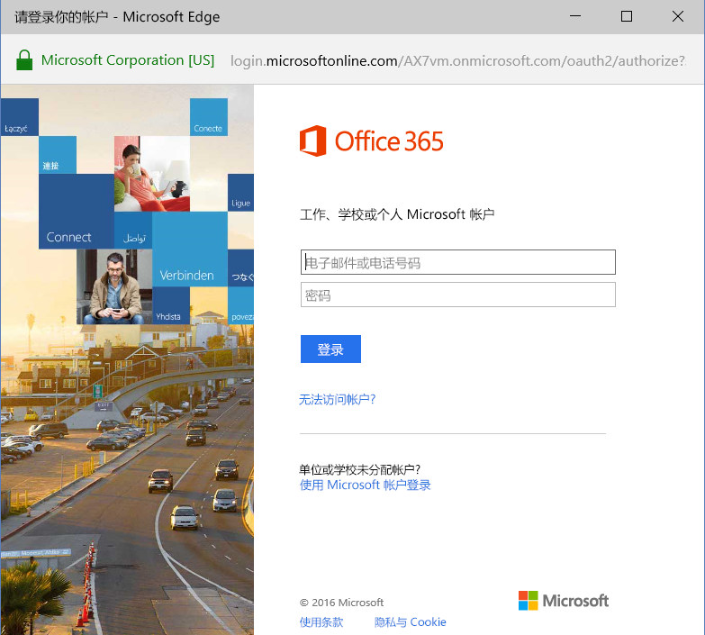

# 使用 Power BI 连接到 Microsoft Dynamics AX 内容包
Microsoft Dynamics AX 有三个针对不同业务用户的 Power BI 内容包。 专门针对首席财务官设计的“财务状况”内容包，它可让你访问有关组织的财务状况的信息。 面向渠道经理的“零售渠道状况”内容包，该内容包专注于销售状况，通过直接从“零售和商业”提取数据从而预测销售趋势并提出意见。 “成本管理”专为首席运营官和首席财务官而设计，它可提供有关经营业绩的详细信息。

连接到适用于 Power BI 的 Microsoft Dynamics AX [零售渠道状况](https://app.powerbi.com/getdata/services/dynamics-ax-retail-channel-performance)、[财务状况](https://app.powerbi.com/getdata/services/dynamics-ax-financial-performance) 或[成本管理](https://app.powerbi.com/getdata/services/dynamics-ax-cost-management)内容包。

## 如何连接
1. 选择左侧导航窗格底部的**获取数据**。
   
   
2. 在**服务**框中，选择**获取**。
   
   
3. 选择一个 Dynamics AX 内容包，然后选择**获取**。
   
   
4. 指定你的 Dynamics AX 7 环境的 URL。 请参阅下面有关[查找这些参数](#FindingParams)的详细信息。
   
   
5. 对于**身份验证方法**，选择**oAuth2**\>**登录**。 出现提示时，输入你的 Dynamics AX 凭据。
   
    
   
    
6. 审批后，导入过程将自动开始。 导入完成后，在导航窗格中将会出现新的仪表板、报表和模型。 选择仪表板查看已导入的数据。
   
     

**下一步？**

* 尝试在仪表板顶部的[在“问答”框中提问](power-bi-q-and-a.md)
* 在仪表板中[更改磁贴](service-dashboard-edit-tile.md)。
* [选择磁贴](service-dashboard-tiles.md)以打开基础报表。
* 虽然数据集将按计划每日刷新，你可以更改刷新计划或根据需要使用**立即刷新**来尝试刷新

## 包含的内容
该内容包使用 Dynamics AX 7 OData 数据源分别导入与零售渠道、财务和成本管理状况相关的数据。

## 系统要求
此内容包需要 Dynamics AX 7 环境 URL，并且用户应具有访问 OData 数据源的权限。

## 查找参数

用户登录时可在浏览器中找到 Dynamics AX 7 环境 URL。 只需将根 Dynamics AX 环境的 URL复制到 Power BI 对话框中。

## 故障排除
加载数据可能需要一些时间，具体耗时取决于你实例的大小。 如果在 Power BI 中看到空报表，请确认你有此报表所需的 OData 表的访问权限。

## 后续步骤
[Power BI 入门](service-get-started.md)

[在 Power BI 中获取数据](service-get-data.md)

