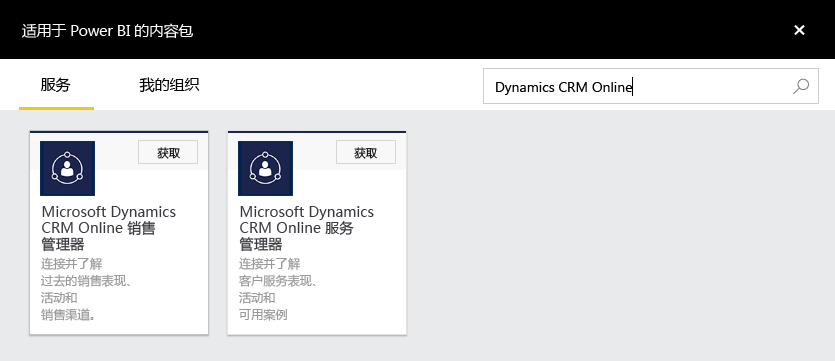
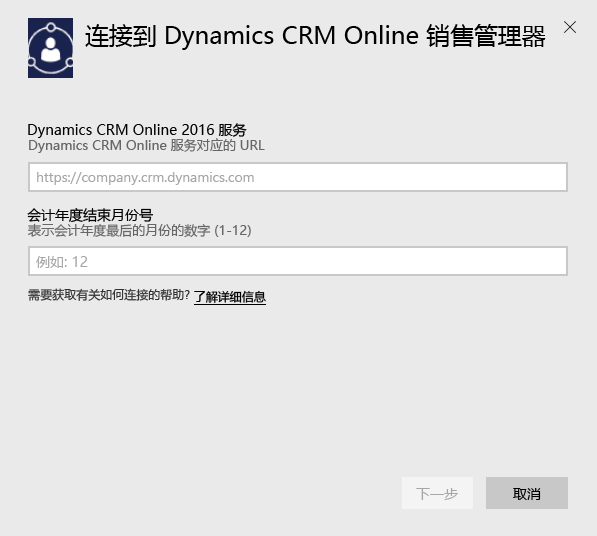
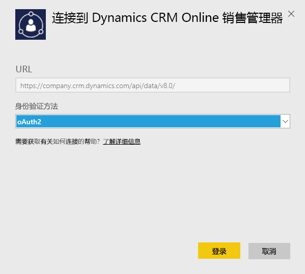
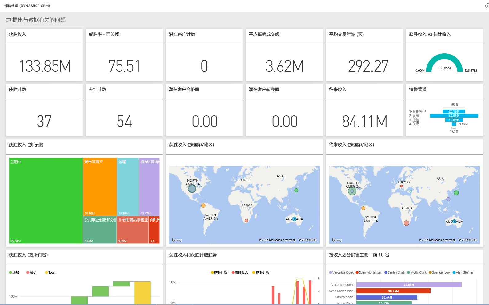

# 使用 Power BI 连接到 Microsoft Dynamics CRM
用于 Power BI 的 Microsoft Dynamics CRM Online 使你能够轻松地访问和分析数据。 Power BI 使用 OData 数据源以创建描述性模型，其中具有所需的所有实体和度量值，如帐户、活动、商机、产品、潜在客户、用户等。 安装应用后，可以在 Power BI 服务 ([https://powerbi.com](https://powerbi.com)) 和 Power BI 移动应用中查看仪表板和报表。 

连接到 Dynamics CRM Online[销售经理](https://msit.powerbi.com/groups/me/getdata/services/dynamics-crm-sales-manager)或[服务管理器](https://msit.powerbi.com/groups/me/getdata/services/dynamics-crm-customer-service)。 阅读有关使用 Power BI 与 [Dynamics CRM Online 集成](https://powerbi.microsoft.com/integrations/microsoft-dynamicscrm)的详细信息。

此连接需要 Microsoft Dynamics CRM Online 2016 或更高版本。 以下是有关[要求](#Requirements)的详细信息。

## 如何连接
[!INCLUDE [powerbi-service-apps-get-more-apps](./includes/powerbi-service-apps-get-more-apps.md)]

1. 选择 **Microsoft Dynamics CRM 销售经理** 或 **Microsoft Dynamics CRM 服务管理器**，然后单击**连接**。
   
   
2. 提供与你的帐户相关联的服务 URL。  这将在窗体 `https://company.crm.dynamics.com` 中，请参阅[以下](#FindingParams)详细信息。
   
   
3. 出现提示时，请提供凭据（如果你已使用了浏览器登录，则可跳过此步骤）。 对于身份验证方法，输入 **oAuth2**，然后单击**登录**：
   
   
4. 连接后，你将看到为销售经理或服务管理器自定义的仪表板，该仪表板是使用你自己的数据进行填充的：
   
   

## 查看 Microsoft Dynamics CRM 仪表板和报表
[!INCLUDE [powerbi-service-apps-open-app](./includes/powerbi-service-apps-open-app.md)]

[!INCLUDE [powerbi-service-apps-open-app](./includes/powerbi-service-apps-what-now.md)]

## 包含的内容
以下部分详细介绍了[销售经理](#Sales)和[服务管理器](#Service)角色中所包含的内容。

请注意，额外的数据将基于分配到 Dynamics CRM Online 用户的安全角色而受限制。

仪表板和报表旨在提供侧重于团队或组的有关近期数据的运营报表。 每个查询受限于从 Dynamics CRM Online 中检索最大为 100K 的记录。 如果由于组织中的数据量大而超过此限制，设置将失败，因为数据刷新 Dynamics CRM Online 将被终止。 如果你的帐户过大，请考虑通过 Power BI Desktop 进行连接以生成自定义解决方案。

### 销售经理
仪表板和报表包含关键指标，例如：  

* 获胜收入   
* 胜率   
* 往来收入   
* 失败收入   
* 预期收入  
* 平均每笔成交额等。  

它们还包含关键图表，例如：  

* 获胜和失败收入趋势，获胜收入 Vs 估计收入趋势  
* 按照各个方面（如行业、地区、区域）的获胜收入   
* 按收入、活动划分的销售主管，   
* 排名靠前的帐户，排名靠前的获胜/失败交易，    
* 新潜在客户趋势、销售漏斗等。   

这些指标和图表有助于了解你的销售组织业绩并且对你的销售团队进行销售漏斗分析。

下表列出了此服务中可用的 CRM 实体，并且还提供了有关应用于每个实体记录的筛选器的详细信息。

| CRM 实体 | 应用的筛选器 |
| --- | --- |
| 帐户 |有在过去的 365 天内修改的相关商机的所有帐户。 |
| 活动 |在过去的 90 天内修改的所有活动   [modifiedon] > 今天 - 90 天 |
| 业务部门 |所有未禁用的业务部门   [isdisabled] = false |
| 潜在客户 |在过去的 180 天内修改的所有潜在客户   [modifiedon] > 今天 - 180 天 |
| 商机 |在过去的 365 天内修改的所有商机   [modifiedon] > 今天 - 365 天 |
| 商机产品 |在过去的 365 天内修改的所有商机产品   [modifiedon] > 今天 - 365 天 |
| 产品 |所有活动产品   [statecode] <> 1 |
| 区域 |所有区域 |
| 用户 |所有非委派管理员的活动用户    [isdisabled] = false，并且 [accessmode] <> 4 |

### 服务管理器
这些仪表板和报表包含关键指标，例如：  

* CSAT 百分比   
* SLA Met 百分比   
* 已提升案例百分比   
* 平均处理时间   
* 已解决案例总数  
* 活动案例总数  
* 知识库文章在案例中的使用次数等。    

它们还包含关键图表，例如：   

* 新近案例、已解决案例、已提升案例的案例数量趋势   
* 按照各个方面（如来源、位置、优先级、类型）划分的案例数量  
* 按 CSAT 百分比、SLA met 百分比、活动、已解决案例划分的负责人  
* 最常使用和查看次数最多的知识库文章等。  
   这些指标和图表有助于了解你的支持组织业绩并且对你的服务团队和服务队列进行活动案例工作量分析。

下表列出了此服务中可用的 CRM 实体以及有关应用于每个实体记录的筛选器的详细信息。

| CRM 实体 | 应用的筛选器 |
| --- | --- |
| 帐户 |有在过去的 90 天内修改的相关案例的所有帐户。 |
| 活动 |在过去的 90 天内修改的所有活动   [modifiedon] > 今天 - 90 天 |
| 案例 |在过去的 90 天内修改的所有案例   [modifiedon] > 今天 - 90 天 |
| 案例解决活动 |在过去的 90 天内修改的所有案例解决活动   [modifiedon] > 今天 - 90 天 |
| 联系人 |有在过去的 90 天内修改的相关案例的所有联系人。 |
| 知识文章 |所有最新版本的知识文章    [islatestversion] = true |
| 知识文章事件 |在过去的 90 天内修改的所有知识文章事件   [modifiedon] > 今天 - 90 天 |
| 队列 |所有活动队列    [statecode] = 0 |
| 队列项 |在过去的 365 天内创建的所有案例相关的队列项    [createdon] > 今天 - 365 天   [objecttypecode] = 112 |
| 用户 |所有活动用户    [isdisabled] = false |

## 系统要求
* 一个有效的 Dynamics CRM Online 2016 或更高版本实例（Power BI 不适用于本地 CRM 版本）。 如果没有 2016 或更高版本：
* 管理员必须启用站点设置中的 OData 终结点。
* 任何表格中小于 100k 条记录的帐户。 请注意，如果该帐户有权访问超过 100k 条记录，导入将会失败。

## 查找参数
在浏览器的 URL 栏中可以找到该实例的地址。 它通常具有以下格式：`https://[instance_name].crm.dynamics.com`。

Power BI 仅支持 Dynamics CRM 2016 终结点。 该连接不适用于早期版本的 CRM Online。 使用 Power BI Desktop 直接连接到你的帐户。

## 故障排除
如果你遇到连接问题，请确认：  

* 你提供的是正确的实例 URL（使用管理员帐户检查）  
* 该实例是 CRM Online 2016  
* 已启用 OData 终结点  

此外，请尝试使用 OData URL `https://[instance_name].crm.dynamics.com/api/data/v8.0/` 直接在 Power BI Desktop 中进行连接。

如果确认拥有 Dynamics CRM Online 2016，但是连接时仍出现问题，请与 CRM 管理员联系以确认已拥有所有可用的更新。

如果没有 CRM Online 2016 或更高版本，请使用 Power BI Desktop 直接连接到你的帐户。

如果看到错误“数据刷新失败，因为查询超过 100000 条记录的最大限制”，请考虑直接从 Power BI Desktop 连接或使用 CRM 解决方案模板。

## 后续步骤
* [Power BI 中的应用有哪些？](service-install-use-apps.md)
* [在 Power BI 中获取数据](service-get-data.md)
* 更多问题？ [尝试咨询 Power BI 社区](http://community.powerbi.com/)

