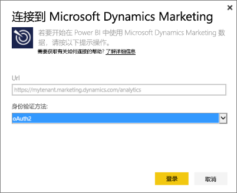
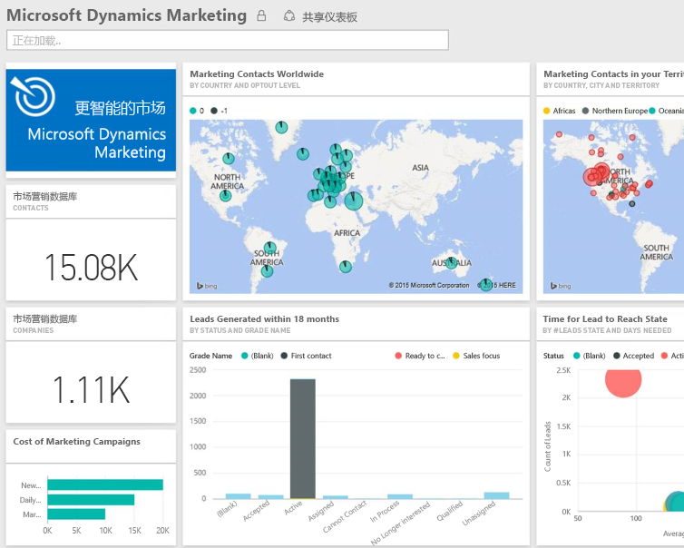

# 使用 Power BI 连接到 Microsoft Dynamics Marketing
通过 Power BI 的 Microsoft Dynamics Marketing 内容包，你可以轻松访问和分析来自 Dynamics Marketing 的数据 该内容包使用以 OData 数据源为基础的描述性模型，其中包括所有所需条目和度量值，例如程序、活动、市场营销联系人、公司、潜在客户、潜在客户互动、潜在客户分级、营销电子邮件和网站、行为观察、预算、财务交易、绩效 KPI 等。 

连接到 Power BI 的 [Dynamics Marketing 内容包](https://app.powerbi.com/getdata/services/microsoft-dynamics-marketing)。

>[!NOTE]
>需要为 Dynamics Marketing 实例指定有效的 OData URL（此内容包对于本地 CRM 版本无效）。 其他要求见下文。

## 如何连接
1. 选择左侧导航窗格底部的“获取数据”。
   
    
2. 在**服务**框中，选择**获取**。
   
    
3. 选择 **Microsoft Dynamics Marketing** \> **获取**。
   
   
4. 提供与你的帐户相关联的 OData URL。  应采用 “https:// [instance\_name].marketing.dynamics.com/analytics” 形式。
   
   
5. 出现提示时，请提供凭据（如果你已使用了浏览器登录，则可跳过此步骤）。 对于身份验证方法，输入 **oAuth2**，然后单击**登录**：
   
   
6. 连接后，你将看到含有你的数据的 Dynamics Marketing 仪表板。 黄色星号标记着左侧导航窗格中的新项目。
   
   

**下一步？**

* 尝试在仪表板顶部的[在“问答”框中提问](power-bi-q-and-a.md)
* 在仪表板中[更改磁贴](service-dashboard-edit-tile.md)。
* [选择磁贴](service-dashboard-tiles.md)以打开基础报表。
* 虽然数据集将按计划每日刷新，你可以更改刷新计划或根据需要使用**立即刷新**来尝试刷新

## 系统要求
* 需要为 Dynamics Marketing 实例指定有效的 OData URL（此内容包对于本地 CRM 版本无效）。  
* 管理员必须启用站点设置中的 OData 终结点。 在**组织数据服务**部分中，导航到**开始 \> 设置 \> 站点设置**，可以找到 OData 终结点的地址。  OData URL 的格式为： https:// [instance\_name].marketing.dynamics.com/analytics  
* 用于访问 Microsoft Dynamics Marketing 的用户帐户/身份必须与注册用于 Power BI 的用户帐户/身份一致。 登录 Microsoft Dynamics Marketing 时，使用用于 Power BI 的相同身份自动登录。 若希望使用其他帐户登录 Microsoft Dynamics Marketing，请先使用该帐户注册为 Power BI 用户。 我们希望在即将发布的版本中解决此问题。   

## 故障排除
尝试连接到 Dynamics CRM 帐户时，如果看到“登录失败”消息，请确认使用与访问 CRM Online OData 数据源所用的同一帐户登录 Power BI。 也请尝试在浏览器中登录到源，以便在其中进行测试。

请管理员确认 OData URL 正确且已启用 OData 终结点。

检查所用 Dynamics Marketing 版本 - 18.0 和 18.1版本中进行了其他修复，如果使用较早版本并仍遇到问题，可考虑升级。

如果仍然存在问题，请打开支持票证以联系 Power BI 团队：

* 在 Power BI 应用中选择问号 \> **联系支持人员**。
* 从 Power BI 技术支持网站（即你正在阅读此文章的地方）中选择页面右侧的**联系支持人员**。

## 后续步骤
[获取 Power BI 的数据](service-get-data.md)

[什么是 Power BI？](power-bi-overview.md)

