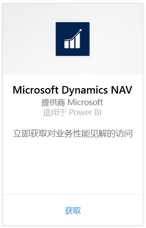
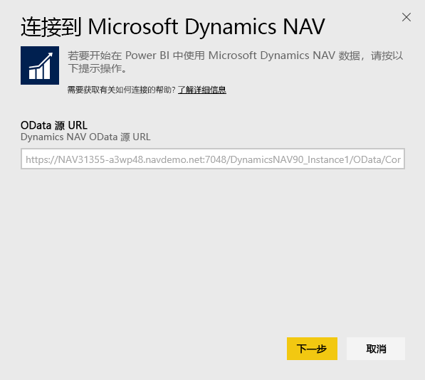
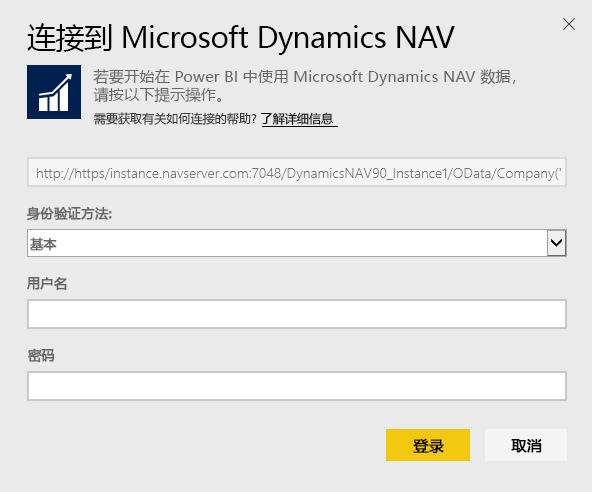
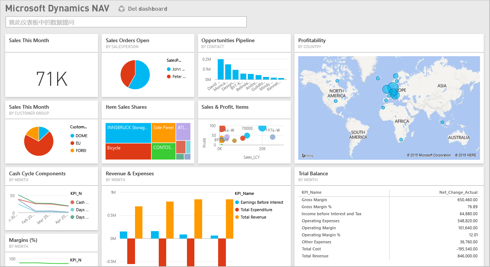

# 使用 Power BI 连接到 Microsoft Dynamics NAV
借助 Power BI，轻松获得有关 Microsoft Dynamics NAV 数据的见解。 Power BI 会检索数据（销售和财务数据），然后基于该数据生成带仪表板和报表的应用。 Power BI 需要具有对从中检索数据（在本例中为销售和财务数据）的表的访问权限。 以下是有关要求的详细信息。 安装应用后，可以在 Power BI 服务 ([https://powerbi.com](https://powerbi.com)) 和 Power BI 移动应用中查看仪表板和报表。 

[连接到用于 Power BI 的 Microsoft Dynamics NAV](https://app.powerbi.com/getdata/services/microsoft-dynamics-nav) 或阅读有关使用 Power BI 进行 [Microsoft Dynamics NAV 集成](https://powerbi.microsoft.com/integrations/microsoft-dynamics-nav)的详细信息。

## 如何连接
[!INCLUDE [powerbi-service-apps-get-more-apps](./includes/powerbi-service-apps-get-more-apps.md)]

1. 选择 **Microsoft Dynamics NAV**，然后选择 **获取**。  
   
2. 出现提示时，请输入你的 Microsoft Dynamics NAV OData URL。 URL 应与以下模式相匹配：
   
    `https//instance.navserver.com:7048/DynamicsNAV90_Instance1/OData/Company('CRONUS%20International%20Ltd.')`
   
   * NAV 服务器名称应与“instance.navserver.com”相匹配
   * NAV 服务器实例名称应与“DynamicsNAV90\_Instance1”相匹配
   * NAV 公司名称应与“Company('CRONUS%20International%20Ltd.')”相匹配
     
     获取此 URL 的一个简单的方法是在 Dynamics NAV 中转到 Web 服务，找到 powerbifinance Web 服务并复制 Odata URL，但是省去此 URL 字符串中的“/powerbifinance”。  
     
3. 选择**基本**并输入你的 Microsoft Dynamics NAV 凭据。
   
    你需要 Microsoft Dynamics NAV 帐户的管理员凭据（或至少对销售和财务数据的访问权限）。  当前仅支持基本（用户名和密码）身份验证。
   
    
4. Power BI 会检索 Microsoft Dynamics NAV 数据，并为你创建随时可用的仪表板和报表。   
   

## 查看仪表板和报表
[!INCLUDE [powerbi-service-apps-open-app](./includes/powerbi-service-apps-open-app.md)]

[!INCLUDE [powerbi-service-apps-open-app](./includes/powerbi-service-apps-what-now.md)]

## 包含的内容
仪表板和报表包含下表中的数据（区分大小写）：  

* ItemSalesAndProfit  
* ItemSalesByCustomer  
* powerbifinance  
* SalesDashboard  
* SalesOpportunities  
* SalesOrdersBySalesPerson  
* TopCustomerOverview  

## 系统要求
若要将 Microsoft Dynamics NAV 数据导入到 Power BI 中，则需要具有对从中检索数据的销售和财务数据表（上面已列出）的访问权限。 表中需要具有一些数据，当前不能导入空表。

## 故障排除
Power BI 使用 Microsoft Dynamics NAV 的 Web 服务来检索数据。 如果 Microsoft Dynamics NAV 实例中有大量数据，将 Web 服务使用情况影响降到最低的建议：按需更改刷新频率。 另一个建议是让一个管理员创建应用并进行共享，而不是让每个管理员都创建自己的应用。

**“参数验证失败，请确保所有参数都是有效的”**  
如果在键入 Microsoft Dynamics NAV URL 后看到此错误。 请确保满足以下要求：

* URL 完全采用这种模式：
  
    `https//instance.navserver.com:7048/DynamicsNAV90_Instance1/OData/Company('CRONUS%20International%20Ltd.')`
  
  * NAV 服务器名称应与“instance.navserver.com”相匹配
  * NAV 服务器实例名称应与“DynamicsNAV90\_Instance1”相匹配
  * NAV 公司名称应与“Company('CRONUS%20International%20Ltd.')”相匹配
* 请确保所有字母均为小写。  
* 请确保该 URL 采用“https”。  
* 请确保此 URL 的末尾没有尾随正斜杠。

**“登录失败”**  
如果在使用 Microsoft Dynamics NAV 凭据登录后收到“登录失败”的错误，你则可能遇到了以下的其中一个问题：

* 你使用的帐户没有权限从你的帐户中检索 Microsoft Dynamics NAV 数据。 验证其是否为管理员帐户，然后重试。
* 当前正在尝试连接的 Dynamics NAV 实例不具有有效的 SSL 证书。 在这种情况下，你将看到更详细的错误消息（“无法建立受信任的 SSL 关系”）。 请注意，不支持自签名的证书。

**“糟糕”**  
如果你在通过身份验证对话框后看到“糟糕”的错误对话框，则说明 Power BI 在加载数据时遇到了问题。

* 请验证 URL 已采用上面指定的模式。 一个常见错误是指定：
  
    `https//instance.navserver.com:7048/DynamicsNAV90\_Instance1/OData`
  
    正确的做法是将与你的 NAV 公司名称匹配的“Company('CRONUS%20International%20Ltd.')”部分包含在内：
  
    `https//instance.navserver.com:7048/DynamicsNAV90\_Instance1/OData/Company('CRONUS%20International%20Ltd.')`

## 后续步骤
* [Power BI 中的应用有哪些？](service-install-use-apps.md)
* [在 Power BI 中获取数据](service-get-data.md)
* 更多问题？ [尝试咨询 Power BI 社区](http://community.powerbi.com/)

