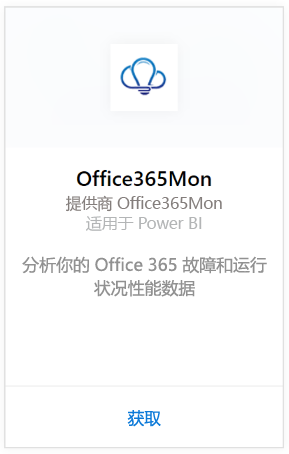
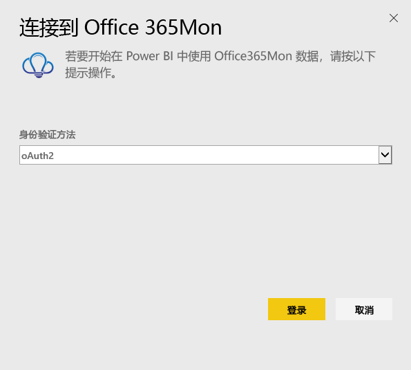
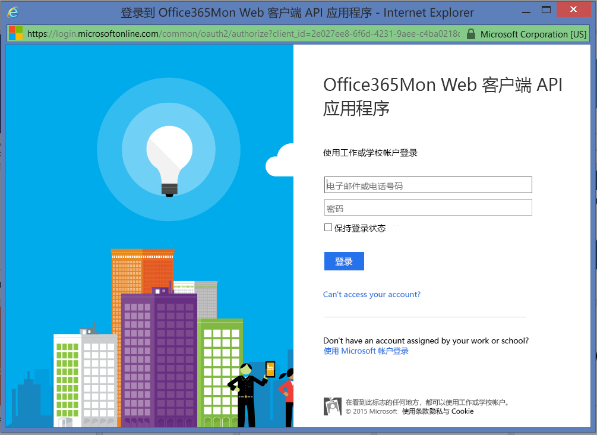
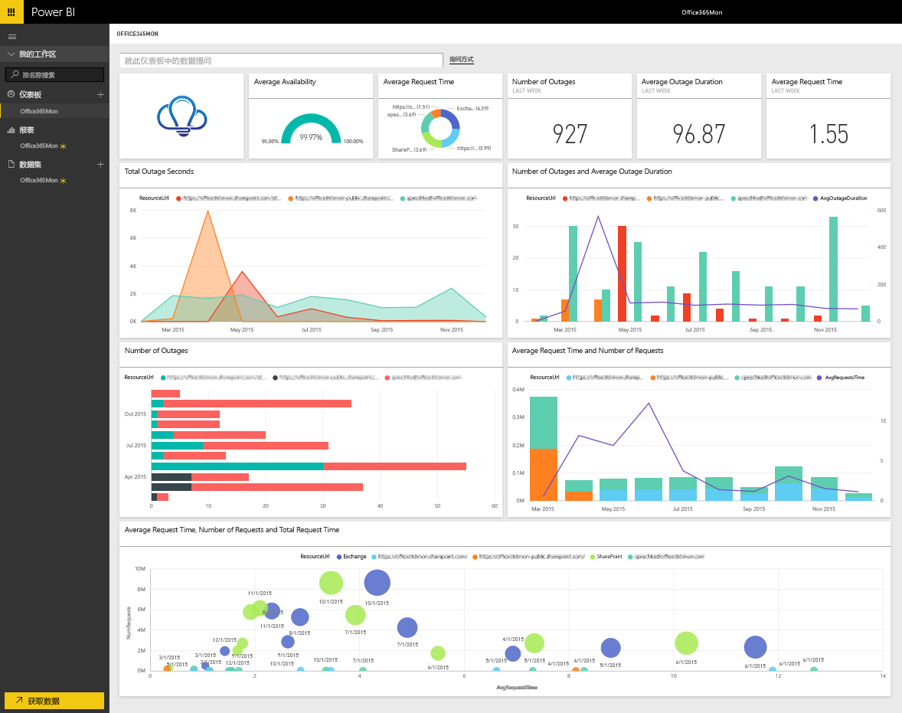

# 使用 Power BI 连接到 Office365Mon
使用 Power BI 和 Office365Mon 内容包可轻松分析 Office 365 故障和运行状况性能数据。 Power BI 将检索你的数据（包括故障和运行状况探测），然后基于该数据构建可立即使用的仪表板和报表。

连接到 Power BI 的 [Office365Mon 内容包](https://app.powerbi.com/groups/me/getdata/services/office365mon)。

>[!NOTE]
>需要使用 Office365Mon 管理员帐户连接和加载 Power BI 内容包。

## 如何连接
1. 选择左侧导航窗格底部的**获取数据**。
   
   
2. 在**服务**框中，选择**获取**。
   
    
3. 选择 **Office365Mon** \> **获取**。
   
   
4. 对于身份验证方法，选择 **oAuth2** \> **登录**。
   
   出现提示时，输入Office365Mon 管理凭据，然后按照身份验证过程进行操作。
   
   
   
   
5. Power BI 导入数据后，你将在左侧的导航窗格中看到新的仪表板、报表和数据集。 新的项目会以黄色星号 \* 标记，请选择 Office365Mon 条目。
   
   

**下一步？**

* 尝试在仪表板顶部的[在“问答”框中提问](power-bi-q-and-a.md)
* 在仪表板中[更改磁贴](service-dashboard-edit-tile.md)。
* [选择磁贴](service-dashboard-tiles.md)以打开基础报表。
* 虽然数据集将按计划每日刷新，你可以更改刷新计划或根据需要使用**立即刷新**来尝试刷新

## 故障排除
使用 Office365Mon 订阅凭据进行登陆后，若显示**登录失败**，则表明所用帐户无权检索你的帐户中的 Office365Mon 数据。 验证其是否为管理员帐户，然后重试。

## 后续步骤
[Power BI 入门](service-get-started.md)

[获取 Power BI 的数据](service-get-data.md)

