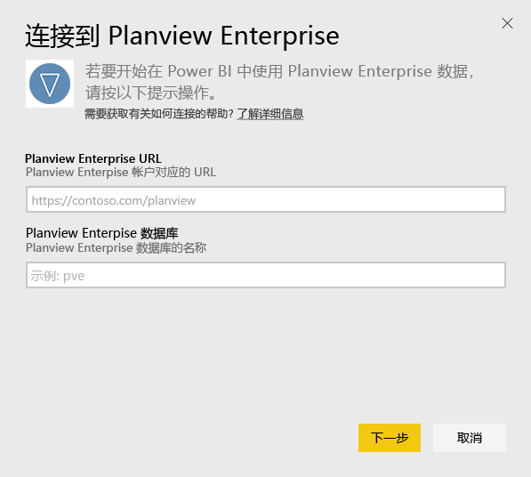
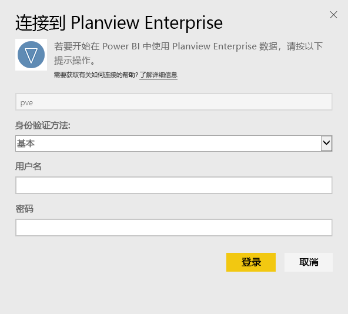
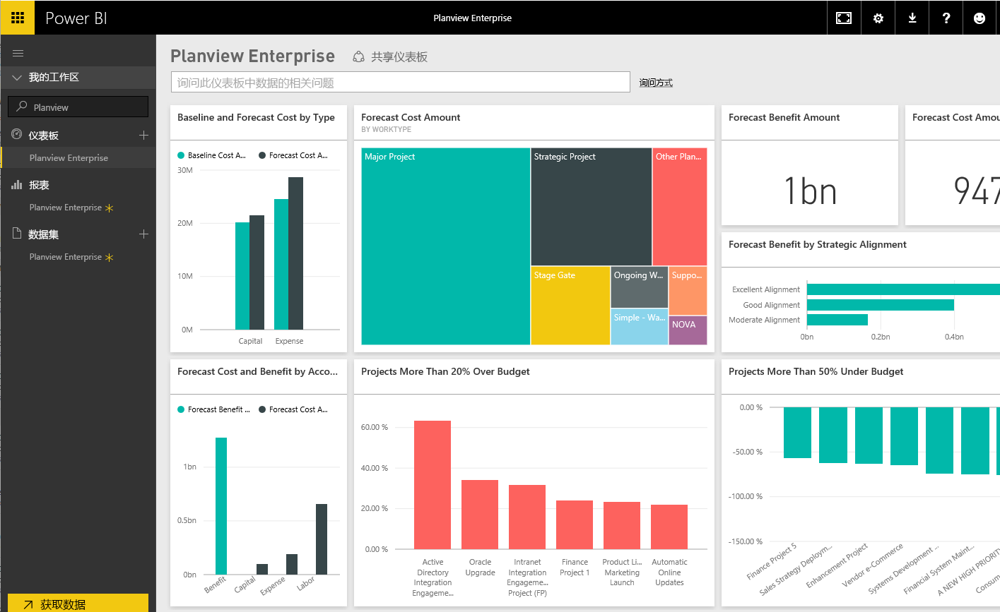

# 使用 Power BI 连接到 Planview Enterprise
通过 Planview Enterprise 内容包，你可以可视化你的资源，并以全新的方式直接在 Power BI 中使用管理数据。 使用你的 Planview Enterprise 登录凭据以交互方式查看证券投资开销，了解你是否超出或低于预算，并知道你的项目如何很好地与公司战略重点保持一致。 你还可以扩展现成的仪表板和报表，以获取对你最重要的信息。

连接到 [Power BI 中的 Planview Enterprise 内容包](https://app.powerbi.com/getdata/services/planview-enterprise)

>[!NOTE]
>若要将 Planview Enterprise 数据导入 Power BI，你必须是 Planview Enterprise 用户，且已在角色上启用 Reporting Portal Viewer 功能。 其他要求见下文。

## 如何连接
1. 选择左侧导航窗格底部的**获取数据**。
   
    
2. 在**服务**框中，选择**获取**。
   
    
3. 在 Power BI 页上，选择 **Planview Enterprise**，然后选择**获取**：  
    
4. 在 Planview Enterprise URL 文本框中，输入你想使用的 Planview Enterprise 服务器的 URL。 在 Planview Enterprise 数据库文本框中，输入 Planview Enterprise 数据库的名称，然后单击下一步。  
    
5. 在身份验证方法列表中，若未选择**基本**选项，则选择该项。 输入帐户的**用户名**和**密码**，然后选择**登录**。  
   
6. 在左窗格中，从仪表板列表中选择 Planview Enterprise。  
     Power BI 会将 Planview Enterprise 数据导入仪表板。 请注意，加载数据可能需要一些时间。  
    

**下一步？**

* 尝试在仪表板顶部的[在“问答”框中提问](service-q-and-a.md)
* 在仪表板中[更改磁贴](service-dashboard-edit-tile.md)。
* [选择磁贴](service-dashboard-tiles.md)以打开基础报表。
* 虽然数据集将按计划每日刷新，你可以更改刷新计划或根据需要使用**立即刷新**来尝试刷新

## 系统要求
若要将 Planview Enterprise 数据导入 Power BI，你必须是 Planview Enterprise 用户，且已在角色上启用 Reporting Portal Viewer 功能。 其他要求见下文。

此过程假设你已使用 Power BI 帐户登录到 Microsoft Power BI 主页。 如果还没有 Power BI 帐户，请在 Power BI 主页上创建一个新的免费 Power BI 帐户，然后单击“获取数据”。

## 后续步骤：

[Power BI 入门](service-get-started.md)

[获取 Power BI 的数据](service-get-data.md)