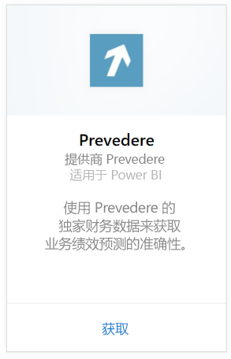
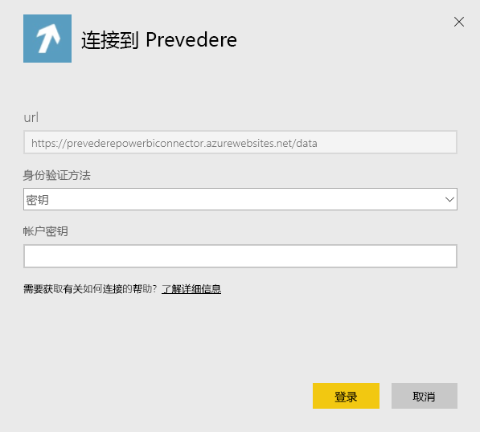
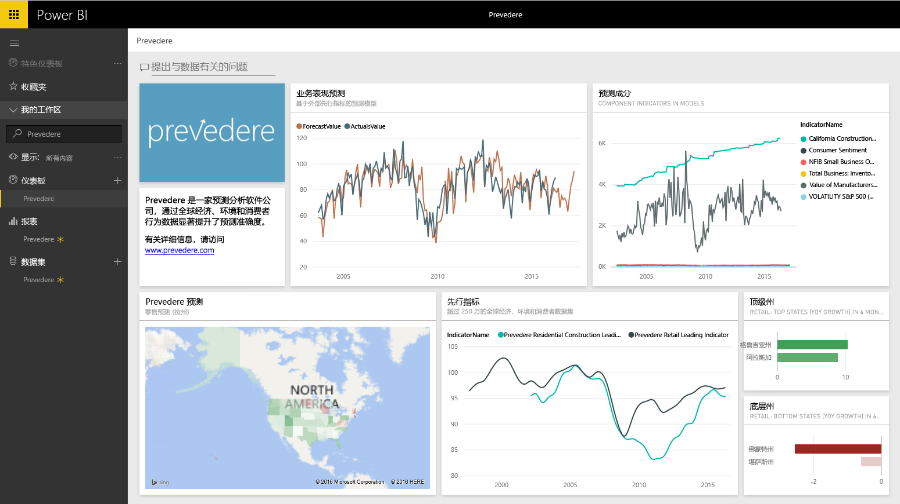

# 使用 Power BI 连接到 Prevedere
获取独家和关键财务信息的访问权限，从而自信主动地发展你的业务。

连接到 Power BI 的 [ Prevedere 内容包](https://app.powerbi.com/getdata/services/prevedere)。

>[!NOTE]
>如果你不是现有的 Prevedere 用户，请使用[示例密钥](https://prevederepowerbiconnector.azurewebsites.net/static/learnmore.html)进行尝试。

## 如何连接
1. 选择左侧导航窗格底部的**获取数据**。
   
   
2. 在**服务**框中，选择**获取**。
   
   
3. 选择 **Prevedere**，然后选择“获取”。
   
   
4. 对于“身份验证方法”，请选择“密钥”，然后键入你的 Prevedere API 密钥。
   
    
5. 选择“登录”以开始导入过程。 导入完成后，在导航窗格中将会出现新的仪表板、报表和模型。 选择仪表板查看已导入的数据。
   
     

**下一步？**

* 尝试在仪表板顶部的[在“问答”框中提问](power-bi-q-and-a.md)
* 在仪表板中[更改磁贴](service-dashboard-edit-tile.md)。
* [选择磁贴](service-dashboard-tiles.md)以打开基础报表。
* 虽然数据集将按计划每日刷新，你可以更改刷新计划或根据需要使用**立即刷新**来尝试刷新

## 包含的内容
此内容包获取了零售预测、预测模型、主要指标等见解。

## 系统要求
此内容包需要访问 Prevedere API 密钥或示例密钥（见下文）。

## 查找参数

现有的客户可以使用 API 密钥来访问他们的数据。 如果你还不是客户，你可以使用[示例密钥](https://prevederepowerbiconnector.azurewebsites.net/static/learnmore.html)来查看数据和分析示例。

## 故障排除
加载数据可能需要一些时间，具体耗时取决于你实例的大小。

## 后续步骤
[Power BI 入门](service-get-started.md)

[在 Power BI 中获取数据](service-get-data.md)

