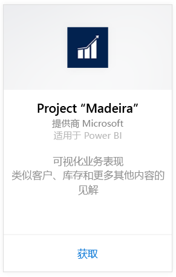
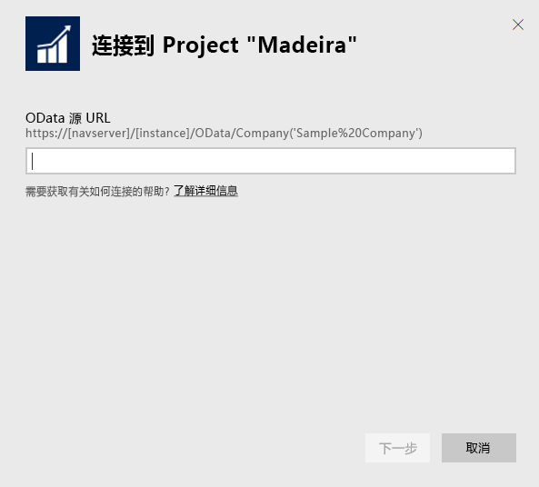
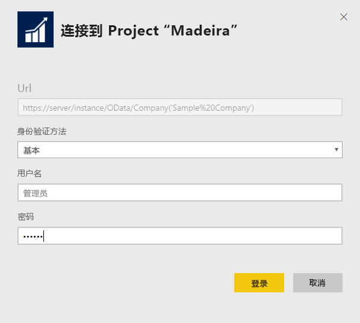
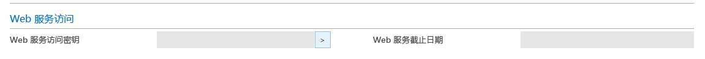
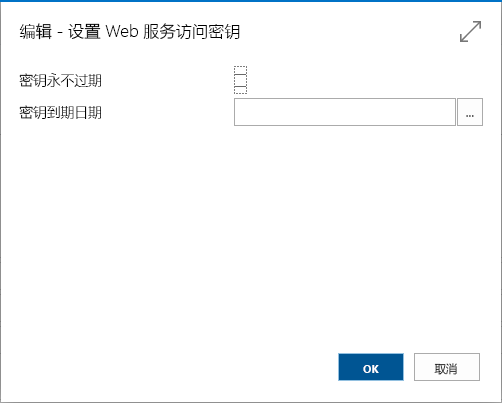

# 使用 Power BI 连接到 Project "Madeira"
通过 Power BI 和 Project "Madeira" 内容包，可以轻松获得有关 Project "Madeira" 数据的深入见解。 Power BI 会检索数据（销售和财务数据），然后基于该数据生成全新的仪表板和报表。
连接到适用于 Power BI 的 Project "Madeira" 或阅读有关 Project "Madeira" 与 Power BI 集成的更多信息。

>[!NOTE]
>此内容包需要具有对从中检索数据（在此示例中为销售和财务数据）的表的访问权限。 [下面](#Requirements)是有关各种要求的详细信息。

连接到适用于 Power BI 的 [Project "Madeira" Analytics 内容包](https://app.powerbi.com/getdata/services/project-madeira)。

## 如何连接
1. 选择左侧导航窗格底部的**获取数据**。  
    
2. 在**服务**框中，选择**获取**。  
    
3. 选择 **Project "Madeira"**，然后选择**获取**。  
    
4. 出现提示时，输入你的 Project "Madeira" URL。 URL 需要完全按照以下模式：https://mycronusus.projectmadeira.com:7048/NAV/OData/Company('CRONUS%20US')，加上你的 Project “Madeira” 公司名称。 请注意，末尾没有尾部斜杠，并且连接必须是 HTTPS。 请参阅[以下](#FindingParams)有关查找此 URL 的详细信息。  
   
    
5. 出现提示时，选择“基本”作为身份验证方法，输入你的 Project "Madeira" 电子邮件地址作为用户名，然后输入 Project "Madeira" 帐户的 Web 服务访问密钥作为密码。 如果你已经在浏览器中登录到 Project "Madeira"，则可能不会看到凭据提示。 请参阅[以下](#FindingParams)有关生成此访问密钥的详细信息。  
   
    >[!NOTE]
    >用户必须是 Project "Madeira" 中的超级用户。
   
    
6. 连接后，将自动加载仪表板、报表和数据集。 完成后，将使用帐户中的数据更新磁贴。  
   
    

**下一步？**

* 尝试在仪表板顶部的[在“问答”框中提问](power-bi-q-and-a.md)
* 在仪表板中[更改磁贴](service-dashboard-edit-tile.md)。
* [选择磁贴](service-dashboard-tiles.md)以打开基础报表。
* 虽然数据集将按计划每日刷新，你可以更改刷新计划或根据需要使用**立即刷新**来尝试刷新

## 系统要求
若要将 Project "Madeira" 数据导入 Power BI，则需要具有对从中检索数据的销售和财务数据表的访问权限。 内容包所需的所有表（区分大小写）包括：  
 
    ´´´ 
    - ItemSalesAndProfit  
    - ItemSalesByCustomer  
    - powerbifinance  
    - SalesDashboard  
    - SalesOpportunities  
    - SalesOrdersBySalesPerson  
    - TopCustomerOverview  
    ´´´ 

## 查找参数
**获取正确的 URL**在 Project "Madeira"中获取此 URL 的一个简单方法是转到 Web 服务，找到 powerbifinance Web 服务，并复制 Odata URL（使用右键单击和复制快捷方式），但是省去此 URL 字符串中的 “/powerbifinance…”部分。

**Web 服务访问密钥**为了使用来自 Project "Madeira" 的数据，你将需要为你的用户帐户创建 Web 服务访问密钥。 在 Project "Madeira" 中，搜索“用户”页面，然后打开用于用户帐户的卡。 在此处你可以生成一个新的 Web 服务访问密钥，并将其复制到“Power BI 连接”页中的“密码”字段。

开始使用 Web 服务访问密钥是，今后都将使用此密钥，因此在弹出的消息中选择“确定”。
创建密钥时，你可以选择它是否在某个特定日期后过期。

选择“确定”时，将创建一个密钥，你可以将其复制到“Power BI 连接”页中的“密码”字段。

## 故障排除
Power BI 仪表板依赖于上面所列的已发布的 Web 服务，并且如果你从当前的财务解决方案导入数据，它将显示来自演示公司或你自己的公司的数据。 但是，如果出现问题，本部分将提供针对大多数典型问题的解决方法。

“参数验证失败，请确保所有参数都有效。”****如果在输入Project Madeira URL 后看到此错误消息，请确认是否满足以下要求：  

    - URL 完全采用这种模式 https://*mycronusus*.projectmadeira.com:7048/NAV/OData/Company('*CRONUS%20US*')  
    - 删除括号中公司名后的任何文本  
    - 请确保此 URL 的末尾没有尾随正斜杠。  
    - 确保此 URL 使用安全连接，如以 HTTPS 开头的 URL 所示。  

**“登录失败”**如果在你使用 Project "Madeira" 凭据登录到仪表板时，收到“登录失败”错误，这可能是由于以下问题之一导致的：  

    - 你所使用的帐户没有从你的帐户读取 Project "Madeira" 数据的权限。 验证 Project "Madeira" 中的用户帐户，并确保你使用了正确的 Web 服务访问密钥作为密码，然后重试。  
    - 你正在尝试连接到的 Project "Madeira" 实例不具有有效的 SSL 证书。 在这种情况下，你将看到更详细的错误消息（“无法建立受信任的 SSL 关系”）。 请注意，不支持自签名的证书。  

**“糟糕”**如果在你通过身份验证对话框后，看到“糟糕”错误对话框，这一错误经常是由于连接到内容包的数据时出现的问题所造成的。 验证该 URL 是否采用了之前指定的模式：  
    https://*mycronusus*.projectmadeira.com:7048/NAV/OData/Company('*CRONUS%20US*')

一个常见错误指定特定 Web 服务的完整 URL：  
    https://*mycronusus*.projectmadeira.com:7048/NAV/OData/Company('*CRONUS%20US*')/powerbifinance

或者，你可能忘记了指定公司名称：   
    https://*mycronusus*.projectmadeira.com:7048/NAV/OData/

## 后续步骤
[Power BI 入门](service-get-started.md)

[Power BI - 基本概念](service-basic-concepts.md)

