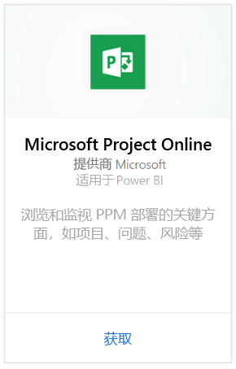
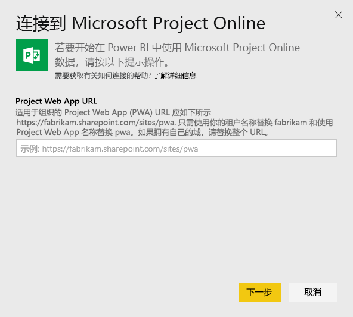
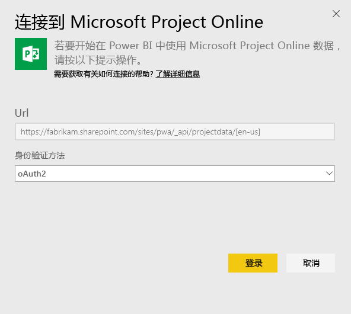
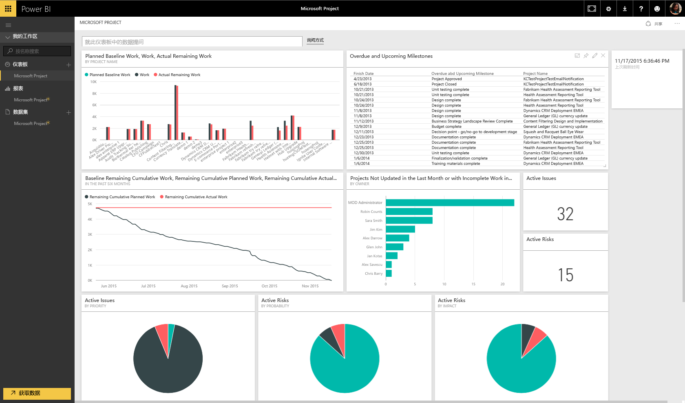
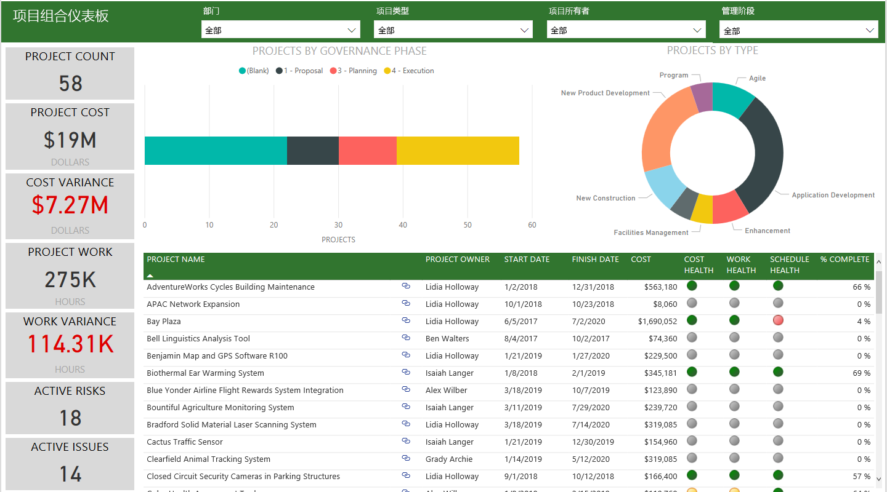
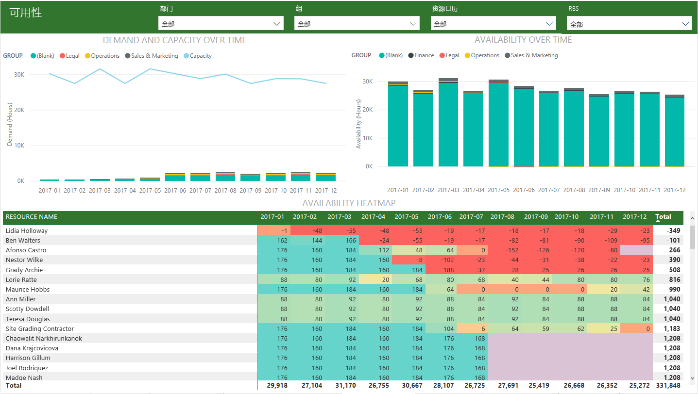
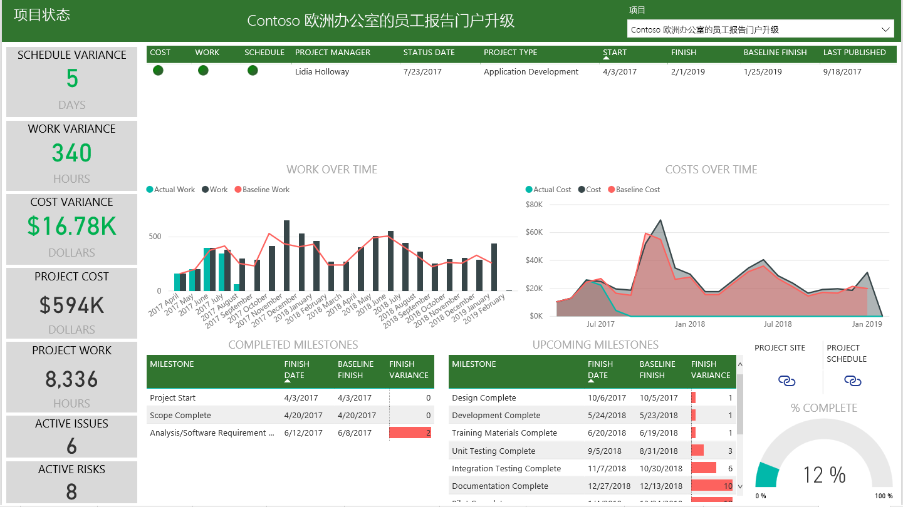

# 使用 Power BI 连接到 Project Online
Microsoft Project Online 是一个灵活的在线解决方案，用于项目组合管理 (PPM) 和日常工作。 Project Online 使组织能够开始运转、排定项目资产组合投资优先级以及交付预期业务价值。 Power BI 的 Project Online 内容包可使你从 Project Online 发掘见解，以帮助管理项目、项目组合和资源。

连接到 Power BI 的 [Project Online 内容包](https://app.powerbi.com/getdata/services/project-online)。

## 如何连接
1. 选择左侧导航窗格底部的**获取数据**。
   
    
2. 在**服务**框中，选择**获取**。
   
   
3. 选择 **Microsoft Project Online** \> **获取**。
   
   
4. 在 **Project Web App URL** 文本框中，输入你要连接到的 Project Web Add (PWA) 的 URL，然后点击**下一步**。 请注意，如果你使用自定义域，则它可能与示例不同。 在“PWA 站点语言”文本框中，键入与 PWA 站点语言相对应的数字。 对于英语，键入单个数字“1”；法语键入“2”；德语键入“3”；葡萄牙语（巴西）键入“4”；葡萄牙语（葡萄牙）键入“5”以及西班牙语键入“6”。 
   
    
5. 对于身份验证方法，选择 **oAuth2** \> **登录**。 出现提示时，输入 Project Online 凭据，然后按照身份验证过程进行操作。
   
    
    
请注意，需要拥有项目组合查看者、项目组合经理或管理员权限才能连接到 Project Web App。

6. 你将看到一个通知，指示你的数据正在加载。 根据帐户的大小，这可能需要一些时间。 Power BI 导入数据后，可在左侧的导航窗格中看到新的仪表板、13 个报表和数据集。 这是 Power BI 为显示数据而创建的默认仪表板。 可以修改此仪表板以便按所需方式显示数据。

   

7. 仪表板和报表准备就绪后，即可开始浏览你的 Project Online 数据！ 内容包附带 13 个丰富而详细的报表，分别为项目组合概述（6 个报表页面），资源概述（5 个报表页面）和项目状态（2 个报表页面）。 

   
   
   
   
   

**下一步？**

* 尝试在仪表板顶部的[在“问答”框中提问](power-bi-q-and-a.md)
* 在仪表板中[更改磁贴](service-dashboard-edit-tile.md)。
* [选择磁贴](service-dashboard-tiles.md)以打开基础报表。
* 虽然数据集将按计划每日刷新，你可以更改刷新计划或根据需要使用**立即刷新**来尝试刷新

**展开内容包**

下载[GitHub PBIT 文件](https://github.com/OfficeDev/Project-Power-BI-Content-Packs)，进一步自定义和更新内容包

## 后续步骤
[Power BI 入门](service-get-started.md)

[在 Power BI 中获取数据](service-get-data.md)

