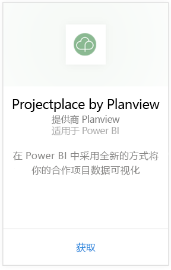
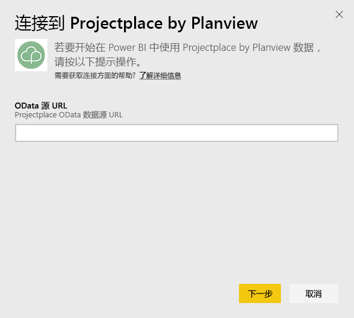
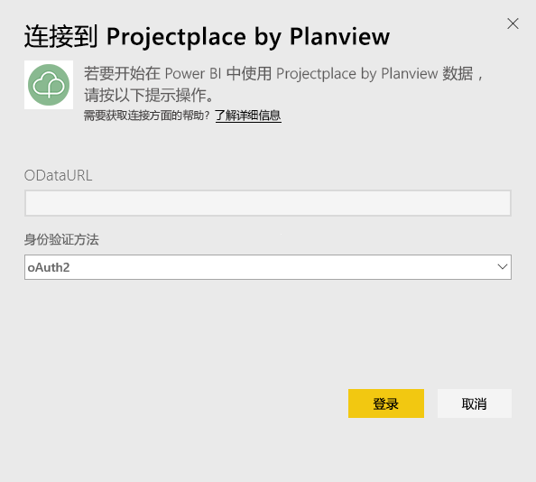
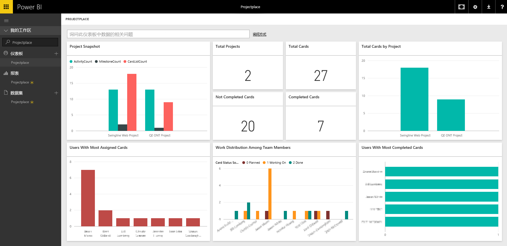

# 使用 Power BI 连接到 Projectplace by Planview
通过 Projectplace by Planview 内容包，你能够以全新的方式直接在 Power BI 中可视化你的协作项目数据。 使用你的 Projectplace 登录凭据交互式查看关键项目统计信息，找出最活跃和最富生产力的团队成员，并识别出 Projectplace 帐户各项目中存在风险的卡片和活动。 你还可以扩展现成的仪表板和报表，以获取对你最重要的信息。

[连接到 Power BI 中的 Projectplace 内容包](https://app.powerbi.com/getdata/services/projectplace)

>[!NOTE]
>要将 Projectplace 数据导入 Power BI，则你必须是 Projectplace 用户。 其他要求见下文。

## 如何连接
1. 选择左侧导航窗格底部的**获取数据**。
   
    
2. 在**服务**框中，选择**获取**。
   
    
3. 在 Power BI 页上，选择 **Projectplace by Planview**，然后选择**获取**：  
   
    
4. 在 OData 数据源 URL 文本框中，输入想要使用的 Projectplace OData 数据源的 URL，如下图所示：
   
    
5. 在身份验证方法列表中，若 **OAuth**未被选择，则选择该项。 点击**登录**，然后按照登录流程操作。  
   
   
6. 在左侧窗格中，从仪表板列表中选择 **Projectplace**。 Power BI 将 Projectplace 数据导入仪表板。 请注意，加载数据可能需要一些时间。  
   
    仪表板包含显示来自你 Projectplace 数据库的数据的磁贴。 下图为 Power BI 中默认 Projectplace 仪表板的示例。
   
    

**下一步？**

* 尝试在仪表板顶部的[在“问答”框中提问](service-q-and-a.md)
* 在仪表板中[更改磁贴](service-dashboard-edit-tile.md)。
* [选择磁贴](service-dashboard-tiles.md)以打开基础报表。
* 虽然数据集将按计划每日刷新，你可以更改刷新计划或根据需要使用**立即刷新**来尝试刷新

## 系统要求
要将 Projectplace 数据导入 Power BI，则你必须是 Projectplace 用户。 此过程假设你已使用 Power BI 帐户登录到 Microsoft Power BI 主页。 如果还没有 Power BI 帐户，请在 Power BI 主页上创建一个新的免费 Power BI 帐户，然后单击“获取数据”。

## 后续步骤
[Power BI 入门](service-get-started.md)

[Power BI - 基本概念](service-basic-concepts.md)

