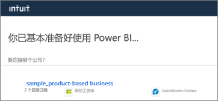
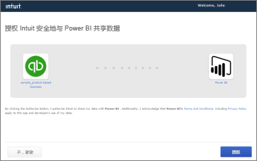
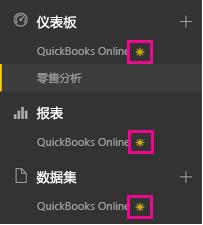
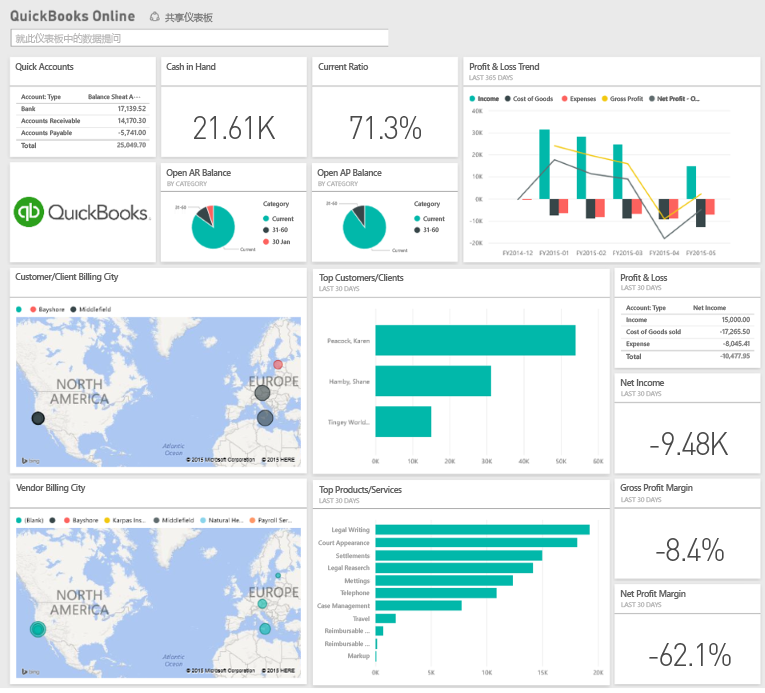
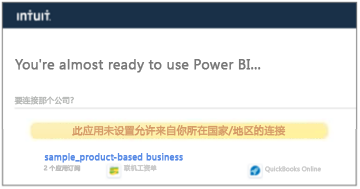

# 使用 Power BI 连接到 QuickBooks Online
从 Power BI 连接到 QuickBooks Online 数据时，你将立即获得一个 Power BI 仪表板和 Power BI报表，报表提供了关于业务现金流、盈利率和客户等的信息。 按原样使用仪表板和报表，或者对其进行自定义以突出显示你最关注的信息。 此数据每天自动刷新一次。

连接到适用于 Power BI 的 [QuickBooks Online 内容包](https://dxt.powerbi.com/getdata/services/quickbooks-online)。

>[!NOTE]
>若要将你的 QuickBooks Online 数据导入 Power BI，你需要是 QuickBooks Online 帐户管理员，并使用管理员帐户凭据进行登录。

## 如何连接
1. 选择左侧导航窗格底部的**获取数据**。
   
    
2. 在**服务**框中，选择**获取**。
   
    
3. 选择 **QuickBooks Online**，然后选择**获取**。
   
   
4. 对于身份验证方法，选择 **oAuth2**，然后选择**登录**。 
5. 出现提示时，输入 QuickBooks Online 凭据，然后按照 QuickBooks Online 身份验证过程操作。 （如果你已经在浏览器中登录到 QuickBooks Online，则可能不会看到凭据提示。）
   >[!NOTE]
   >你的 QuickBooks Online 帐户需要管理凭据。
6. 在下一屏幕中选择你想要连接到 Power BI 的公司。
   
   
7. 在下一屏幕中选择**授权**以开始导入过程。 这可能需要几分钟时间，具体耗时取决于公司数据的大小。 
   
   
   
   Power BI 导入数据后，你会在左侧的导航窗格中看到新的仪表板、报表和数据集。 新的项目会以黄色星号 \* 标记。
   
   
8. 选择 QuickBooks Online 仪表板。 此仪表板由 Power BI 自动创建，以显示你导入的数据。 你可修改此仪表板按所需方式显示数据。 
   
   

**下一步？**

* 尝试在仪表板顶部的[在“问答”框中提问](power-bi-q-and-a.md)
* 在仪表板中[更改磁贴](service-dashboard-edit-tile.md)。
* [选择磁贴](service-dashboard-tiles.md)以打开基础报表。
* 虽然数据集将按计划每日刷新，你可以更改刷新计划或根据需要使用**立即刷新**来尝试刷新

## 故障排除
**“糟糕! 出现错误。”**

如果在选择**授权**后出现此消息：

“糟糕！ 出现错误。” 请关闭此窗口，然后重试。

此公司的另一用户已订阅该应用程序。 若要对此订阅进行更改，请联系 [ 管理员电子邮件 ]。”

...这意味着你公司的另一个管理员已使用 Power BI 连接到公司数据。 联系该管理员以共享仪表板。 目前，只能有一个管理员用户可以将特定的 QuickBooks Online 公司数据集连接到 Power BI。 Power BI 创建仪表板后，管理员可以与多个同事在同一 Power BI 租户上共享此仪表盘。

**“此应用未设置允许来自你所在国家/地区的连接”**

当前 Power BI 仅支持 QuickBooks Online 的美国版本。 

## 后续步骤
[Power BI 入门](service-get-started.md)

[Power BI - 基本概念](service-basic-concepts.md)

