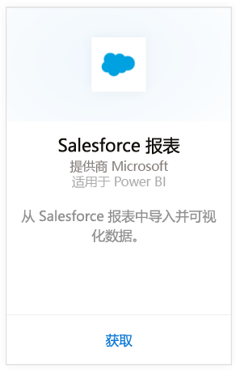
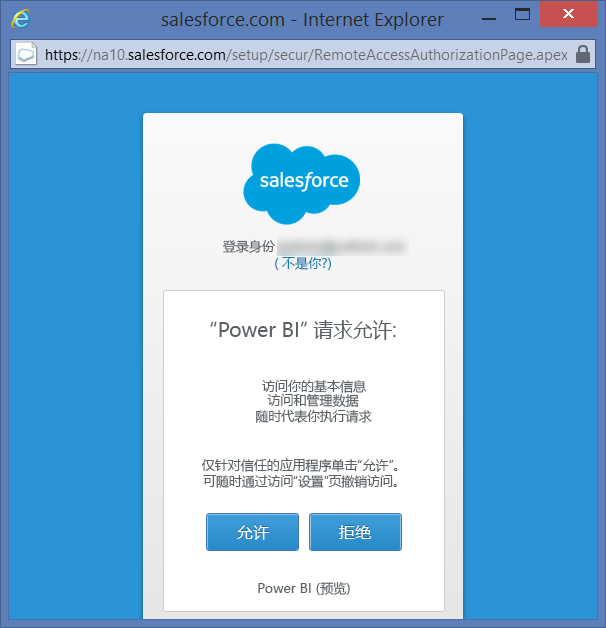
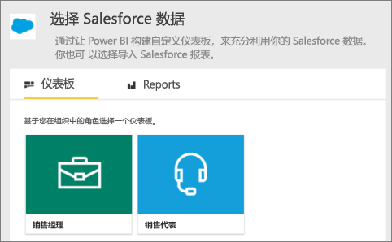
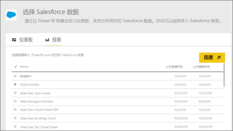
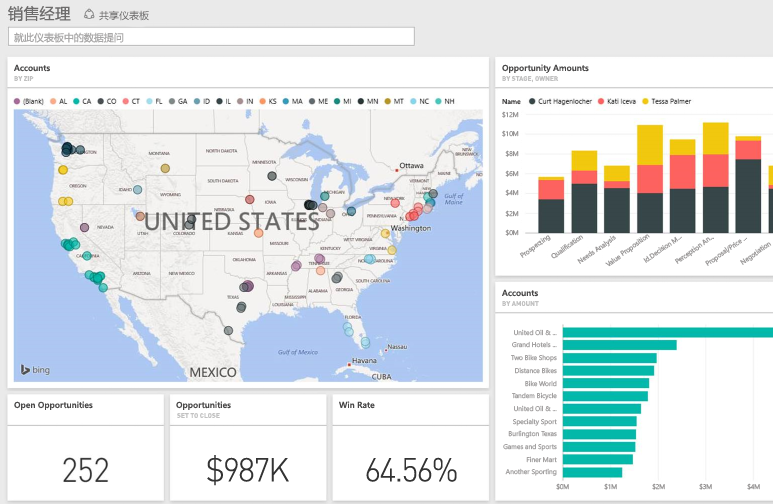

# 使用 Power BI 连接到 Salesforce
你可以使用 Power BI 轻松连接到你的 Salesforce.com 帐户。 创建此连接可检索你的数据，并自动提供基于数据的仪表板和相关报表。

连接到适用于 Power BI 的 [Salesforce 内容包](https://app.powerbi.com/getdata/services/salesforce)或阅读有关 [Salesforce 与 Power BI 集成](https://powerbi.microsoft.com/integrations/salesforce)的更多信息。

## 连接方式
1. 选择左侧导航窗格底部的**获取数据**。
   
    
2. 在**服务**框中，选择**获取**。
   
    
3. 单击 **Salesforce**，然后选择**获取**。  
   
   
4. 选择**登录**启动登录流。
   
    
5. 出现提示时，输入你的 Salesforce 凭据。 单击**允许**以便 Power BI 可以访问你的 Salesforce 基本信息和数据。
   
   
6. 使用下拉列表选项，配置你想导入 Power BI 的内容：
   
   * **仪表板**
     
     选择基于某一角色的预定义仪表板（例如**销售经理**）。 这些仪表板从 Salesforce 中引入一组特定的标准数据，且不包括自定义字段。
     
     
   * **报表**
     
     从你的 Salesforce 帐户中选择一个或多个自定义报表。 这些报表将与你在 Salesforce 中的视图相匹配，并且可以包含来自自定义字段或对象的数据。
     
     
     
     如果看不到任何报表，请在你的 Salesforce 帐户中添加或创建它们，然后再次尝试连接。
7. 单击“连接”以开始导入过程。 导入过程中，你会看到显示导入正在进行的通知。 导入完成后，你会看到其中有你的 Salesforce 数据的仪表板、报表和数据集，全都列在左侧导航窗格中。
   
   

你可以更改此仪表板，使其按你所需的方式显示数据。 你可以通过问答提问 - 或者单击磁贴以[打开基础报表](service-dashboard-tiles.md)并在仪表板中[更改磁贴](service-dashboard-edit-tile.md)。

**下一步？**

* 尝试在仪表板顶部的[在“问答”框中提问](power-bi-q-and-a.md)
* 在仪表板中[更改磁贴](service-dashboard-edit-tile.md)
* [选择磁贴](service-dashboard-tiles.md)以打开基础报表。
* 虽然数据集将按计划每日刷新，你可以更改刷新计划或根据需要使用**立即刷新**来尝试刷新

## 系统要求
* 与已启用 API 访问的 Salesforce 生产帐户连接
* 登录期间授予 Power BI 应用权限
* 帐户具有足够可用的 API 调用，以拉取和刷新数据
* 刷新操作需要有效的身份验证令牌。 确保你导入的 Salesforce 数据集在 5 个以下，因为 Salesforce 限制每个应用程序最多使用 5 个身份验证令牌

## 故障排除
如果遇到任何错误，请查看上述要求。 另请注意，当前不支持登录到自定义或沙盒域的功能。

## 后续步骤
[Power BI 入门](service-get-started.md)

[获取数据](service-get-data.md)

