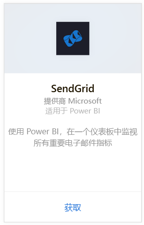
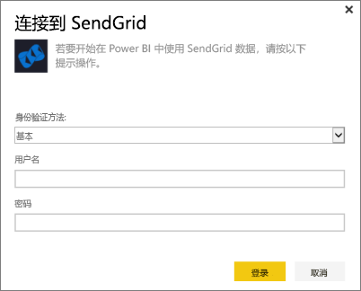
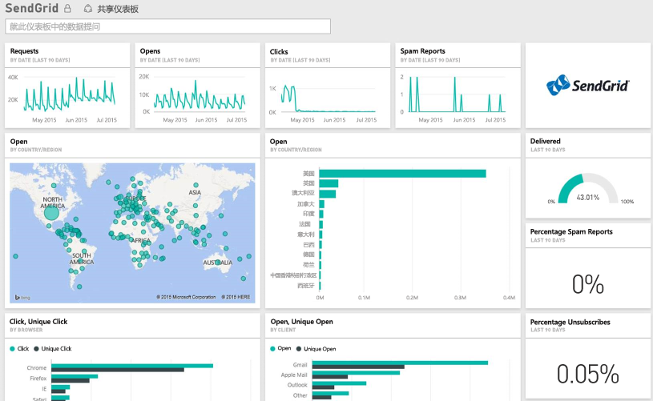

# 使用 Power BI 连接到 SendGrid
Power BI 的 SendGrid 内容包允许你从你的 SendGrid 帐户提取见解和统计信息。 使用 SendGrid 内容包可以在仪表板中可视化你的 SendGrid 统计信息。

连接到 Power BI 的 [SendGrid 内容包](https://app.powerbi.com/getdata/services/sendgrid)。

## 如何连接
1. 选择左侧导航窗格底部的**获取数据**。
   
    
2. 在**服务**框中，选择**获取**。
   
    
3. 选择 **SendGrid** 内容包，并单击**获取**。
   
    
4. 出现提示时，提供你的 SendGrid 用户名和密码。 选择**登录**。
   
   
5. Power BI 导入数据后，你将看到新的仪表板、报表以及左侧导航窗格中的数据集，其中填充了过去 90 天的电子邮件统计信息。 新的项目会以黄色星号 \* 标记。
   
   

**下一步？**

* 尝试在仪表板顶部的[在“问答”框中提问](power-bi-q-and-a.md)
* 在仪表板中[更改磁贴](service-dashboard-edit-tile.md)。
* [选择磁贴](service-dashboard-tiles.md)以打开基础报表。
* 虽然数据集将按计划每日刷新，你可以更改刷新计划或根据需要使用**立即刷新**来尝试刷新

## 包含的内容
SendGrid 仪表板中提供以下指标：

* 总体电子邮件统计信息 - 请求、已发送的邮件、已退回的邮件、拦截的垃圾邮件、垃圾邮件报表等。
* 按类别列出的电子邮件统计信息
* 按地理位置列出的电子邮件统计信息
* 按 ISP 列出的电子邮件统计信息
* 按设备、客户端、浏览器列出的电子邮件统计信息

## 后续步骤
[Power BI 入门](service-get-started.md)

[获取数据](service-get-data.md)

