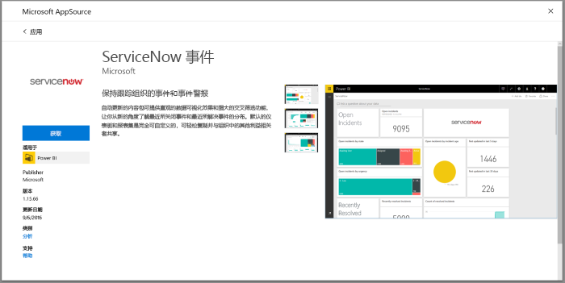
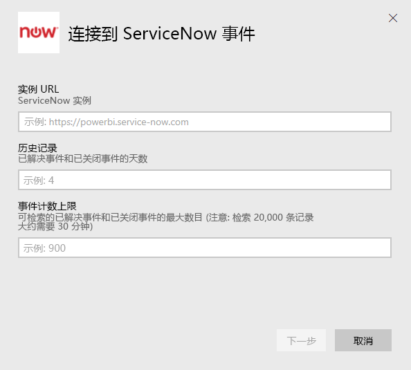
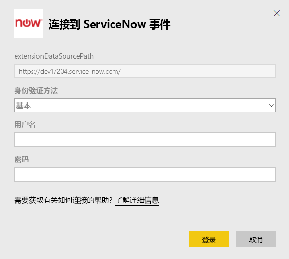
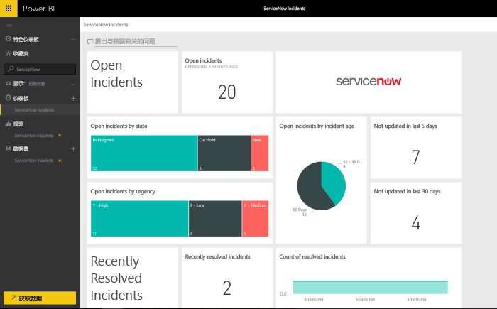

# 使用 Power BI 连接到 ServiceNow 以报告事件
ServiceNow 提供包括业务、运营和 IT 管理在内的多个产品和解决方案，从而提升你的业务。 此内容包包含有关打开、最近解决的和最近关闭的事件的多个报表和见解。  

连接到用于 [ServiceNow 事件](https://app.powerbi.com/getdata/services/servicenow) 的 Power BI 内容包。

## 如何连接
1. 选择左侧导航窗格底部的**获取数据**。
   
    
2. 在**服务**框中，选择**获取**。
   
    
3. 选择“**ServiceNow 事件**”\>“**获取**”。
   
   
4. 提供 ServiceNow 实例的 URL 和要引入的天数/记录数范围。 请注意，达到限制后，导入将会停止。
   
   
5. 出现提示时，输入 ServiceNow **基本**凭据。 请注意，目前不支持单一登录。有关系统要求的详细信息如下所示。
   
   
6. 完成登录流程后，导入过程将开始。 导入完成后，在导航窗格中将会出现新的仪表板、报表和模型。 选择仪表板查看已导入的数据。
   
    

**下一步？**

* 尝试在仪表板顶部的[在“问答”框中提问](service-q-and-a.md)
* 在仪表板中[更改磁贴](service-dashboard-edit-tile.md)。
* [选择磁贴](service-dashboard-tiles.md)以打开基础报表。
* 虽然数据集将按计划每日刷新，你可以更改刷新计划或根据需要使用**立即刷新**来尝试刷新

## 系统要求
若要进行连接需要：  

* 可以使用基本身份验证访问 yourorganization.service-now.com 的帐户（此版本中不支持单一登录）  
* 该帐户必须具有 rest_service 角色以及对事件表的读取访问权限  

## 故障排除
如果在加载期间遇到凭据错误，请检查上述访问要求。 如果拥有正确的权限但仍遇到问题，请以 ServiceNow 管理员身份进行操作以确保拥有自定义实例可能需要的任何其他权限。

如果加载时间较长，请检查连接期间指定的事件数量和天数并考虑将其减少。

## 后续步骤
[Power BI 入门](service-get-started.md)

[Power BI - 基本概念](service-basic-concepts.md)

