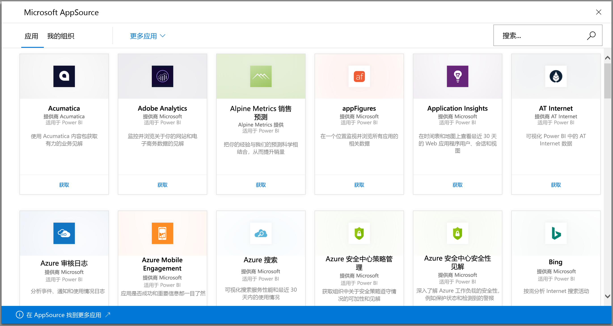
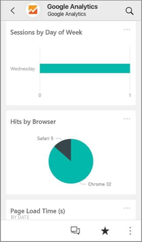
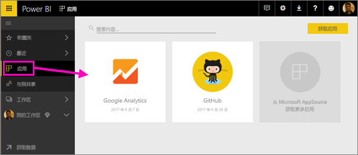
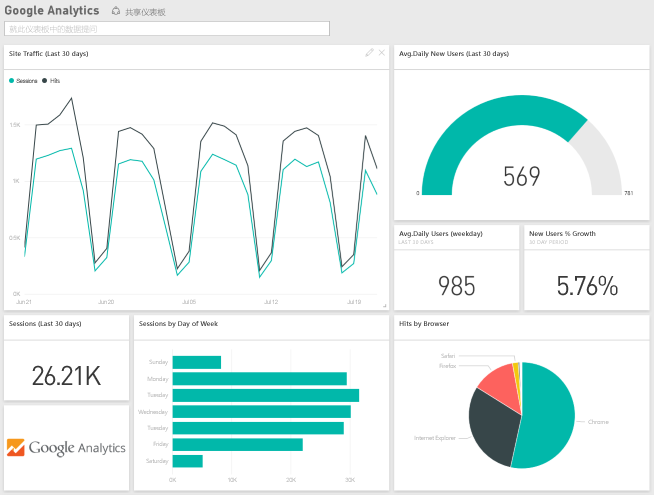

# 使用 Power BI 连接到要使用的服务
可以连接到许多用以运行你的业务的服务，例如 Salesforce、Microsoft Dynamics 和 Google Analytics。 Power BI 通过使用你的凭据连接到服务，然后创建包含仪表板的 Power BI 应用和一组 Power BI 报表，这些报表可自动显示数据并提供业务视觉对象见解。 

登录到 Power BI，查看所有[可以连接到的服务](https://app.powerbi.com/getdata/services)。 Power BI 团队定期添加新的服务。

安装应用后，可以在 Power BI 服务 ([https://powerbi.com](https://powerbi.com)) 和 Power BI 移动应用中查看仪表板和报表。 

## 开始使用
[!INCLUDE [powerbi-service-apps-get-more-apps](./includes/powerbi-service-apps-get-more-apps.md)]

## 查看仪表板和报表
导入完成后，新的应用将显示在“应用”页上。

1. 选择左侧导航窗格中的“应用”，然后选择应用。
   
     
2. 可以通过在问答框中键入来提出问题，或单击磁贴打开基础报表。 
   
    
   
    可以筛选和突出显示报表中的数据，但不能保存所做的更改。

## 包含的内容
连接到服务后，将看到一个新创建的应用，其中包含一个仪表板、报表和数据集。 服务的数据侧重于特定方案，可能不包括来自服务的所有信息。 计划每天自动刷新一次数据。 可以通过选择数据集来控制计划。

还可以使用 [Power BI Desktop](desktop-get-the-desktop.md) 连接到某些服务，例如 Google Analytics，并创建你自己的自定义仪表板和报表。  

有关连接到特定服务的详细信息，请参阅个人帮助页面。

## 疑难解答
**空磁贴**  
Power BI 首次连接到服务时，你可能会在仪表板上看到一组空磁贴。 如果 2 小时后，仪表板仍然为空，很有可能是连接失败造成的。 如果没有看到包含可修复此问题相关信息的错误消息，请提交支持票证。

* 选择右上角的问号图标 (“?”)，然后选择“获取帮助”。
  
    

**缺少信息**  
仪表板和报表包括侧重于特定方案的服务中的内容，不包括来自服务的所有信息。 如果内容包中有你未曾见过的特定元素，请在 [Power BI 支持](https://support.powerbi.com/forums/265200-power-bi)页上发表你的意见。

## 服务建议
你是否使用某种服务并希望获得该服务的 Power BI 应用？ 请转到 [Power BI 支持](https://support.powerbi.com/forums/265200-power-bi)页面告诉我们。

你有需要生成应用的服务吗？ [提交你的提名](https://azure.microsoft.com/marketplace/programs/certified/apply/)并选择“发布 Power BI 内容包”以开始使用。

## 后续步骤
* [Power BI 中的应用有哪些？](service-install-use-apps.md)
* [在 Power BI 中获取数据](service-get-data.md)
* 更多问题？ [尝试咨询 Power BI 社区](http://community.powerbi.com/)

