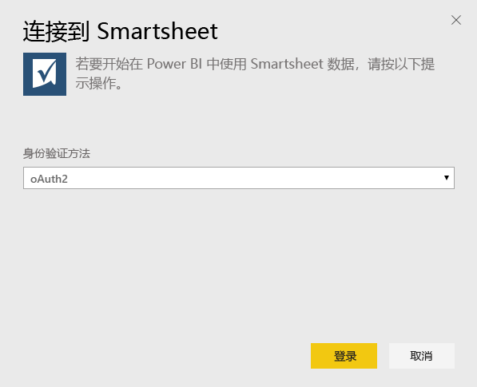
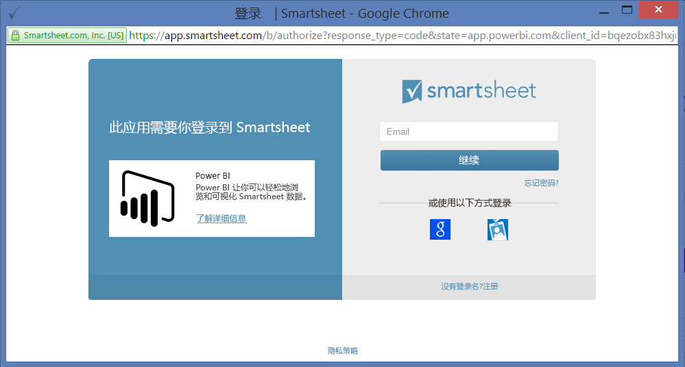
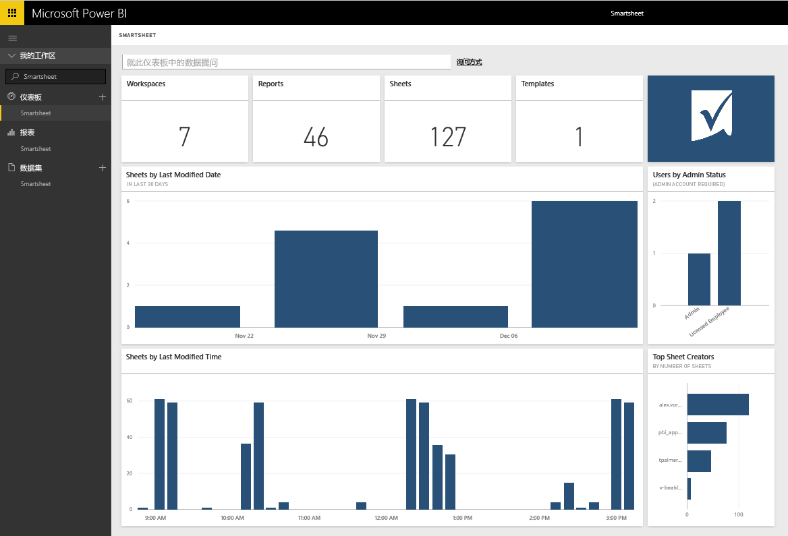

# 使用 Power BI 连接到 Smartsheet
Smartsheet 提供了协作和文件共享的简单平台。 Power BI 的 Smartsheet 内容包提供仪表板、报表和显示你的 Smartsheet 帐户概述的数据集。 还可以使用 [Power BI Desktop](desktop-connect-to-data.md) 直接连接到你帐户中的单独工作表。 

连接到 Power BI 的 [Smartsheet 内容包](https://app.powerbi.com/groups/me/getdata/services/smartsheet)

>[!NOTE]
>最好使用 Smartsheet 管理员帐户连接和加载 Power BI 内容包，因为该帐户具有额外的访问权限。

## 如何连接
1. 选择左侧导航窗格底部的**获取数据**。
   
   
2. 在**服务**框中，选择**获取**。
   
    
3. 选择 **Smartsheet \> 获取**。
   
   
4. 对于身份验证方法，选择 **oAuth2 \> 登录**。
   
   出现提示时，输入 Smartsheet 凭据，然后按照身份验证过程进行操作。
   
   
   
   
5. Power BI 导入数据后，你将在左侧的导航窗格中看到新的仪表板、报表和数据集。 新的项目会以黄色星号 \* 标记，请选择 Smartsheet 条目。
   
   

**下一步？**

* 尝试在仪表板顶部的[在“问答”框中提问](power-bi-q-and-a.md)
* 在仪表板中[更改磁贴](service-dashboard-edit-tile.md)。
* [选择磁贴](service-dashboard-tiles.md)以打开基础报表。
* 虽然数据集将按计划每日刷新，你可以更改刷新计划或根据需要使用**立即刷新**来尝试刷新

## 包含的内容
Power BI 的 Smartsheet 内容包包含你的 Smartsheet 帐户的概述，例如你拥有的工作区、报表和工作表的数量及其修改时间等。管理员用户还将在看到有关系统中用户的一些信息，如顶层工作表创建者。  

若要直接连接到你帐户中的单独工作表，可以使用 [Power BI Desktop](desktop-connect-to-data.md) 中的 Smartsheet 连接器。  

## 后续步骤：

[什么是 Power BI？](power-bi-overview.md)

[获取 Power BI 的数据](service-get-data.md)