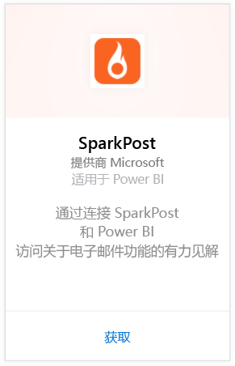
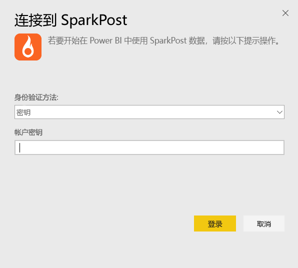
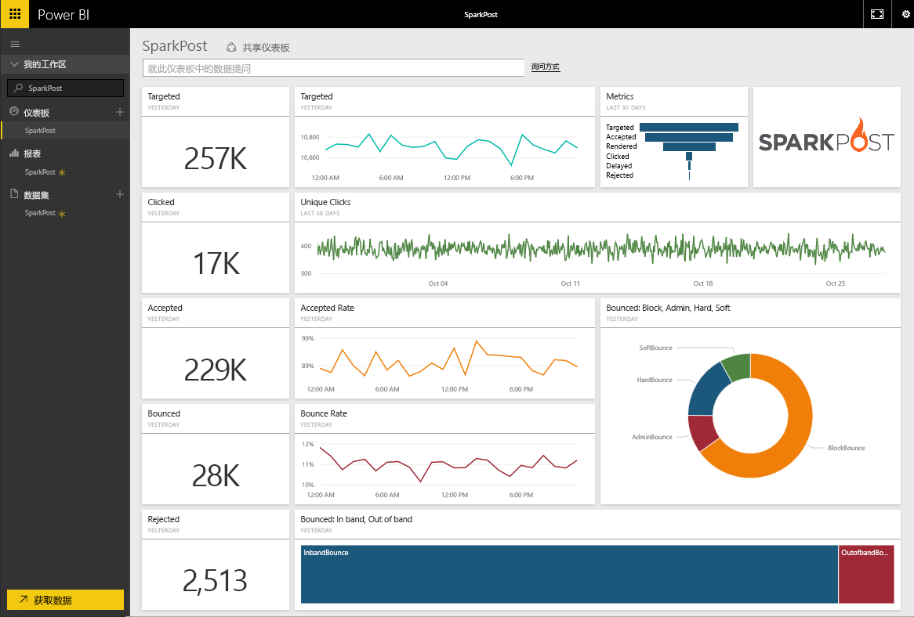

# 使用 Power BI 连接到 SparkPost
SparkPost 的 Power BI 内容包允许你从 SparkPost 帐户将所有有价值的数据集提取到富有洞察力的仪表板中。 借助 SparkPost 内容包，可以将你的电子邮件整体统计信息可视化，其中包括通过 ISP 的域、活动和参与。

连接到[适用于 Power BI 的 SparkPost 内容包](https://app.powerbi.com/getdata/services/spark-post)。

## 如何连接
1. 选择左侧导航窗格底部的**获取数据**。
   
   
2. 在**服务**框中，选择**获取**。
   
   
3. 选择 **SparkPost** 内容包，并单击**获取**。 
   
   
4. 出现提示时，提供你的 SparkPost API 密钥，并选择“登录”。 请参阅下面有关[查找这些参数](#FindingParams)的详细信息。
   
   
5. 数据将开始加载，这可能需要一些时间，具体取决于你帐户的大小。 Power BI 导入数据后，你将看到默认的仪表板、报表和左侧导航窗格中的数据集，数据集是使用过去 90 天的电子邮件统计信息进行填充的。 新的项目会以黄色星号 \* 标记。
   
   

**下一步？**

* 尝试在仪表板顶部的[在“问答”框中提问](power-bi-q-and-a.md)
* 在仪表板中[更改磁贴](service-dashboard-edit-tile.md)。
* [选择磁贴](service-dashboard-tiles.md)以打开基础报表。
* 虽然数据集将按计划每日刷新，你可以更改刷新计划或根据需要使用**立即刷新**来尝试刷新

## 包含的内容
适用于 Power BI 的 SparkPost 内容包包括信息，这些信息包括独特的单击、接受速度、跳出速度、延迟速度、拒绝速度等。

## 查找参数
内容包使用 API 密钥来将你的 SparkPost 帐户连接到 Power BI。 你可以在你的帐户 \> API 和 SMTP 下找到你的 API 密钥（有关详细信息，请查看[此处](https://support.sparkpost.com/customer/portal/articles/1933377-create-api-keys)）。 我们建议使用具有 `Message Events: Read-only ` 和 `Metrics: Read-only` 权限的 API 密钥

