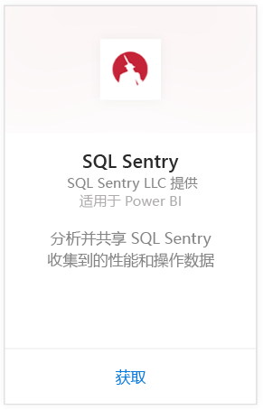
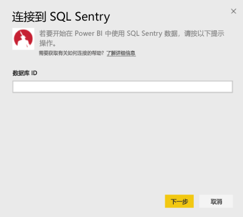
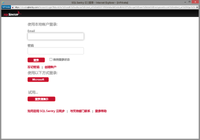
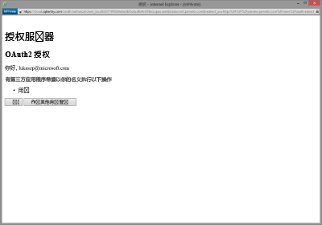
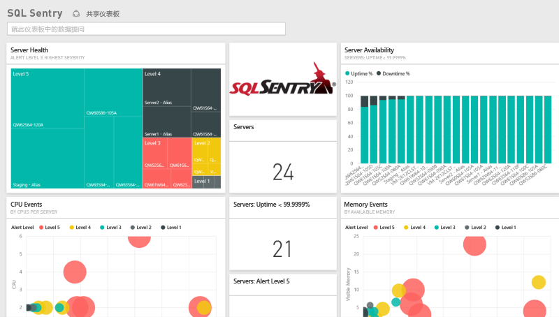
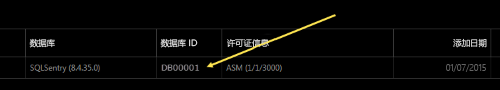
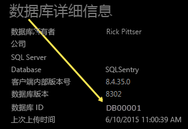

# 使用 Power BI 连接到 SQL Sentry
使用 Power BI 壳轻松分析由 SQL Sentry 收集的性能数据。 Power BI 检索数据，然后生成默认的仪表板并基于此数据生成相关的报表。

连接到 Power BI 的 [SQL Sentry 内容包](https://app.powerbi.com/groups/me/getdata/services/sql-sentry)。

>[!NOTE]
>若要进行连接，需要具有用于连接到  http://cloud.sqlsentry.com 的 SQL Sentry 帐户和要监视的数据库 ID 的访问权限。  以下介绍在何处查找数据库 ID。

## 如何连接
1. 选择左侧导航窗格底部的**获取数据**。
   
   
2. 在**服务**框中，选择**获取**。
   
    
3. 选择 **SQL Sentry \> 获取**。
   
   
4. 提供你要在 Power BI 中监视的数据库的**数据库 ID**。 请参阅下方有关[查找此参数](#FindingParams)的更多详细信息。
   
   
5. 对于身份验证方法，选择 **oAuth2 \> 登录**。
   
   出现提示时，输入 cloud.sqlsentry.com 凭据，然后按照 SQL Sentry 身份验证过程进行操作。
   
   
   
   首次连接时，Power BI 会提示你允许对你的帐户进行只读访问。 选择“同意”以开始导入过程。  根据帐户中的数据量，导入过程可能需要几分钟时间。
   
   
6. Power BI 导入数据后，你将在左侧的导航窗格中看到新的仪表板、报表和数据集。 新的项目会以黄色星号 \* 标记：
   
   
7. 选择 SQL Sentry 仪表板。
   
   这是 Power BI 为显示数据而创建的默认仪表板。 可以修改此仪表板以便按所需方式显示数据。
   
   

**下一步？**

* 尝试在仪表板顶部的[在“问答”框中提问](power-bi-q-and-a.md)
* 在仪表板中[更改磁贴](service-dashboard-edit-tile.md)。
* [选择磁贴](service-dashboard-tiles.md)以打开基础报表。
* 虽然数据集将按计划每日刷新，你可以更改刷新计划或根据需要使用**立即刷新**来尝试刷新

## 包含的内容
在 Power BI 中 SQL Sentry 提供以下数据：

| 表名 | 说明 |
| --- | --- |
| 连接 |此表提供有关你的 SQL Sentry 定义的连接的信息。 |
| 日期  |此表包含从今天追溯到收集和保留了性能数据的最早日期。 |
| 停机时间  |此表包含与环境中受监视的每个服务器的停机时间和运行时间相关的信息。 |
| 内存使用情况  |此表包含有关每个服务器中可用或空闲内存量的信息。  |
| 服务器  |此表包含环境中每个服务器的记录。 |
| 服务器运行状况  |此表包含一个环境中自定义条件生成的所有事件的数据，包括严重性和计数。 |

## 查找参数
可通过在新的 Web 浏览器窗口中登录到 <https://cloud.sqlsentry.com> 来查找数据库 ID。  主概述页上列出了**数据库 ID**：

    

“数据库详细信息”屏幕上也显示了**数据库 ID**：

    

## 故障排除
如果 Power BI 中未显示来自某些应用的数据，请检查以确保使用正确的数据库 ID，并确保你有权查看该数据。 

如果你不是同步到 <https://cloud.sqlsentry.com> 的 SQL Sentry 数据库的所有者，请与管理员联系以确保你有权查看收集的数据。

## 后续步骤
[什么是 Power BI？](power-bi-overview.md)

[获取 Power BI 的数据](service-get-data.md)

