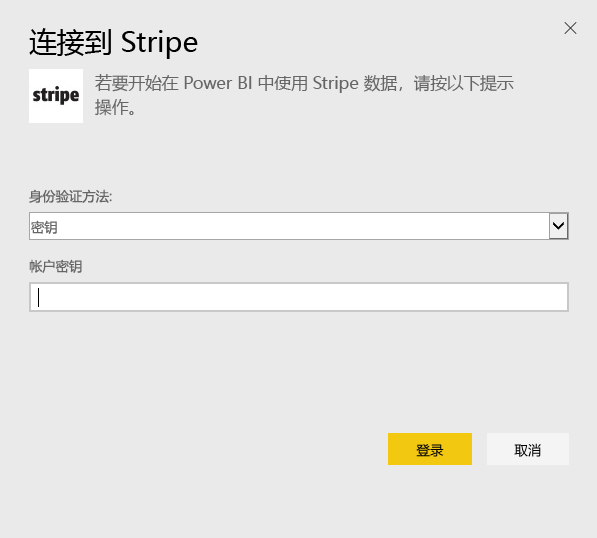
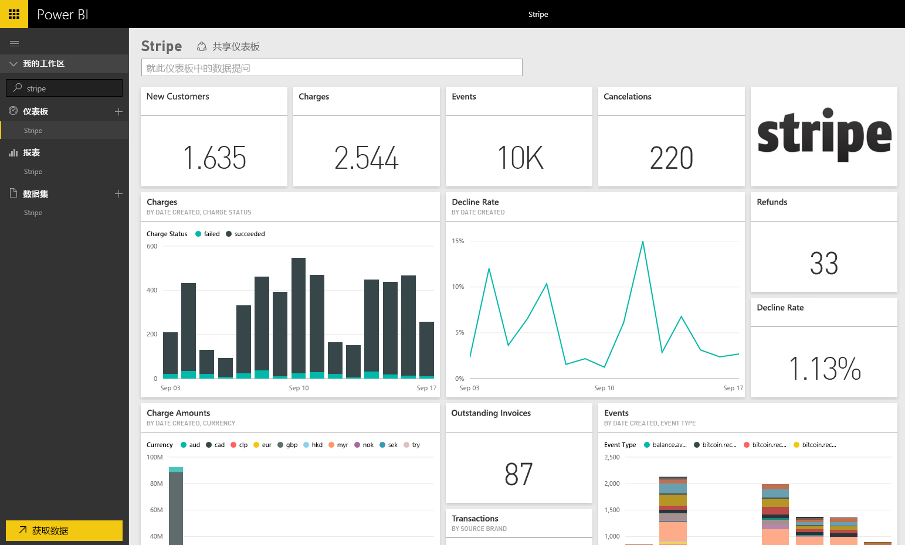

# 使用 Power BI 连接到 Stripe
通过此 Power BI 内容包在 Power BI 中的对Stripe 数据进行可视化和浏览。 Power BI Stripe 内容包将拉取有关你的客户、费用、活动和发票的数据。 该数据包括过去 30 天内最近一万个活动和五千笔费用。 该内容将按照由你控制的计划每天自动刷新一次。 

连接到 [Power BI 的 Stripe 内容包](https://app.powerbi.com/getdata/services/stripe)。

## 如何连接
1. 选择左侧导航窗格底部的“获取数据”。  
   
    
2. 在**服务**框中，选择**获取**。  
   
      
3. 选择**Stripe** &gt; **获取**。  
   
      
4. 提供 Stripe [API 密钥](https://dashboard.stripe.com/account/apikeys)进行连接。  
   
    
5. 导入过程将自动开始。 导入完成后，在导航窗格中将会出现新的仪表板、报表和模型，以星号标记。 选择仪表板查看已导入的数据。
   
    

**下一步？**

* 尝试在仪表板顶部的[在“问答”框中提问](power-bi-q-and-a.md)
* 在仪表板中[更改磁贴](service-dashboard-edit-tile.md)。
* [选择磁贴](service-dashboard-tiles.md)以打开基础报表。
* 虽然数据集将按计划每日刷新，你可以更改刷新计划或根据需要使用**立即刷新**来尝试刷新

## 后续步骤
[什么是 Power BI？](power-bi-overview.md)

[获取 Power BI 的数据](service-get-data.md)

