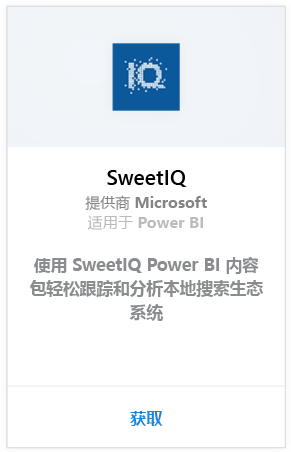
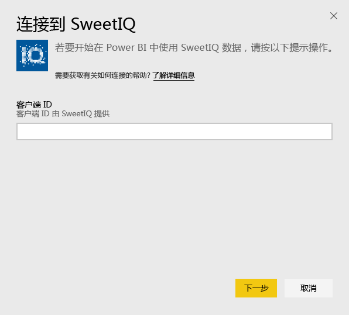
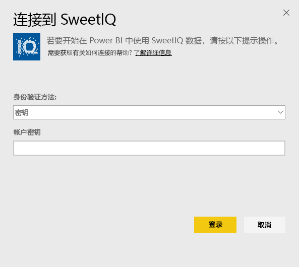
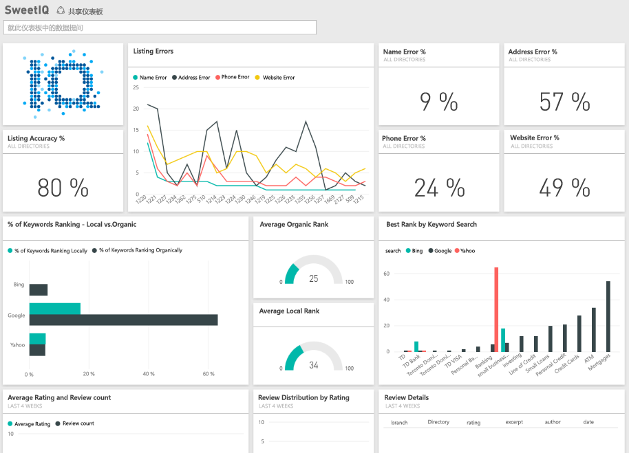

# 使用 Power BI 连接到 SweetIQ
Power BI 内容包从 SweetIQ 帐户拉取数据，并生成一组可立即使用的内容，让你可以轻松浏览数据集。 使用 SweetIQ 内容包分析有关你的位置、排名、评级和评论的数据。 该数据设置为每日刷新，确保你正在监视的数据时刻保持最新。

连接到 Power BI 的 [SweetIQ 内容包](https://app.powerbi.com/groups/me/getdata/services/sweetiq)。

## 如何连接
1. 在左侧的导航窗格中，单击**获取数据**
   
    
2. 选择 **SweetIQ**，然后单击**获取**
   
    
3. 提供你的 SweetIQ 客户端 ID。 它通常是字母数字值。 请参阅以下有关查找此值的详细信息。
   
    
4. 选择**密钥**身份验证类型，并提供 Sweet IQ API 密钥。 它通常是字母数字值。 请参阅以下有关查找此值的详细信息。
   
    
5. Power BI 将开始加载你的数据，根据帐户中数据的大小，加载可能需要一些时间。 加载完成后，你会在左侧的导航窗格中看到新的仪表板、报表和数据集。
   
    

**下一步？**

* 尝试在仪表板顶部的[在“问答”框中提问](power-bi-q-and-a.md)
* 在仪表板中[更改磁贴](service-dashboard-edit-tile.md)。
* [选择磁贴](service-dashboard-tiles.md)以打开基础报表。
* 虽然数据集将按计划每日刷新，你可以更改刷新计划或根据需要使用**立即刷新**来尝试刷新

## 查找参数
此内容包的客户端 ID 和 API 密钥与你的 SweetIQ 用户名和密码不同。

为你的帐户有权访问的客户端之一选择客户端 ID。 你可以在 SweetIQ 帐户中的“客户端管理”下找到客户端列表。

向管理员咨询你的 API 密钥，以访问特定客户端的数据。

## 后续步骤
[Power BI 入门](service-get-started.md)

[获取 Power BI 的数据](service-get-data.md)

