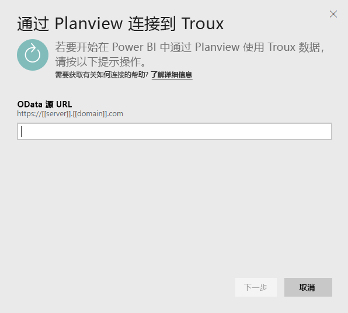
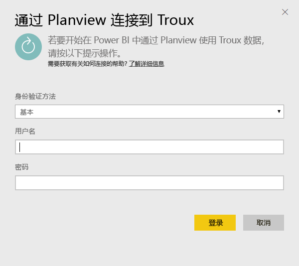
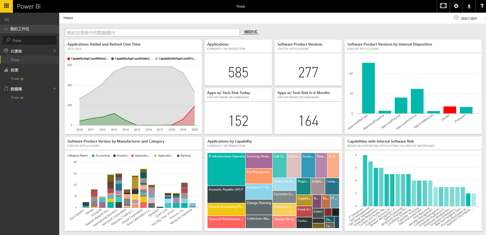

# 连接到适用于 Power BI 的 Troux
你可以使用 Troux 内容包直接在 Power BI 中以全新的方式可视化企业体系结构存储库。 该内容包提供了一套关于以下内容的见解：业务能力、提供这些功能的应用程序和支持那些可以使用 Power BI 完全自定义应用程序的技术。

连接到适用于 Power BI 的 [Troux 内容包](https://app.powerbi.com/getdata/services/troux)。

## 如何连接
1. 选择左侧导航窗格底部的**获取数据**。
   
   
2. 在**服务**框中，选择**获取**。
   
   
3. 选择 **Troux** \> **获取**。
   
   
4. 指定 Troux OData URL。 请参阅下面有关[查找这些参数](#FindingParams)的详细信息。
   
   
5. 对于**身份验证方法**，请选择**基本**并提供用户名和密码（区分大小写），然后选择**登录**。
   
    
6. 审批后，导入过程将自动开始。 导入完成后，在导航窗格中将会出现新的仪表板、报表和模型。 选择仪表板查看已导入的数据。
   
     

**下一步？**

* 尝试在仪表板顶部的[在“问答”框中提问](power-bi-q-and-a.md)
* 在仪表板中[更改磁贴](service-dashboard-edit-tile.md)。
* [选择磁贴](service-dashboard-tiles.md)以打开基础报表。
* 虽然数据集将按计划每日刷新，你可以更改刷新计划或根据需要使用**立即刷新**来尝试刷新

## 系统要求
需要 Troux OData 数据源和 Troux 9.5.1 或更高版本的访问权限。

## 查找参数
你的客户服务团队可以为你提供唯一的 Troux OData 数据源 URL

## 故障排除
如果提供凭据后看到超时错误，请尝试重新连接。

## 后续步骤
[Power BI 入门](service-get-started.md)

[在 Power BI 中获取数据](service-get-data.md)

